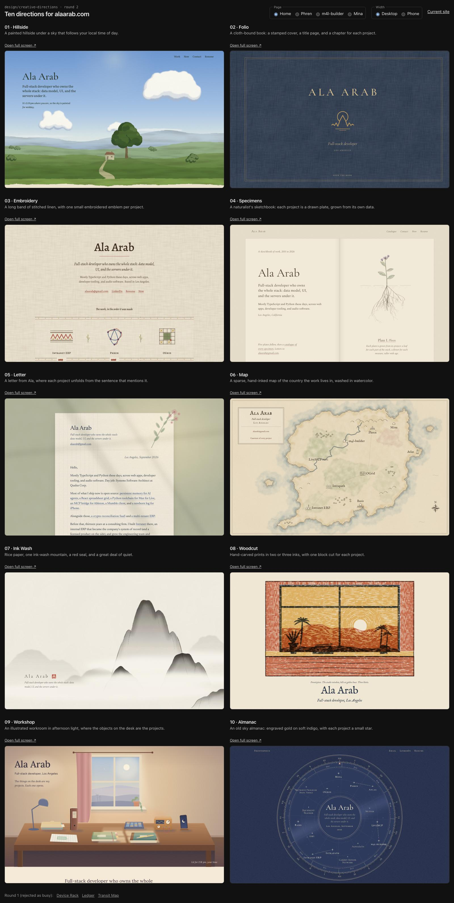

# Design directions for alaarab.com

Branch `design/creative-directions`. Nothing here is on main or deployed.

- [analysis.md](analysis.md): what the current site does, what reads as template, and the bugs found along the way.
- **Round 2 (current):** ten soft, painted, bookish directions, listed below.
- [Round 1](round-1/): Device Rack, Ledger, Transit Map. Rejected as busy, blocky, and "newspaper".

## Run the prototypes

```bash
bun install
bun run lab
```

Open http://localhost:3300/lab to see all ten side by side. Use the toggles to switch between the home page and the Phren, m4l-builder and Mina pages, at desktop or phone width. Each direction also runs full screen at `/lab/<key>`, and every project at `/lab/<key>/projects/<slug>`. There's no hot reload, so restart after edits. `bun run dev` is broken under Bun 1.3.14 (see analysis.md).



## Round 2

Brief: soft, artistic, subtle. Take the qualities of Ghibli background painting and classic book covers (Tolkien's own jackets, Pauline Baynes' maps) without their subject matter. There are no category controls. Each project page is themed to the project itself: Phren as kept memory, m4l-builder as an instrument (the only page with a knob), Mina as a 3 a.m. feed. All ten render the real content from `src/data/siteContent.ts`.

| # | Direction | Idea | Write-up |
|---|---|---|---|
| 1 | Hillside | A painted hillside whose sky follows your local time | [hillside](hillside/README.md) |
| 2 | Folio | A cloth-bound book: cover, title page, a chapter per project | [folio](folio/README.md) |
| 3 | Embroidery | A stitched linen band, one embroidered emblem per project | [embroidery](embroidery/README.md) |
| 4 | Specimens | Botanical plates, each plant grown from the project's own data | [specimens](specimens/README.md) |
| 5 | Letter | A letter from Ala; each project unfolds from the sentence that mentions it | [letter](letter/README.md) |
| 6 | Map | A sparse hand-inked map, washed in watercolor | [map](map/README.md) |
| 7 | Ink Wash | Rice paper, one ink mountain, a red seal, a lot of quiet | [inkwash](inkwash/README.md) |
| 8 | Woodcut | Soft color woodcut prints, one carved block per project | [woodcut](woodcut/README.md) |
| 9 | Workshop | A desk in afternoon light; the objects are the projects | [workshop](workshop/README.md) |
| 10 | Almanac | Engraved gold on soft indigo, each project a star | [almanac](almanac/README.md) |

## Ranking

**1. Specimens.** This is the only one where the art comes out of the work itself. Each project's plant grows from its own data (leaves from its stack, flowers from its metrics, height from its age), so a new project gets its own drawing without anyone hand-drawing it. It's soft and quiet, and the Phren plate (roots below the soil, larger than the plant, standing for the memory it keeps) is the best single idea across all ten. Risks: at a glance it can read as whimsy before work, and the watercolor filters need profiling on mid-range phones.

**2. Ink Wash.** The most beautiful and the most subtle. The first screen is almost all paper and mist. The Phren page (stepping stones into mist) is lovely. Risks: it says the least about the work at first glance, it could drift toward "spa website", and every new project needs a hand-painted motif.

**3. Folio or Map**, for the Lord of the Rings book-cover feel. Folio's cover is the strongest first screen of the ten, but past the cover it's mostly fine typography. Map's island is the most Tolkien-like of the ten and stays calm, but it stops working past about ten places.

**Also strong:** Letter is the most personal and the softest, but it's text-led and the least visual.

**Weaker:**
- Almanac is elegant, but the home chart carries all 15 labels plus rings, which is the busyness you rejected in round 1. Its Mina plate also shows the moon changing phase within one night, which doesn't happen.
- Workshop is warm, but flat vector drawing reads as clip-art up close.
- Woodcut has the most character but is the loudest of the ten, not subtle.
- Hillside is the most directly Ghibli in concept, but blobby clouds and a clip-art tree at midday miss the painterly bar. Its dusk Phren page is much better.
- Embroidery is sweet, but its emblems are simple and the linen texture is heavy.

A good path would be Specimens as the site, with Ink Wash's restraint in the typography and spacing.

## Notes from the build

- Bun 1.3.14 CSS modules rename `@keyframes` but not the names that reference them, so module-defined animations silently never run. Every direction now defines its keyframes in a hoisted `<style>`. Map's place names and Woodcut's print-in were affected before the fix.
- Verified on 2026-09-26 with motion on (not reduced): all ten home pages, plus the Phren, m4l-builder, Mina and Basis pages, show one h1 each, no console errors, and no horizontal overflow at 390 px (90 page loads).
