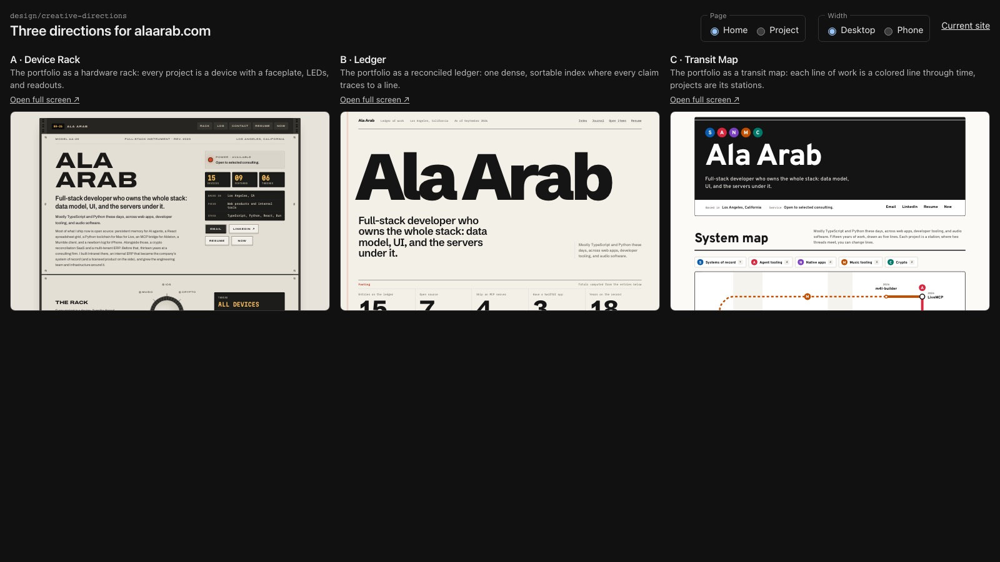
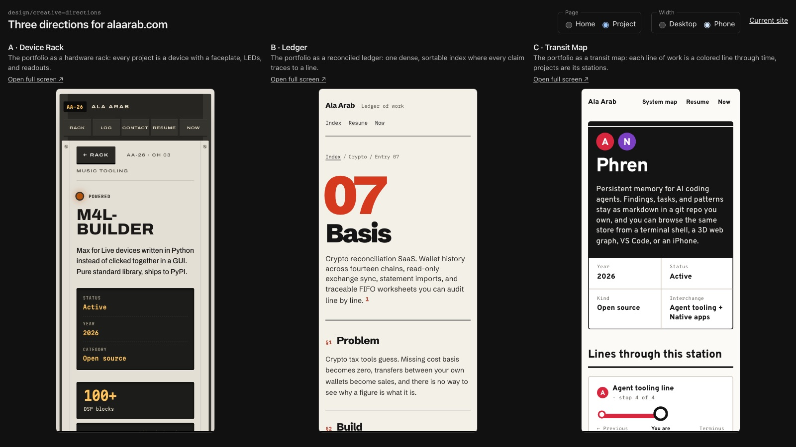

# Design directions for alaarab.com

Branch `design/creative-directions`. Nothing here is on main or deployed.

- [analysis.md](analysis.md): what the current site does, what reads as template, and the bugs found along the way. Screenshots of every live page are in `screenshots/current/`.
- [A · Device Rack](direction-a-rack.md): every project is a hardware device in a rack, with a thread-selector knob that powers one line of work.
- [B · Ledger](direction-b-ledger.md): the portfolio is one reconciled, sortable index on paper, and each project page is a numbered spec sheet.
- [C · Transit Map](direction-c-transit.md): lines of work run through time as a subway map and projects are the stations.

All three render the real content from `src/data/siteContent.ts` and nothing is duplicated. Each builds the home page and every `/projects/<slug>` page.

## Run the prototypes

```bash
bun install
bun run lab
```

- http://localhost:3300/lab shows all three side by side, with toggles for home or project page and desktop or phone width.
- http://localhost:3300/lab/rack and http://localhost:3300/lab/rack/projects/m4l-builder
- http://localhost:3300/lab/ledger and http://localhost:3300/lab/ledger/projects/basis
- http://localhost:3300/lab/transit and http://localhost:3300/lab/transit/projects/phren

`bun run lab` builds once and has no hot reload, so restart it after edits. `PORT=4000 bun run lab` changes the port. `bun run dev` is broken under Bun 1.3.14 on main as well (see analysis.md), which is why the lab uses its own script.




## Recommendation: C · Transit Map, with the Ledger's index as /projects

**Take the Transit Map.** It is the only one of the three that says something true about Ala that a template can't: the work is several threads that keep crossing over fifteen years. Agent tooling meets music at LiveMCP, the ERP line runs from Intranet at ADM to Intrapath today, and iOS runs through Mina, Mutter, and Phren's app. The first screen shows that breadth in one picture instead of nine identical cards. It is also the most readable of the three: light, high contrast, signage type, and a plain text timetable underneath that doubles as the accessible version.

**Borrow from the Ledger** for the parts a map is bad at. Use its sortable index as the `/projects` page and its numbered spec-sheet structure (§1 Problem, §2 Build, §3 Result) inside station pages. The Ledger is the safest direction overall: it scales to any number of projects and suits the dry, exact copy. As a whole site, though, it reads as a very good Swiss-style index more than as *Ala*.

**Why not the Rack as the main site:** it has the most personality and the best interaction (the knob), but it's a costume. Every page has to keep up the hardware metaphor, the home page runs about 6,700 px, the phone first screen is all intro text, and it only really fits the music work. It would make a great `/music` page or a microsite for m4l-builder and LiveMCP.

**Costs and risks of C to plan for:**
- The map is hand-placed. Each new project needs a position and a label spot. Move the line assignments into `siteContent.ts` (a `lines` field per project) so the data drives the lines, but station and label positions still need placing by hand.
- Below 960 px the map is replaced by the vertical timetable. A real vertical map for phones is extra work, and the most likely next step if this direction is chosen.
- Some line assignments are editorial and need your call: Garden Sensor Network on the Music line (through the Processing music game), Retrofit on the Native line (its iPad apps), and OGrid on Agent tooling only through its MCP server.
- The estimate is about 3 to 4 days to production, plus the phone map if you want it.

## Fix regardless of direction

These are in the live site today, and each is small:
1. Production ships React's development build (493 KB, 336 `jsxDEV` calls), and nginx serves it with no gzip.
2. Horizontal scroll on the phone home page (the nav overflows at 390 px), and 26 px tap targets.
3. `--ink-dim` text fails AA contrast (3.98:1).
4. Every project page links to itself as "Project page".
5. `bun run dev` fails under Bun 1.3.14.
6. The repo's CLAUDE.md/AGENTS.md still describes a Next.js site.
