# Almanac

**Concept in one line:** the portfolio is an old sky almanac, a planisphere engraved in cream-gold on soft indigo, and each project is one small star on it.

Prototype: `/lab/almanac` (home) and `/lab/almanac/projects/:slug`. Code in `src/lab/almanac/`.

## Why it fits Ala

- A star chart is a map of separate things that sit in one sky. Ala's work is exactly that: agent tooling, music tools, iOS apps, an ERP that ran for a decade. The chart shows all of it at once without sorting it into categories or making a grid of cards.
- Almanacs are working documents. They were printed to be used at night, by people doing real work (navigation, farming, timekeeping). That suits someone whose projects exist because he needed them himself: Mina at 3 AM, LiveMCP and m4l-builder for his own sessions in Ableton.
- The only lines drawn between stars are real connections in the data: Intranet ERP to Intrapath (its rewrite), LiveMCP to m4l-builder (both Ableton tools), Phren to Atlas (both keep markdown stores for agents). Constellations are how people have always named relationships between points. Here they're earned, not decorative.
- It is the one dark direction, and it answers "a lot softer" by being dusky indigo (the blue of a Ghibli night) rather than the black and neon of the current site.

## References and what is borrowed from each

- **Johann Doppelmayr, _Atlas Coelestis_ (1742)** and **Johann Bode, _Uranographia_ (1801)**. Borrowed: fine engraved lines at one weight, graduated rings with long and short ticks, the small star glyphs whose size stands for magnitude, spaced engraved small capitals for names, and the ornamental title cartouche. Left out: the dense mythological figure drawings, the crowded labels, the hand-coloured washes.
- **The planisphere** (a turning star wheel under a fixed hour ring). Borrowed: a rotating disc with a month ring under a fixed ring of hours, turned very slowly. That is the one motion on the home page.
- **Night scenes in Studio Ghibli films, especially Kazuo Oga's skies in _My Neighbor Totoro_**. Borrowed: the soft, deep, slightly warm blue of a night that is never black; a faint band of haze across the sky (the Milky Way painted as a wash, not an effect); low-contrast atmosphere around the edges. Left out: any characters or anime styling.
- **Letterpress and engraved plates from book design.** Borrowed: plate numbering ("Plate VII"), a double-ruled plate frame, and captions set small beneath the art. Paper grain from feTurbulence at a few percent opacity so the indigo reads as printed ink on stock rather than a screen fill.

## Palette

| Role | Hex | Why |
|---|---|---|
| Ground | `#26304d` | A dusky indigo, like the sky roughly an hour after sunset. Its luminance is about 0.031 (black is 0, pure `#1a1a1a` is about 0.010), so it is clearly blue and clearly lit, not near-black. It sits between Prussian blue and slate, which keeps it soft next to gold. |
| Plane | `#2e3a5c` | A lifted indigo for the chart disc and the plates, so the engraving sits on a slightly lighter "paper" than the page, the way an atlas plate sits on its margin. |
| Deep edge | `#1f2842` | Only at the very edge of the chart, where the atmosphere darkens, and only as a wash. |
| Engraved line | `#e6d6ad` | Cream-gold. Old engraving printed in black on cream; here the relationship is inverted, so the line is the colour of the paper. 9.0:1 on the ground. |
| Text | `#efe6d0` | Warm cream for body copy, 10.5:1 on the ground and 9.0:1 on the plane. Never pure white. |
| Quiet text | `#c9bfa4` | Captions and secondary lines, 7.1:1 on the ground. |
| Rose-gold accent | `#e3a98f` | One warm note: the focused star, the annotation leader, links on hover. 6.4:1 on the ground. It keeps the page from going cold. |

Each project page shifts the ground a few degrees (violet for Phren, bronze for m4l-builder, a lavender dusk for Mina) while keeping the same cream-gold line, so every plate is still from the same atlas.

## Type pairing

- **Cormorant SC** (600) for the small engraved labels: star names on the chart, the hour ring, plate numbers. Spaced small capitals are exactly how engravers lettered star names. I picked it over Cinzel because Cinzel is all-caps Roman inscription lettering and turns into movie-poster type as soon as it is used more than a few times; Cormorant SC has true small-caps proportions and quieter serifs. It is used only for labels of one to three words.
- **Cormorant Garamond** (500, and italic) for display: "Ala Arab" in the cartouche and plate titles. It has the high contrast and fine hairlines of engraved lettering, which matches the gold rules.
- **EB Garamond** (400/500) for body text. Cormorant's hairlines are too thin to read as cream on indigo at 18px; EB Garamond is a text cut with sturdier strokes and a larger x-height, so paragraphs stay comfortable at 19px and a 64-character measure.

## Signature moment

The planisphere turns, about one revolution every half hour, like a star wheel turning through a night. Star names are counter-rotated so they always stay level. Hovering the chart or focusing any star pauses it. Focusing or hovering a star shows a small engraved annotation (a thin rose-gold leader and the project's one-line summary in italic). Under `prefers-reduced-motion` the chart does not move at all.

## How project pages are themed

Every project page is one engraved plate in the same atlas: a numbered plate, a double-ruled frame, one drawing, and the project's text set as prose underneath. The drawing and the ground tint come from the project:

- **Phren**: a constellation made of many small stars (remembered notes) joined by fine lines across sessions; five loose clusters are sessions, and a few arcs join a note to the one that recalls it in a later session. The lines draw in once, over about three seconds.
- **m4l-builder**: an astrolabe. A working knob (an accessible slider) turns the rete, and as it turns the engraved rings of the plate bend into waveforms.
- **Mina**: the moon's phases across one night from 9 PM to 5 AM, with 3 AM marked by a small star. Smallest plate, softest tones.
- **Every other slug** has its own small plate from the `plates` table keyed by slug in `plates.tsx`: Basis is a balance of two scales drawn as a constellation, Intranet ERP a long, steady star trail, Atlas a star whose light is a lighthouse beam, and so on.
- Unknown slug: "No star by that name on this chart", with a way back.

## Deliberately left out

- Any scatter-plot logic. Star positions are hand-placed for composition; they encode nothing, and there is no legend, no axis, no filter.
- Zodiac signs, mythological figures, astrology words, and fake Latin. The decoration is rings, ticks, months, and hours only.
- Glow, bloom, neon, and gradients used as decoration. Stars are engraved glyphs, not light effects. The only blur is the painted haze of the Milky Way.
- Experience timeline and resume detail on the home page. The resume is one link away.
- Monospace anywhere.

## Screenshots

Home, desktop fold (the chart turns slowly; this is its resting composition):

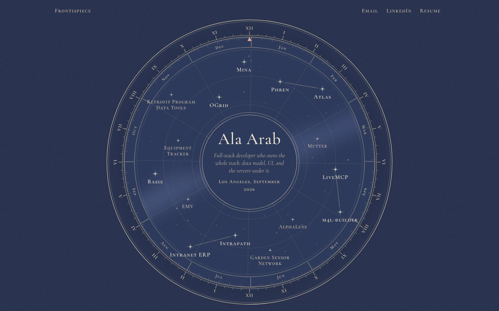

A star focused by keyboard, with its engraved annotation (the chart is paused):

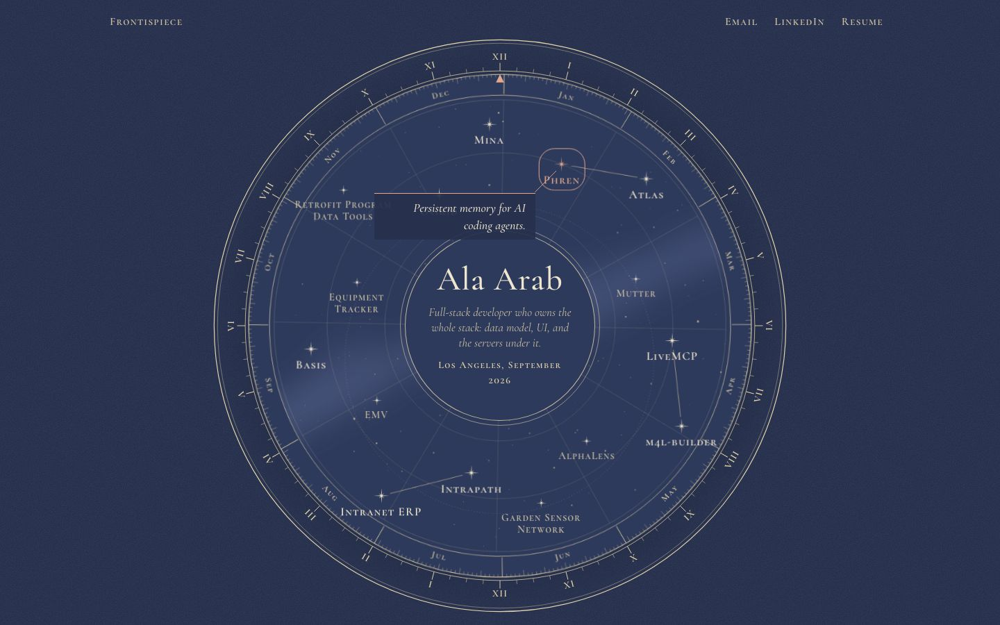

Hover annotation: 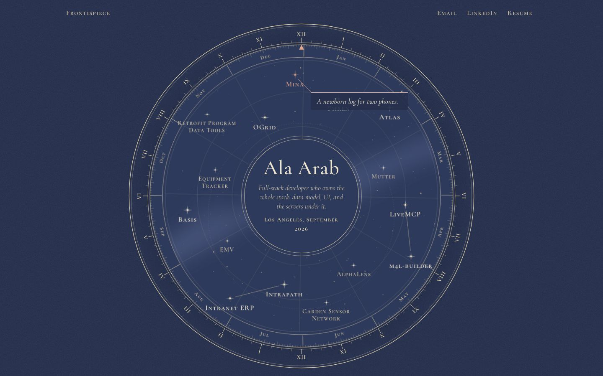

Full home page: 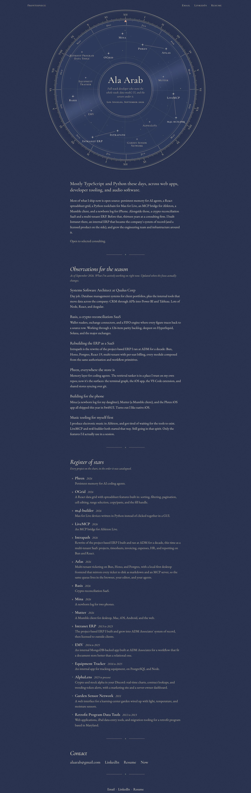

Phone: 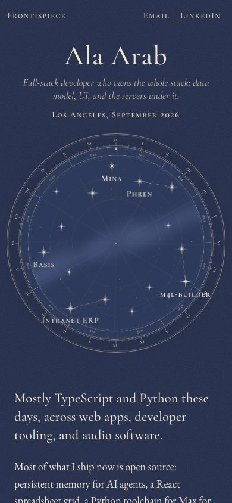 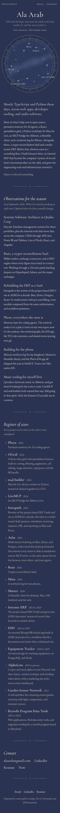

Showcase plates:

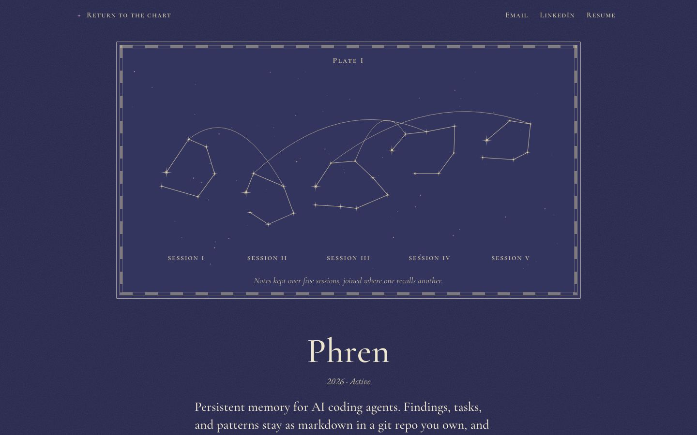
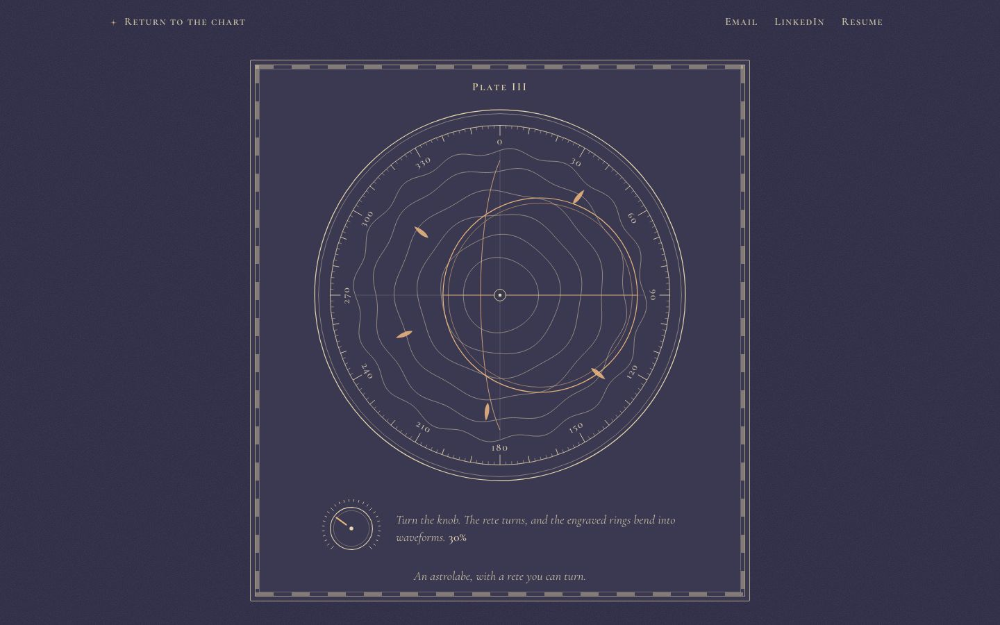
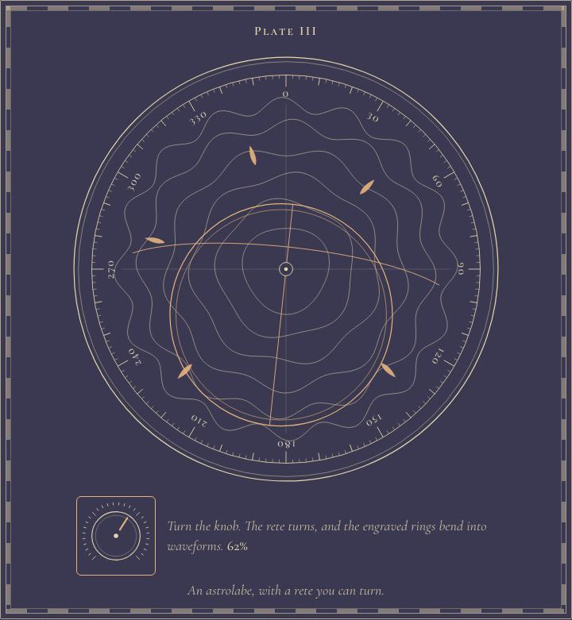
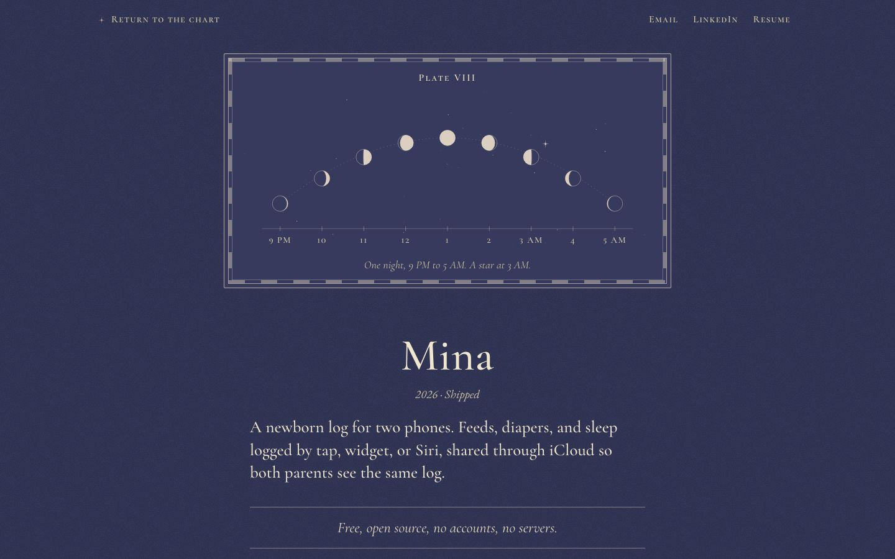
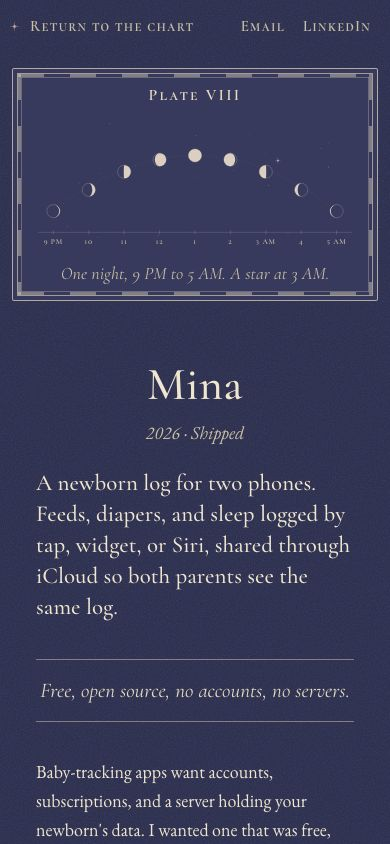

Smaller plates: 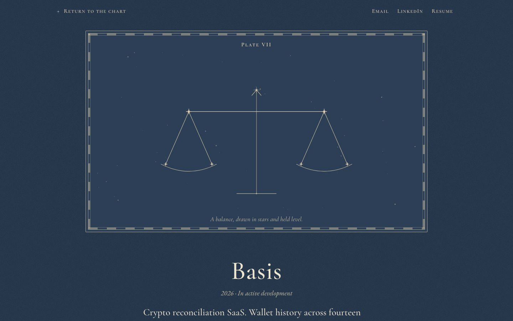 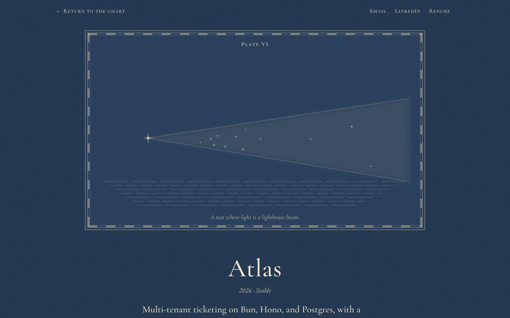 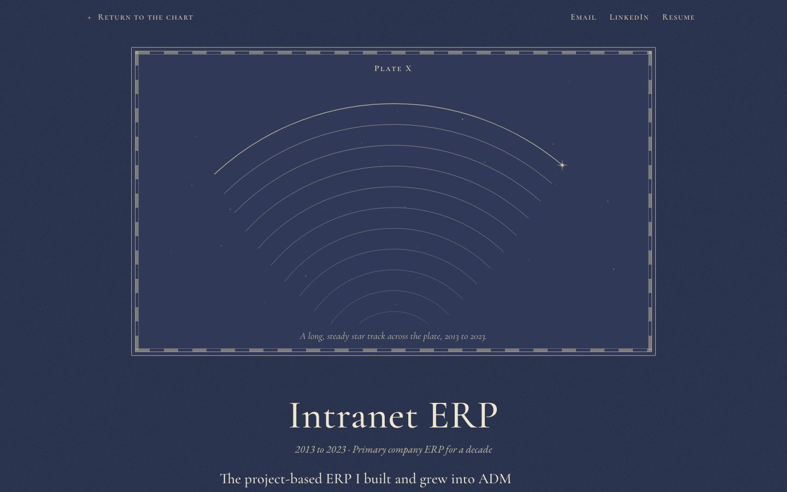

## Critique and changes

**Pass 1.** Would Ala call it busy? The chart itself held up: one idea, one circle, lots of indigo around it. What failed:
- Numerals and month names on the lower half of the rings were upside down ("IIX" for XII). Engravers turn lettering to read upright; I now flip anything in the lower half.
- The title cartouche was a rectangle with a double rule in the middle of a round chart. That was the one "block" on the page. It is now a round medallion with a double ring, which reads as part of the instrument.
- The Milky Way was a single straight blurred stripe, closer to a gradient than a painted wash. It is now eleven overlapping soft ellipses along a gentle curve, like pooled watercolour.
- Garden Sensor Network's label ran into the month ring. Moved inward.
- The Phren plate had no lines at all. Cause: Bun's CSS modules hash `@keyframes` names but leave the `animation` shorthand pointing at the old name, so every animation (including the chart's turn) was silently dead. Keyframes now live in a small `<style>` element rendered by the component.

**Pass 2.**
- Phren's constellation was too small, and its "recall" lines were long straight rules across the plate, which looked like a diagram. The clusters are larger and the four recall lines are now high arcs, like lines drawn across a sky.
- The plates were plain double-ruled rectangles, a web frame with texture on it. They now have the graduated border of an 18th-century atlas plate: a narrow band of alternating filled and open bars between two hairlines. It is the most "printed" detail on the site.
- The mouse-over annotation was a hard rectangle; softened (rounded foot, rose-gold top rule only).
- Home contact links were inline in a sentence and under 44px tall; they are now a short list of 44px targets. Topline "Plate I" clashed with Phren being Plate I; the home is now the "Frontispiece".
- Astrolabe limb numbers on the lower half flipped to read upright.

**Is it subtle? Is it slop?** It is the most restrained of the dark options I can picture: no glow, no gradient, one line weight family, cream on indigo. Everything is drawn from engraving vocabulary (rings, ticks, bars, star glyphs), so it doesn't read as a template with a texture on top. The below-the-chart pages are the weaker part: they're good book typography, but not much more than that. The register is long (15 entries) on a phone.

## Verification

- `tsc --noEmit` passes.
- No horizontal overflow at 390px on home, the three showcase pages, Basis, and the not-found page (scrollWidth = 390).
- No console errors on any checked page.
- One h1 per page.
- Every link and the knob measure at least 44px tall at 390px and 1440px.
- Reduced motion: the disc, the star layer, and the Phren draw-in all have `animation: none`. The chart is measured turning about 0.2° per second otherwise, and it pauses on hover and focus.
- Contrast: body `#efe6d0` on `#26304d` is 10.5:1. Quiet text `#c9bfa4` is at least 5.8:1 on every project's ground and plane. Accents are at least 6.4:1.
- The knob works from the keyboard (arrows, Page Up/Down, Home, End) and by dragging, with `aria-valuenow` and `aria-valuetext`.

## What it would take to ship

- **Effort:** about 2 to 3 days to productionise. That covers moving the plate table into content (or keeping it in code with a fallback plate), prerendering (the chart is pure SVG and CSS, so it prerenders cleanly), removing the lab-only keyframes workaround if Bun fixes the bug, and testing Safari's handling of `cqw` inside rotating layers.
- **Risks:** Label collisions as the chart turns. Names are hand-placed for the resting position, and at some angles two labels come close (Retrofit Program Data Tools is the longest). Pausing on hover makes the annotation readable, but the rotation can briefly bring a label under the medallion. Safari's subpixel text on rotating layers can shimmer; if it does, the turn can drop to a few discrete steps per minute.
- **As projects are added:** each one needs a hand-placed position (an angle and a radius) and its own plate drawing. Around 20 stars the chart gets crowded. At that point older work should become unlabelled faint stars (still in the register), or a second hemisphere plate should hold them. The plate drawings are the real ongoing cost: each is 20 to 60 lines of SVG, and a generic fallback would undo the point of the direction.
