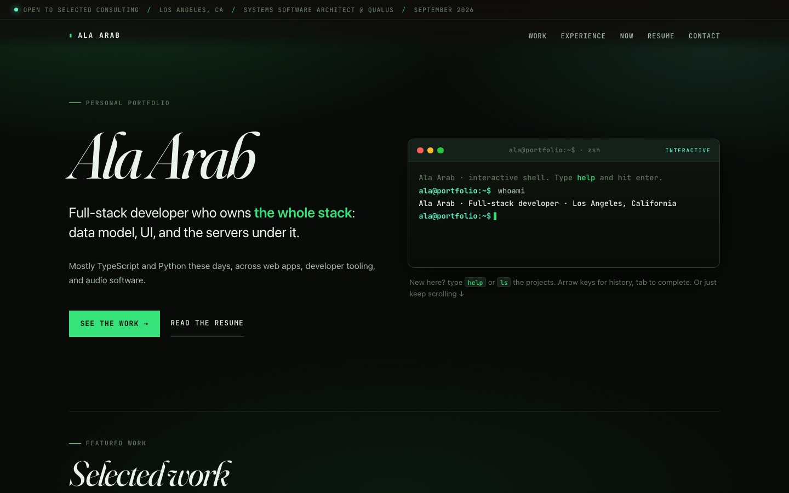
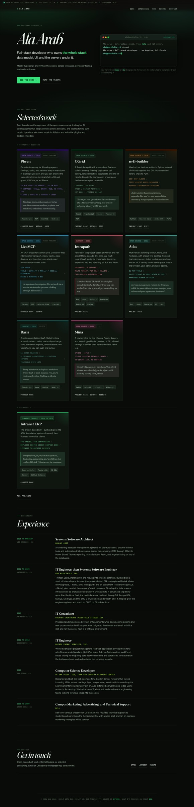
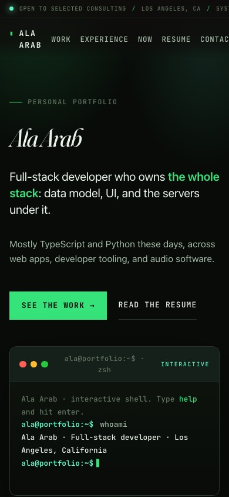

# alaarab.com design analysis

Reviewed 2026-09-26 against the live site (https://alaarab.com, commit `0fc2497`), every URL in its sitemap (home, /projects, /resume, /now, and all 15 `/projects/<slug>` pages), at 1440×900 and 390×844, plus the source in `src/`.

Screenshots of every page are in [`screenshots/current/`](screenshots/current/). `*-fold` is the first viewport and `*-full` is the whole page.

## Verdict

The site is competent and has clearly been through a lot of polish: prerendered HTML, per-page OG cards, a skip link, print styles, and reduced-motion handling. It still looks like a template. Take the name off and you have a "dark developer portfolio" that could belong to anyone who writes TypeScript: near-black background, one neon accent, a fancy serif for headings, uppercase mono labels, a fake terminal, and a grid of bordered cards with tag chips. None of the visual choices say agent tooling, Max for Live, iOS, ERPs, or crypto. The content is specific and good. The design doesn't use it.

The three biggest problems:

1. **Nothing is specific to Ala.** The design has no idea of its own. Terminal plus green is the most common developer-portfolio look there is.
2. **Every project gets the same card.** Fifteen projects over fifteen years, from a newborn log to a 220-tool Ableton bridge, all render as the same bordered box with the same six layers of text. There are no visuals of any product.
3. **The home page is a long flat scroll.** It is 5,960 px tall on desktop and 10,360 px on a phone, with no hierarchy between the work that matters and the work that doesn't.

## First impression

- You read, in order: a status ticker, a mono wordmark, "PERSONAL PORTFOLIO", a 7rem italic "Ala Arab", then a sentence about owning the whole stack. The eyebrow "Personal portfolio" says nothing a visitor doesn't already know.
- The headline "Full-stack developer who owns the whole stack: data model, UI, and the servers under it" is a claim thousands of people make. The interesting facts (an MCP bridge for Ableton, a newborn log on your own phone, an ERP that replaced Deltek, crypto FIFO that never silently zeroes) are all below the fold.
- Half the hero is the terminal, and its visible output is one `whoami` line and about 90 px of empty black. It is fun for people who type into it. Everyone else sees an empty box. On a phone it sits below the fold and takes a full screen of scrolling.
- The first viewport has no project, image, or product.

## Identity and voice

- The copy is good: plain, technical, specific ("Blank USD values stay unresolved; they are never silently assigned a zero cost."). The visual voice doesn't match it. Italic Fraunces is soft, literary, and editorial, while the writing is dry and exact. The terminal and neon green point in a third direction, hacker.
- There are three identities with no link between them: italic serif display, JetBrains Mono uppercase labels, and a pixel font on the OG cards ([`public/og/phren.png`](../../public/og/phren.png)). The social cards look like a different person's site.
- Music, the most distinctive thing about Ala as an engineer, appears only as one sentence in "Selected work" and two cards.

## Typography

- Fraunces italic at `clamp(3.2rem, 8.5vw, 7.4rem)` with `SOFT 100` and −0.045em tracking is the one expressive choice, and it is used for everything: the name, "Selected work", "Experience", "Get in touch", "Overview", "Work", "Result", "Stack", "Next door". Repeated that often, it stops meaning anything.
- The mono uppercase is overused. Nav, eyebrows, pills, metrics, tags, buttons, footer, and the marquee are all 0.7 to 0.8rem JetBrains Mono with 0.06 to 0.14em tracking. Around a dozen different jobs share one style, so the mono carries no signal.
- The body is the system UI stack (`ui-sans-serif, -apple-system, ... Inter`), so the long-form text renders differently on every OS and has no character.
- Project pages set a 90-word "Work" paragraph at about 0.95rem in `--ink-soft` on near-black, in a half-width column next to a 20-word "Overview". The story-card grid leaves large empty holes ([Phren, full page](screenshots/current/projects_phren-desktop-full.jpg)).

## Color

- The palette is `#080b08` background, `#36e27a` neon green accent, and green-tinted greys, plus two radial green glows and an SVG noise overlay. This is the stock dark portfolio.
- Per-project `accent` colors exist in the data (Phren purple, OGrid Excel green, m4l-builder amber). On the home page they show up only as a 4 px top border and a pill tint. On the project page they tint the quote bar and the related cards, but the page is still green on black. The best color data in the content module goes almost unused.
- The theme meta is `#0e0c0a`, a warm brown-black left over from an earlier palette, while the page is green-black. The header gradient also still uses `rgba(14, 12, 10, …)`.
- **Contrast failure:** `--ink-dim` `#62755f` on `#080b08` is 3.98:1, and on the card surface `#0f150f` it is 3.73:1. That fails WCAG AA (4.5:1) for all the small text it's used on: eyebrows, timeline meta, the terminal tip, stat labels, pills.

## Layout and rhythm

- The home page is ticker → hero → "Selected work" (a 3-column card grid, split into "Currently building" and "Previously") → "Experience" (six long timeline entries) → "Get in touch". Every section uses the same eyebrow plus italic heading plus body layout at the same width. There are no changes of pace, no full-bleed moments, and no density changes.
- "Selected work" shows 9 of 15 projects as featured, so the selection isn't selective. "Previously" holds a single card orphaned on a 3-column grid.
- Each card stacks six layers: pills, title, summary, metrics row, italic outcome box, tag chips, links. Every card is about 400 px tall no matter how much there is to say. EMV (two sentences of content) and Phren (a seven-surface monorepo) get the same space.
- **/projects** groups by `category`, which has six inconsistent values: "Open source", "Flagship product", "Current", "Client work", "Legacy case study", "Product". Intrapath and Basis ("Current") sit apart from the other 2026 work, and AlphaLens ("Product") ends up last, after 2011 work ([projects, full page](screenshots/current/projects-desktop-full.jpg)).
- **/resume** repeats every project summary in full after the experience section, making it 5,419 px, which is long for a resume ([resume, full page](screenshots/current/resume-desktop-full.jpg)).
- **/now** has large dead gaps between each heading and its body, and two stacked rules under the header ([now](screenshots/current/now-desktop-fold.jpg)).
- Project pages have no images, although `public/og/<slug>.png` exists for all 15 and several projects (Phren's 3D graph, OGrid, Mina, Mutter) are very visual products.
- Every project page shows a "Project page" link that points to itself (it comes from `project.links`). Intranet ERP, Intrapath, Basis, EMV, and Equipment Tracker have no other link, so their only call to action goes nowhere.

## Motion

- Motion is limited to a pulsing status dot, an underline sweep on nav hover, and hover transitions on cards. Reduced motion is honored. Nothing moves in a way that says anything about the work. For someone who builds audio devices and live graphs, the site is static.

## Navigation

- The home nav mixes in-page anchors (Work, Experience, Contact) with routes (Now, Resume). The other pages drop the header completely and use three underlined text links ("Portfolio / All projects / Resume"), so the site has two navigation systems.
- There's no persistent way home from deep pages except those small links, and no next/previous between projects. "Next door" related cards are the only way across.

## Mobile (390 px)

- **The home page scrolls horizontally.** The nav overflows the viewport ("Contact" runs to x=399 on a 390 px screen and gets clipped), and the marquee also overruns. `scrollWidth > innerWidth` on the home page only.
- The wordmark wraps to two lines ("ALA / ARAB") to make room for a five-item nav that doesn't fit.
- Nav tap targets are 26 px tall, below the 44 px guideline.
- The home page is 10,360 px, about twelve screens of scrolling, with the terminal taking a full screen before any work shows.
- Project pages work on a phone but are long: the facts row, a self-linking "Project page" button, then four serif section headings in sequence ([EMV, phone](screenshots/current/projects_emv-phone-fold.jpg)).

## Accessibility

What's good: a skip link, `:focus-visible` outlines, `prefers-reduced-motion`, semantic headings, real links, print styles, and the terminal's intro rendered server-side.

What fails or needs work:
- AA contrast on `--ink-dim` small text, as above.
- 26 px nav targets on a phone, and horizontal scroll on the home page.
- Project status is conveyed partly by pill color.
- The terminal input has an `aria-label`, but its instructions live in a separate paragraph below it that isn't tied to it with `aria-describedby`.
- The whole home page is one `main` with repeated "eyebrow + h2" patterns, which is fine structurally but gives a screen reader nothing to skim except "Featured work, Selected work, Currently building…".

## Performance

- **Production is shipping React's development build.** The live bundle `/index-7gt87gm5.js` is 492,786 bytes and contains 336 `jsxDEV` calls and the DevTools hooks. The likely cause is `bun build ./index.html --minify` without `--production` (or `NODE_ENV=production`) in `package.json`.
- **No compression:** nginx serves that bundle with no `content-encoding`. Gzipped it would be 149 KB, and a production React build would be far smaller.
- About 180 KB of web fonts (two families with variable axes) plus a preloaded Google Fonts CSS.
- A fixed full-screen SVG `feTurbulence` noise overlay with `mix-blend-mode: overlay`, and a sticky header with `backdrop-filter: blur(14px)`, both repaint on scroll on low-end phones.
- Good: pages are prerendered, so first paint doesn't wait on JS. The document is about 20 KB and loads in about 0.6 s.

These two issues (dev build and no gzip) are real production bugs, not design questions. They're out of scope for this branch, but they are quick fixes and deserve their own task.

## What reads as generic template, in one list

- Dark background with a single neon accent and radial glows.
- A decorative italic serif for headings plus mono uppercase "eyebrow" labels over every section.
- A fake macOS terminal with traffic lights in the hero.
- A status ticker with a pulsing green dot ("Open to selected consulting").
- A 3-column grid of identical bordered cards with pill badges and tag chips.
- Primary and secondary CTA buttons, "See the work" and "Read the resume".
- A vertical experience timeline with date column on the left.
- "Get in touch" closing section with three links.
- A footer that says what the site is built with.

## What to keep

- The content module and the way pages render from it. All three prototypes run off it unchanged.
- The copy voice: direct, specific, technical.
- Per-project accent colors, which deserve a real role.
- Prerendering, per-route OG cards, skip link, print styles, and reduced-motion support.

## Where to go

Round 1 tried three information-dense directions (see [round-1/](round-1/)). They were rejected as busy and blocky. Round 2 has ten soft, painted, bookish directions; see [README.md](README.md) for the list, how to run them (`bun run lab`, then http://localhost:3300/lab), and a ranking.
