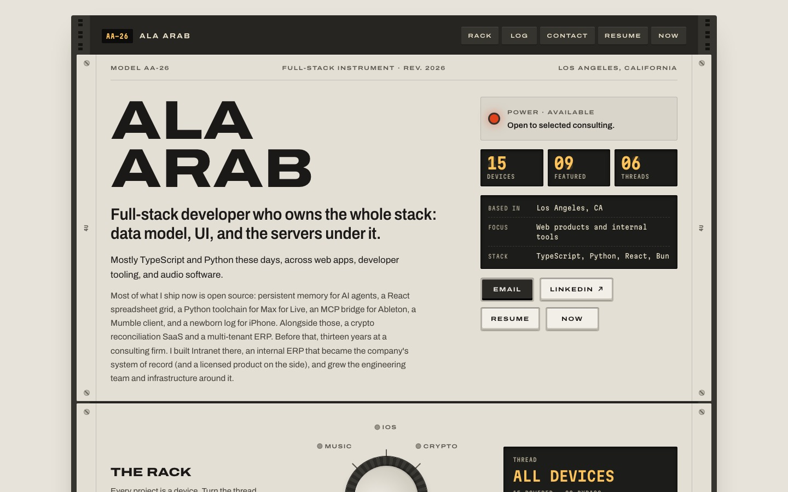
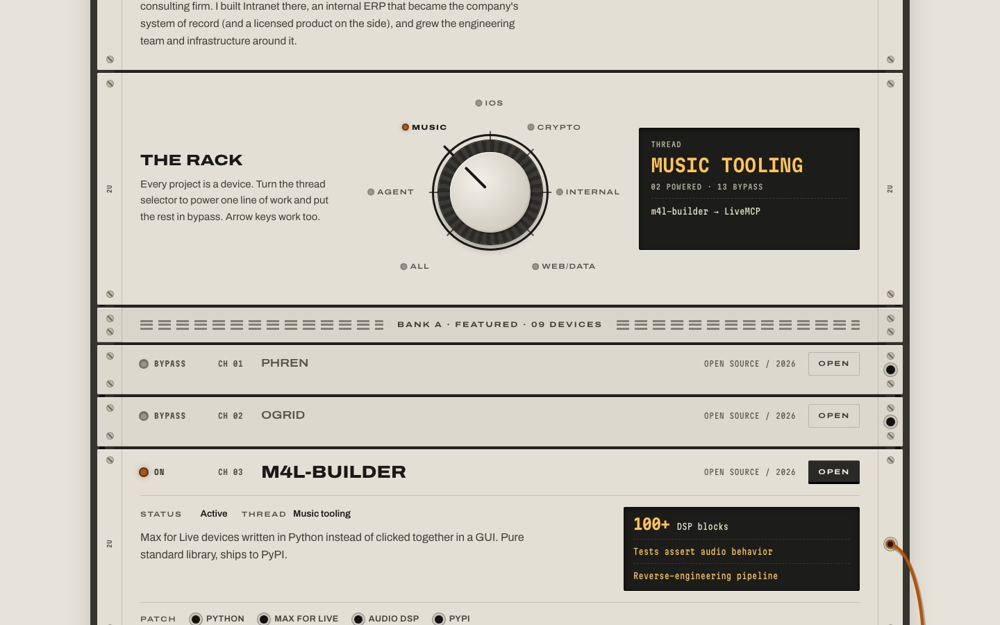
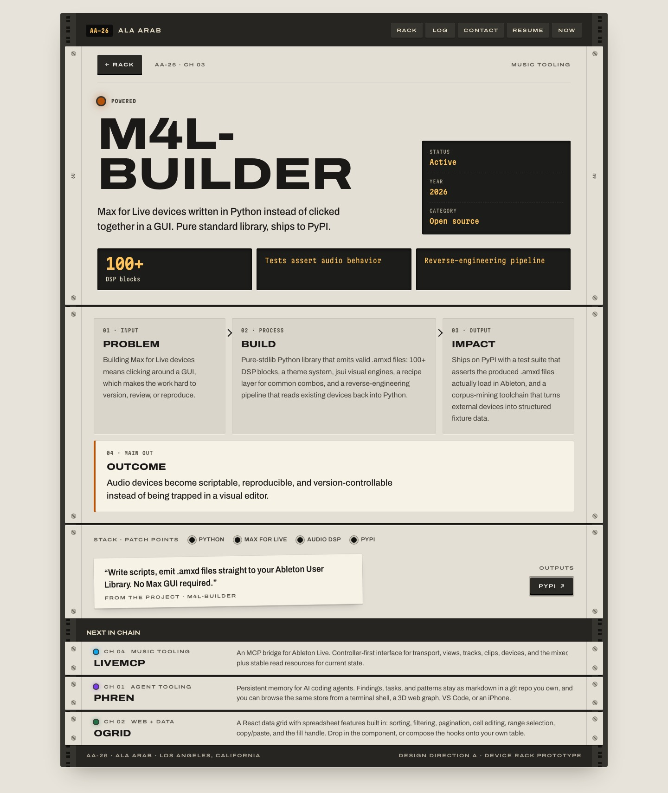
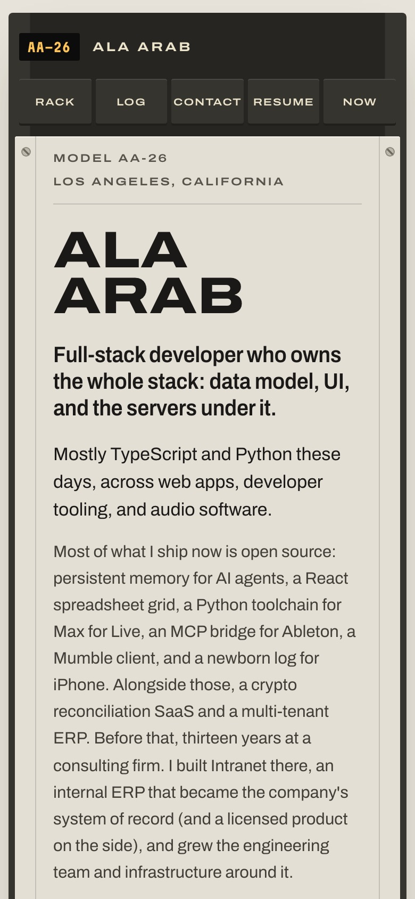
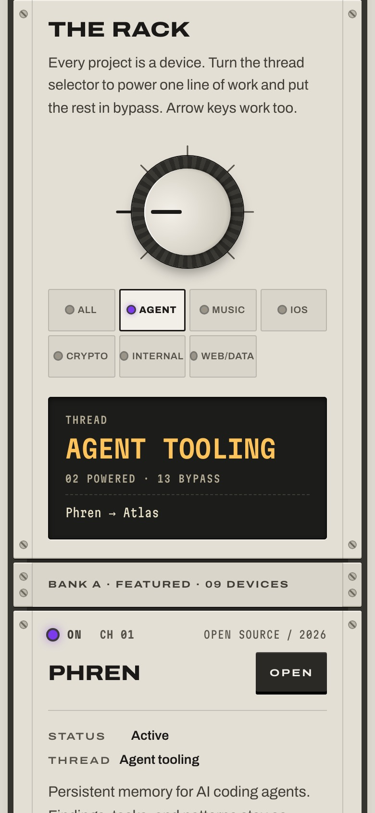

# Direction A · Device Rack

Prototype routes: `/lab/rack` and `/lab/rack/projects/:slug`. Code lives in `src/lab/rack/`.

## Concept

The portfolio is a hardware rack, and every project is a device mounted in it.

## Why it fits Ala

Ala builds instruments and tools: Max for Live devices, an MCP bridge that turns Ableton into a control surface, agent tooling, iOS apps, internal ERPs. A rack of devices is how a producer already thinks about a signal chain, and the "maker of devices" framing carries over to the non-music work without strain. A ticketing system or a FIFO engine reads fine as a unit with a status LED and a few readouts. It also avoids the résumé-template look completely: no card grid, no hero with a portrait, no eyebrow over an italic heading.

## Type

- **Archivo** (variable, `wdth` 62 to 125). Expanded 125% width, heavy weight, all caps for the name, device titles and silkscreen labels. Normal width for body copy, and slightly condensed (92%) for the descriptor line.
- **Martian Mono** (variable, `wdth` 75 to 112.5). Condensed to 75% to 87% for every LCD: counters, readouts, years, status. Numeric counters show faint "88" ghost segments behind the digits, so they read as a segment display without using a novelty font.
- Scale: name at 46 to 100px, device titles at 25px (2U) and 18px (1U), body at 15.5 to 16px, silkscreen at 10.5px with 0.14em tracking.

## Color

Light faceplates in a charcoal rack. Project accents are used only for LEDs, patch cables, the knob detent dot, and a 4px bar on the project page's outcome panel.

| Token | Hex | Use |
| --- | --- | --- |
| `--wall` | `#e7e3da` | page background around the rack |
| `--frame` / `--frame-2` | `#262521` / `#36342f` | rack frame and rails |
| `--hole` | `#121210` | rail holes, jack sockets |
| `--plate` | `#e3dfd5` | powered faceplate |
| `--plate-2` | `#d9d5ca` | recessed panels, blank plates |
| `--plate-bypass` | `#dcd8ce` | bypassed faceplate |
| `--paper` | `#f6f2e6` | quote sticker, outcome panel |
| `--ink` / `--ink-2` / `--ink-3` | `#1a1917` / `#413e37` / `#57534b` | silkscreen and text |
| `--lcd` | `#1c1d1a` | display windows |
| `--lcd-ink` / `--lcd-soft` / `--lcd-dim` | `#ffc35c` / `#ece3cb` / `#b7ae97` | LCD values, text, labels |
| `--power` | `#e0431b` | master power LED |

Projects without a brand color (Intranet ERP, Garden Sensor Network, Retrofit) fall back to a classic red LED, `#d9481c`.

## Layout

- **Nav strip**: part of the rack frame. Model plate `AA-26`, name, and hardware keys (Rack, Log, Contact, Resume, Now).
- **Master device (4U)**: the name as a silkscreened model name, `siteMeta.title` as the descriptor, then intro and summary. On the right side: a lit power LED with the availability line, three LCD counters (15 devices, 9 featured, 6 threads), the quick stats in an LCD list, and contact buttons.
- **Thread selector (2U)**: section heading, the knob, and an LCD that shows the current thread, powered and bypass counts, and the powered devices in chain order.
- **The rack**: a blank "Bank A · Featured" plate, 9 featured devices at 2U, a "Bank B · More work" plate, then 6 more at 1U. The order follows the content file.
- **Signal log (archive rack)**: experience and education as patch-bay rows, each with its years in an LCD chip, a jack (the current job's jack is lit), then company, role, location, and summary.
- **Contact ("Patch in")**: email in an LCD strip with a blinking LED, plus hardware buttons.

## Signature interaction

The thread selector knob has seven detents: All, Agent, Music, iOS, Crypto, Internal, Web/Data. Agent, Music, iOS and Crypto come from `project.thread`. The rest is a small derived mapping in `rackData.ts`: Intranet ERP, Intrapath, EMV and Equipment Tracker are "Internal systems"; OGrid, Garden Sensor Network and Retrofit are "Web + data"; Mutter joins iOS (the /now page groups it with the phone work); AlphaLens joins Crypto.

Turning the knob powers the matching devices and puts the rest in bypass. Bypassed devices collapse to a single row: LED off, "Bypass" printed next to it, a flatter plate, and a smaller title. They stay clickable.

- It is `role="slider"` with `aria-valuetext` ("Music tooling, 2 of 15 devices powered"). Arrow keys step it, Page Up and Page Down jump two, and Home and End go to the ends.
- Dragging or clicking on the knob snaps it to the nearest detent by angle.
- Every detent label is a real `<button aria-pressed>` placed around the dial.
- The selection is mirrored to `?thread=music`, so a filtered rack can be linked.
- On wide screens (≥1321px), SVG patch cables in the thread's color run between consecutive powered devices of the same thread. They hang outside the rack's right rail. With "All" selected, every thread gets its own cable.

## How projects are shown

On the home rack, each device has an LED and On/Bypass label, a channel number, the silkscreened title (which is the link), category and year, and an Open button. Powered devices also show status and thread, the summary, metrics in one LCD window, and the stack as a row of labeled jacks. Metrics that start with a number ("100+ DSP blocks") are split, so the number reads as the big LCD value.

The project page is the device "opened up":

- A 6U faceplate with the big LED, the title at display size, the summary, and an LCD panel with status, year, and category. Metrics sit in separate LCD panels.
- A signal-flow plate: 01 Input (problem), 02 Process (build), 03 Output (impact), with arrows between them, then 04 Main out (outcome) as a paper strip with the LED-color bar.
- A back panel with the stack as patch points, the quote as a slightly rotated printed sticker (when there is one), and links as hardware buttons. The link back to the old `/projects/<slug>` page is skipped.
- "Next in chain": up to three 1U mini devices, same thread first, then same category.
- An unknown slug shows a "No device in this slot" plate with a blinking red LED and a back button.

## Mobile

The rack ears shrink to 20px, the rail holes disappear, and every device goes full width with its head row stacked (LED, channel and meta on one line, then title and Open). The knob stays a knob, but the detents become a 4-column grid of 44px buttons below it. The nav keys become a 5-column row of 44px keys. Cables are hidden. No horizontal scroll at 390px on the home page or on any of the 15 project pages.

## Accessibility notes

- Landmarks: `nav`, `header`, `main`, `section`s with headings, and `footer`. One `h1` per page. Device titles are `h3` under the "The rack" `h2`.
- Skip link to the rack.
- LED state is never color alone: every LED has a printed "On", "Bypass", "Powered" or "No signal" label, and the status text sits next to it.
- Contrast: body `#413e37` on `#e3dfd5` is about 7:1. The smallest silkscreen labels (`#57534b`) are about 5:1 on the powered plate and about 5.3:1 on the bypass plate. LCD text is well above 7:1.
- Focus: a 2px ink outline on plates and an amber outline on the dark frame. The knob gets a round ring.
- The knob announces its value through `aria-valuetext`, and the thread LCD is `aria-live="polite"`, so the powered count is announced.
- Reduced motion turns off the knob's spring, the LED blink, and the cable draw-in.
- The row "Open" button is `aria-hidden` and taken out of the tab order, because the title link already goes to the same place. That avoids a duplicate tab stop.

## What it would take to ship

- **Effort**: moderate, about 2 to 3 days to bring it to production quality. The prototype already renders all real content. What's left is moving the thread mapping into `siteContent.ts` (a `group` field or a fuller `thread` on every project), prerender support for `/`, `/projects/:slug`, and the query-param state, and folding /now and /resume into the same visual system instead of linking out to the old style.
- **Risks**:
  - The metaphor can get cute fast. Extra knobs, VU meters, or fake screws everywhere would turn it into a theme park. Keep it to one real control.
  - The rack is long: 15 devices at full size is about 6,700px on desktop. The knob and the 1U bypass state help, but a production version might start with non-featured devices already collapsed.
  - The cables depend on layout measurement (ResizeObserver) and only show on wide screens, so they are decoration, not information.
  - Archivo's expanded width makes long titles wrap early on phone ("Retrofit Program Data Tools" takes three lines). This is acceptable, but copy should stay short.
  - Several accents (OGrid's green, the Crypto teal) sit close to each other as LEDs. That's fine because they are always labeled.
- **Dev note**: while I built this, the shared Bun dev server's HMR bundle was dropping every CSS-module import (`import_Terminal_module is not defined`). `bun build` was fine, so screenshots were taken from a static `Bun.build` of `index.html`.
