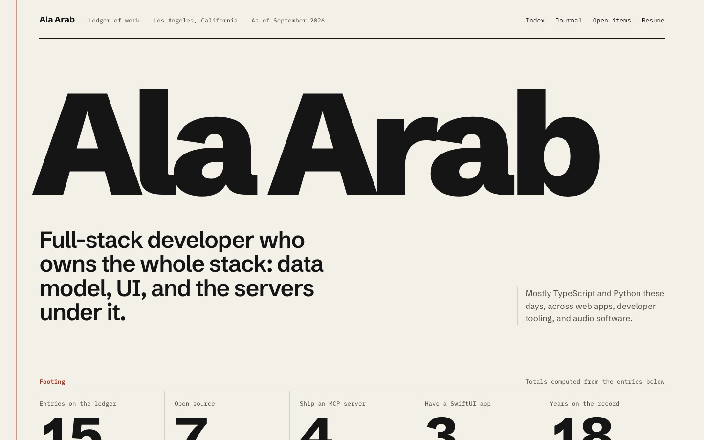
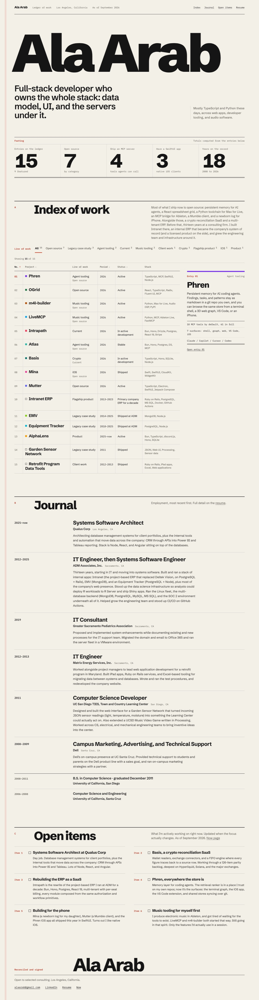
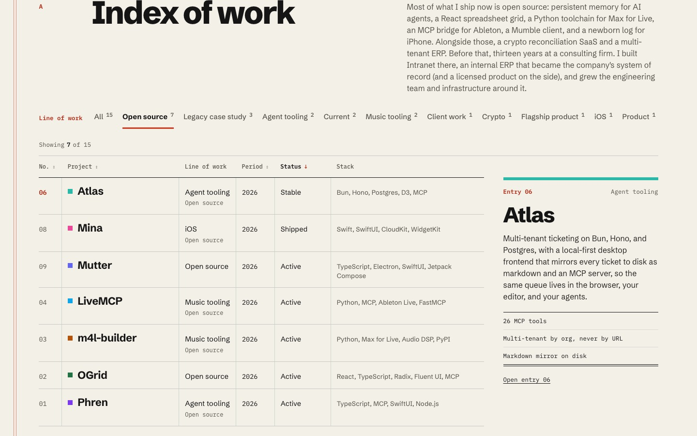
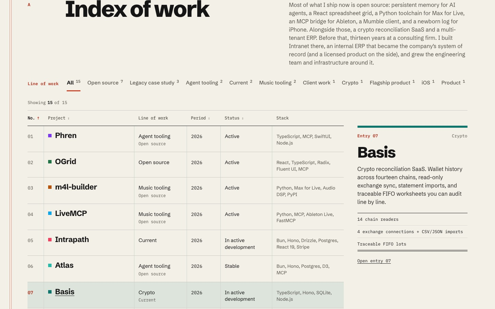
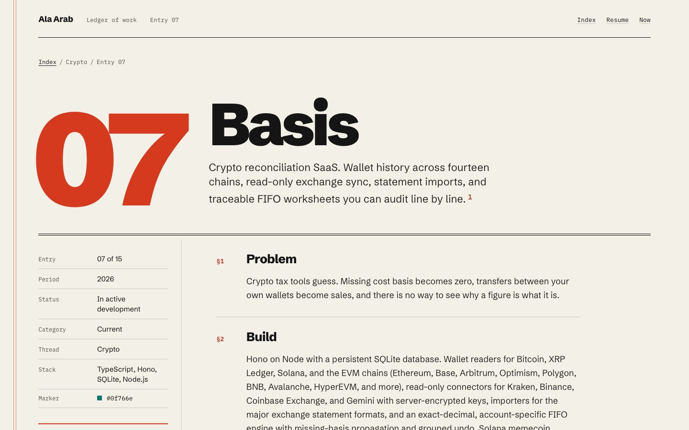
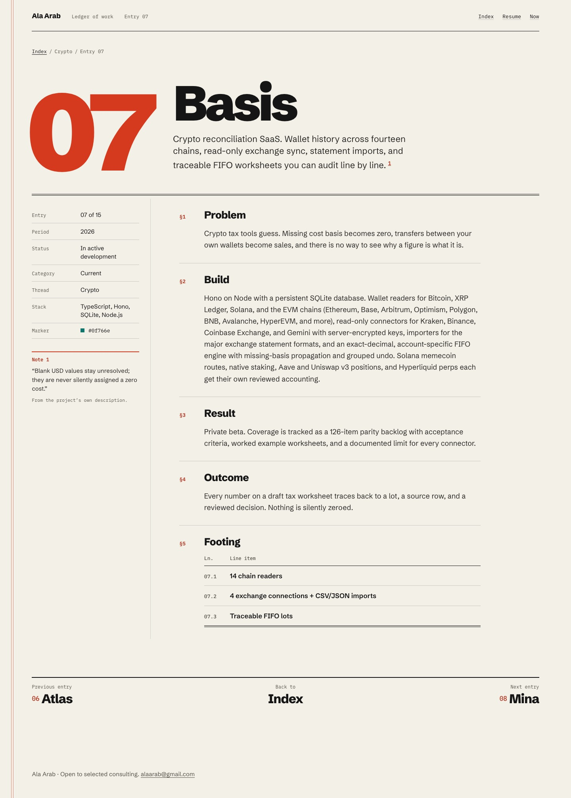
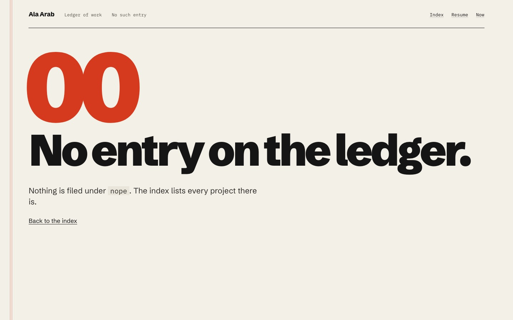
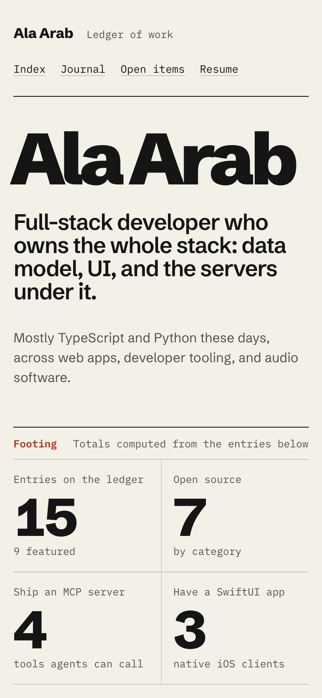
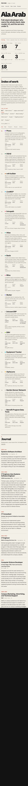
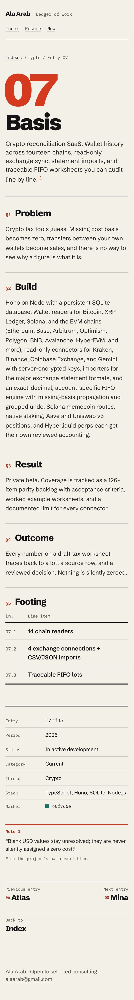

# Direction B · Ledger

Prototype routes: `/lab/ledger` and `/lab/ledger/projects/:slug`. Code lives in `src/lab/ledger/`.

## Concept

The portfolio is a reconciled ledger: one dense, sortable index where every claim traces to a line.

## Why it fits Ala

Ala's work keeps coming back to systems of record. Intranet ran a consulting firm's books for a decade. Basis is pitched on "every number traces back to a source row". Phren and Atlas keep plain-text records that agents can read. So the site is built as a book of account instead of a gallery. The totals at the top are computed from the entries below, each project is a numbered entry, and each entry page reads like a spec sheet. The personality comes from being exact.

## Type

- **Schibsted Grotesk** (400 to 900) for display and body. It is a sturdy news grotesk with more character than Inter at heavy weights. The name is set at 900 with tight tracking (-0.065em) and fills the page width. Section titles and entry titles use 800 to 900 with negative tracking.
- **IBM Plex Mono** (400 to 600) for column heads, entry numbers, labels, periods, figure notes and metrics. It is set in sentence case, never uppercase, so it reads as ledger annotation rather than the current site's eyebrows.
- Tabular lining numerals only on figures, entry numbers and periods. Grotesk prose keeps proportional punctuation, because Schibsted's `tnum` also widens commas and periods.

## Color

| Token | Hex | Use |
|---|---|---|
| `--paper` | `#f3f0e8` | Page |
| `--paper-deep` | `#e9e5da` | Inline code |
| `--ink` | `#151515` | Text, heavy rules |
| `--ink-body` | `#2a2926` | Long-form body text |
| `--ink-2` | `#55524a` | Secondary text (6.3:1 on paper) |
| `--rule` | `rgba(21,21,21,.18)` | Hairline row rules |
| `--col-rule` | `rgba(70,104,90,.20)` | Faint green-grey column rules |
| `--red` | `#d63a1e` | Vermilion: large entry numbers, margin rule, underlines (4.1:1, large text only) |
| `--red-ink` | `#b3301a` | Vermilion for small text and focus rings (5.3:1) |

Each project's own `accent` appears only as a 10px square swatch in its row, as a 10% tint on the hovered row, and as the top bar of the preview pane. There are no gradients and no shadows. A red double vertical rule runs down the left margin, like accounting paper; it is hidden on phones.

## Layout

Home, top to bottom:

1. **Masthead.** Name, "Ledger of work", location, "As of September 2026", and plain underlined nav, all on one hairline.
2. **Statement.** The name very large, `siteMeta.title` as the statement at around 50px, and the intro set off to the right against a column rule.
3. **Footing.** Five derived totals, each with a label and a note, closed by a double rule: entries (15, 9 featured), open source (7), projects that ship an MCP server (4), projects with a SwiftUI app (3), and years on the record (18, from 2008 to 2026, taken from the experience data and the Now date). None of these numbers are typed in by hand.
4. **A · Index of work.** `siteMeta.summary` as the section note, a filter row, a live count, and one real `<table>`: No. / Project / Line of work / Period / Status / Stack. From 1180px up, a sticky preview pane on the right shows the hovered or focused entry's summary and metrics.
5. **B · Journal.** Employment as dated entries with a hanging years column, then education as smaller entries under a heavier rule.
6. **C · Open items.** `nowItems` as a two-column checklist with empty boxes and item numbers.
7. **Sign-off.** "Reconciled and signed" above the name on a signature line, followed by availability and contact links (email, LinkedIn, the current /resume and /now).

Sections are headed by a 2px rule, a mono letter (A, B, C), a heavy grotesk title and a note in the right columns. This replaces the eyebrow and italic heading pattern.

## Signature interaction

The index sorts and filters in place.

- **Sort.** No., Project, Period and Status headers are real `<button>`s inside `<th>` with `aria-sort`. Clicking the active column again flips its direction. Period sorts on the parsed start year, so "2013 to 2023" sorts correctly against "2026".
- **Filter.** Filtering is by line of work. The filter row lists every thread and category with its count (Open source 7, Legacy case study 3, Agent tooling 2, and so on). An entry matches through either its thread or its category, which keeps the filter counts in line with the footing totals. The buttons use `aria-pressed`.
- **Motion.** Rows move to their new positions with FLIP on the Web Animations API. Positions are captured just before the state change and animated in a layout effect. Rows that newly appear fade in. All of this is skipped under `prefers-reduced-motion`.
- **Count.** "Showing 7 of 15" sits in an `aria-live="polite"` region.

## How projects are shown

On the index, each project is a numbered row. The title link is stretched over the whole row, so a click or tap anywhere on the row opens the entry, while there is still only one link per row for keyboard and screen reader users. The Line of work column shows the thread, with the category in small mono under it.

The entry page is a spec sheet:

- A huge vermilion entry number beside the title, with the summary as a lede and a closing double rule.
- A left margin column with facts in a definition list: entry "07 of 15", period, status, category, thread, stack as a comma list, and the accent hex as a "marker".
- References as plain underlined links with their host. The link that points back to `/projects/<slug>` is dropped.
- The quote as **Note 1**, a marginal footnote linked from a superscript in the lede.
- The body as numbered clauses: §1 Problem, §2 Build, §3 Result (`impact`), §4 Outcome, and §5 Footing, a small table of the metrics numbered 07.1, 07.2 and so on, closed by a double rule.
- Previous and next entries in index order, and a link back to the index.
- An unknown slug renders entry "00: No entry on the ledger." with a link back.

## Mobile

- **1179px and below.** The preview pane goes away and each summary shows inline under the project title.
- **1000px and below.** The Stack column is hidden, the footing becomes 3 plus 2 cells, and the entry page's margin column moves under the body.
- **720px and below.** The table turns into stacked blocks, each laid out as a CSS grid: the number on the left, then the title and summary, a row of Line / Period / Status with mono labels, and then the stack. The sortable headers stay in view as a "Sort" row of buttons, and the headers that can't sort are hidden. Every tap target measures at least 44px, apart from links inside running prose. At 390px, `scrollWidth` equals `innerWidth` on the home page and on all 15 entry pages.

## Accessibility notes

- **Structure.** Landmarks are header, main, footer and nav. Each page has one `h1`, and there is a skip link to the index.
- **Tables.** The index is a real table with a visually hidden caption. The metrics footing is also a real table.
- **Focus.** Focus rings are 2px `#b3301a`. When a row's link has focus, the whole row gets the ring (`:has()`) and the row is tinted, as it is on hover.
- **Contrast.** Body text is at least 6.3:1 on paper. Small vermilion text uses the darker `#b3301a`, and bright `#d63a1e` is used only at large display sizes and for rules.
- **Color is never the only signal.** Accent swatches are decorative, and projects without an accent get a hollow square. The active sort shows an arrow and a heavier weight. The active filter shows a heavier weight and an underline, plus `aria-pressed`.
- **Screen readers.** The preview pane is `aria-hidden`, since it repeats the row. Screen readers get the summary from a visually hidden span inside the row.
- **Motion.** `prefers-reduced-motion` turns off the FLIP animation and the hover transitions.

## What it would take to ship

This is about 2 to 3 days of work on top of the prototype.

- **Move into the real routes.** Replace `src/pages/Home.tsx` and `ProjectDetail.tsx`, and restyle `/resume` and `/now` in the same system. Resume is nearly free, because the journal already is one.
- **Prerender.** The lab routes are not prerendered yet. Once they are, the table reads fine without JS, because it renders in catalog order. Sort and filter state is not in the URL. Adding `?sort=period&line=Crypto` would make filtered views linkable, and would be about half a day.
- **Line of work taxonomy.** This is the main content risk. Threads exist on only 6 of the 15 projects, so the filter mixes threads and categories. That is honest to the data, but a little uneven. The cleanest fix is to give every project a `thread` in `siteContent.ts`.
- **Footing figures.** These are derived with simple rules: a stack contains "MCP" or "SwiftUI", category is "Open source", and years are parsed from strings. If the content changes shape (for example a year written as "2025-26"), the parsers need a test.
- **Fonts.** Two Google families at 9 weights in total. Trim to the weights actually used, and self-host for production.
- **Dev server.** `bun --hot` currently fails on every route with `import_Terminal_module is not defined`, because `Terminal.tsx` uses its CSS-module import at the top level, which Bun 1.3.14's dev bundler breaks. Run the prototype with `bun run lab` and open http://localhost:3300/lab/ledger.
