# Direction C · Transit Map

Prototype: `/lab/transit` and `/lab/transit/projects/:slug`. Source: `src/lab/transit/`.

## Concept

The portfolio as a transit map: each line of work is a colored line running through time, projects are its stations, and a project on two lines is an interchange.

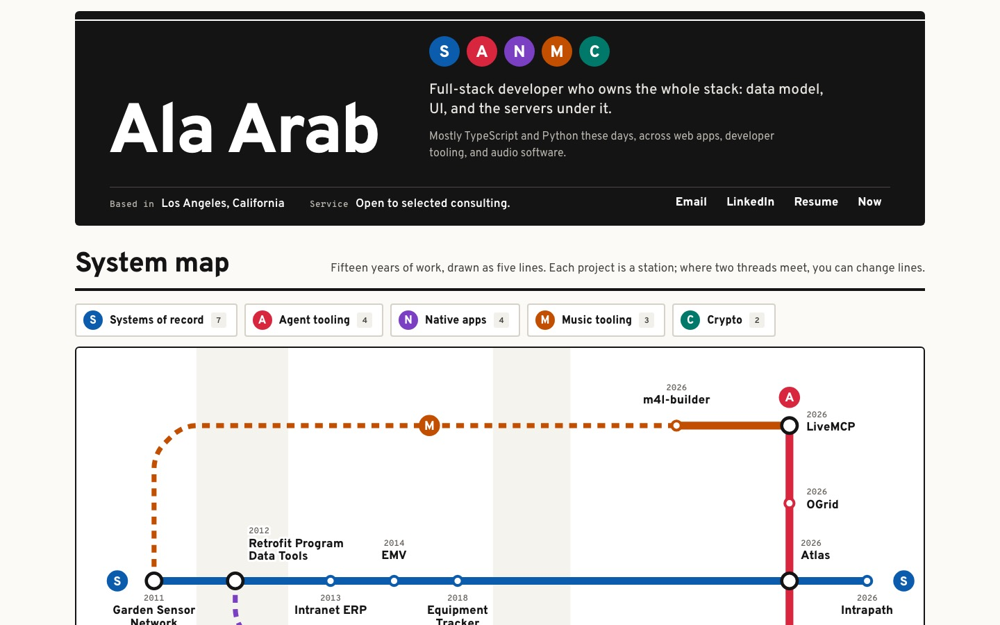

## Why it fits Ala

The work is not one career track. It is several threads that keep crossing. LiveMCP sits where agent tooling meets music tooling. The ERP line runs from Intranet at ADM (2013) to Intrapath today. The native line starts with iPad field apps in 2012 and picks up again with Mina, Mutter, and the Phren iOS app. A card grid flattens all of that into a stack of equal boxes. A map shows 15 years and 15 projects on one screen, and the crossings are the interesting part.

It also suits someone who builds systems. A transit diagram is a data model drawn carefully: nodes, edges, a legend, and rules for where things go.

## Type

- **Overpass** (Google Fonts), weights 500 to 800. It comes from Highway Gothic, the US road-sign face, so it reads as wayfinding without imitating any real transit authority's type. Bold, tight display for the name (up to 136px) and station names; 17px body.
- **Overpass Mono** for years, codes, and small facts (station years on the map, timetable meta, "stop 3 of 7").
- No serif, no italics. Hierarchy comes from weight and size, as on a sign.

## Color

Light paper, black ink, and the line colors as the only strong color. Tokens live on the root of `transit.module.css`.

| Token | Hex | Use |
| --- | --- | --- |
| `--paper` | `#fbfaf7` | page background |
| `--paper-2` | `#f2f0ea` | hover rows, count badges |
| `--white` | `#ffffff` | map field, panels |
| `--ink` | `#141414` | text, sign panels, interchange rings |
| `--ink-2` | `#45433e` | secondary text |
| `--ink-3` | `#66635c` | meta text (5.6:1 on paper) |
| `--rule` | `#d6d2c8` | hairlines |
| `--fade` | `#dcd9d1` | lines that are faded out while another is isolated |

Lines (defined in `src/lab/transit/lines.ts`, each assignment commented with the reason from the project text):

| Code | Line | Color | Stations |
| --- | --- | --- | --- |
| S | Systems of record | `#0b5cad` | Garden Sensor Network, Retrofit Program Data Tools, Intranet ERP, EMV, Equipment Tracker, Atlas, Intrapath |
| A | Agent tooling | `#d7263d` | LiveMCP, OGrid (its MCP server), Atlas (its MCP server), Phren |
| N | Native apps | `#7b3fc4` | Retrofit Program Data Tools (iPad apps), Mina, Mutter, Phren (iOS app) |
| M | Music tooling | `#c24e00` | Garden Sensor Network (the Processing music game), m4l-builder, LiveMCP |
| C | Crypto | `#00796b` | AlphaLens, Basis |

All five line colors pass 4.5:1 against white, so the white letter in each bullet is readable and the lines hold up on the white map field.

## Layout

**Home**

1. **Station sign header.** One black sign panel with the thin white rule along the top. On desktop it is two columns: the name on the left, and the five line bullets, `siteMeta.title` and `siteMeta.intro` on the right. Location, availability, and Email / LinkedIn / Resume / Now run along the bottom rail of the same sign. It is kept compact so the key and the upper half of the map (the Music and Agent lines and the S trunk) sit above the fold at 1440x900. On a phone it stacks, with the info strip as a white panel under the sign.
2. **System map.** A hand-drawn SVG (no graph library). Station positions and label placements are set by hand in `lines.ts`. Routing uses only horizontal, vertical, and 45° legs with rounded corners. Time runs left to right on a segmented era axis (2011 UCSD, 2012-13 Matrix, 2013-2025 ADM, 2025 Qualus, 2026 Now). The axis isn't linear, so the nine 2026 stations get most of the width. The Agent line runs north to south through the 2026 zone and crosses Music at LiveMCP, Systems at Atlas, and Native at Phren. Dashed legs mean "no stations on this stretch" (Music from 2011 to 2026, Native from 2013 to 2026), so a long line never suggests continuous work that didn't happen.
3. **Timetable.** One column per line, stations oldest first on a vertical strip, with year, status, the first sentence of the summary, and "Change for" bullets at interchanges. This is the text equivalent of the map.
4. **Route history.** Education and experience as stops on one black line, oldest at the top, ending at Qualus with a "You are here" marker.
5. **Information.** A black "i" sign and large contact rows.

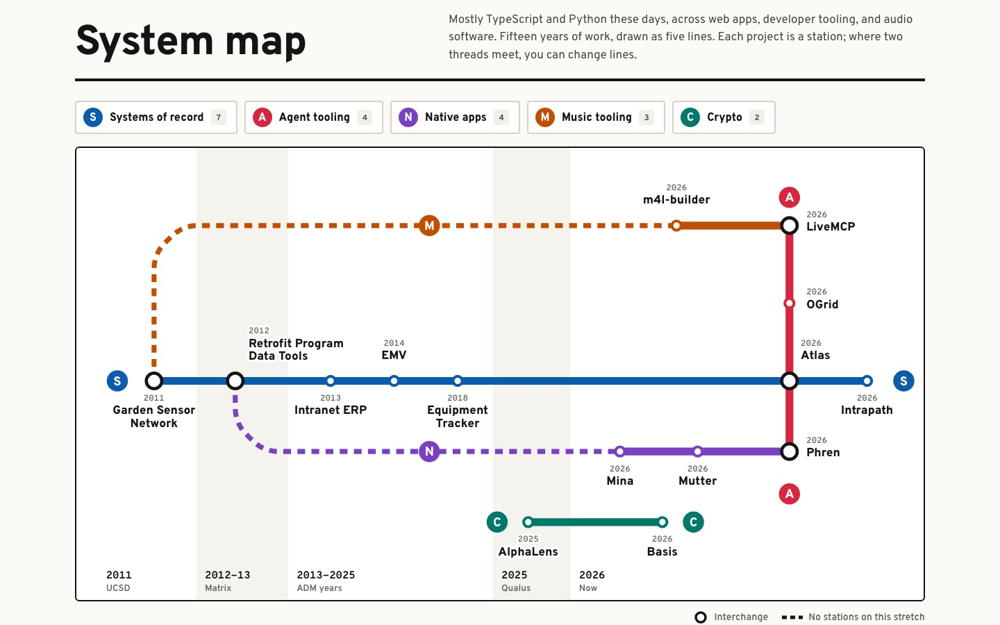
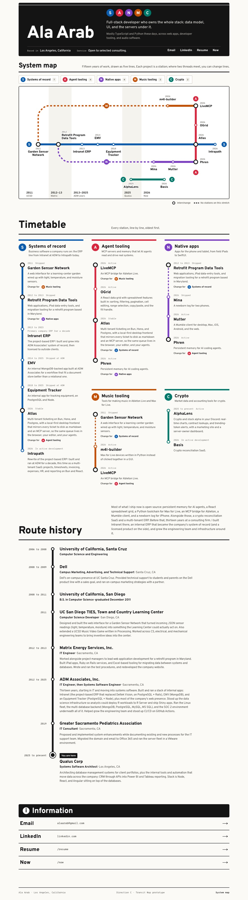

**Station page**

A sign panel with the project title and a bullet for every line that serves it, plus a fact strip (year, status, kind, line or interchange). Next is a line strip for each serving line, showing the previous stop, "You are here", and the next stop, or "End of line" at a terminus. These strips replace a generic "related projects" block. Problem, Build, Impact, and Outcome follow as departure-board rows with black label cells. Then metrics under "At a glance", the stack under "Built with", the quote as a platform notice, and outbound links as "Exits". The link that points back to `/projects/<slug>` is dropped. An unknown slug gets a "Station not found" sign.

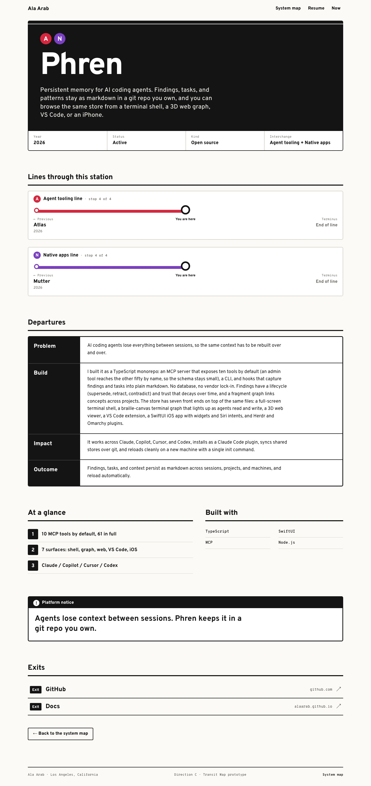
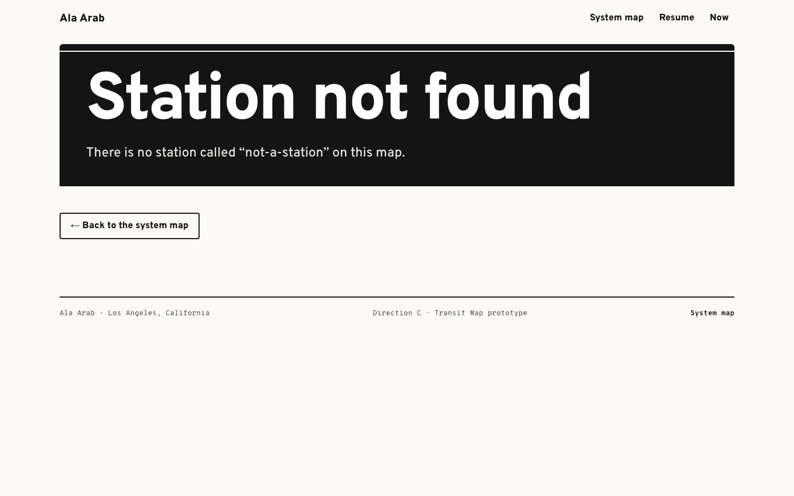

## Signature interaction

- The key above the map is also the filter. Each line is a toggle button (`aria-pressed`). Hovering or focusing a key item, or hovering a line on the map, previews the isolation. Clicking pins it. While a line is isolated, every other line and its stations fade to light grey and the isolated line's stations grow by 1.4x. Escape clears the pin.
- Hovering or focusing a station opens a tooltip card with year, status, full summary, and bullets for the lines serving it. The card flips left or up near the edges.
- Stations are real links (`<a>` in SVG) and tab in map order (left to right, then top to bottom). Focus shows a black ring around the marker and underlines the label.

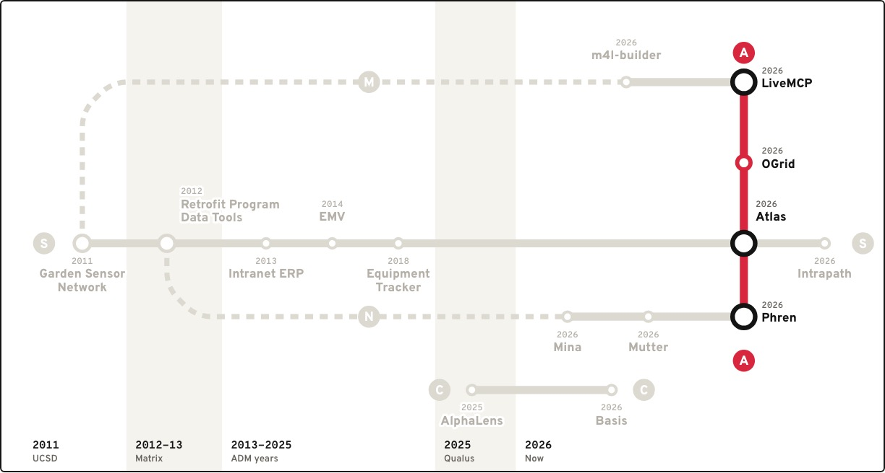
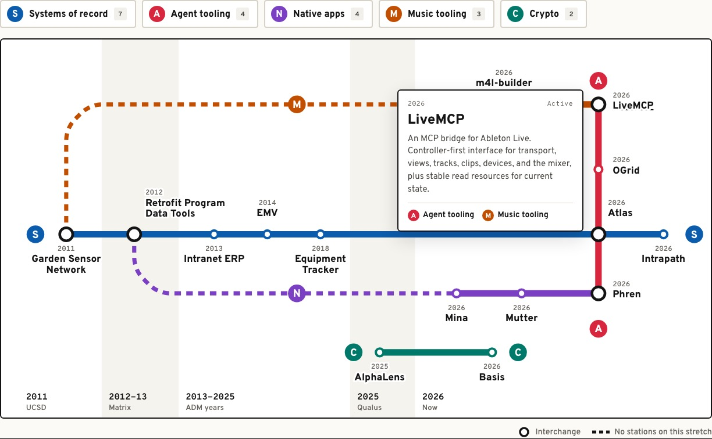
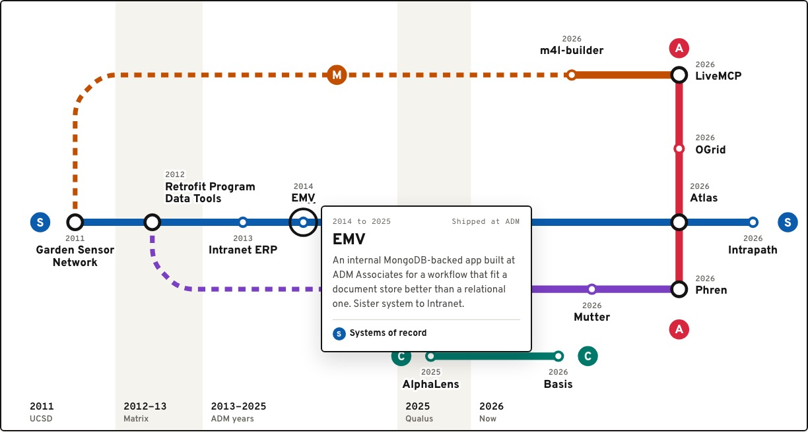

## Mobile

Under 960px the SVG map is hidden. A 1200-unit diagram shrunk to phone width would make the labels unreadable. In its place is a short "Pick a line" index that jumps to each line in the timetable, and the timetable becomes the map: vertical line strips with station dots, black-ringed interchanges, and dashed strips for the gaps. Route history collapses to a single track with years above each stop. On station pages the line strips keep their horizontal prev / here / next form at a narrower width. Tap targets are 44px or more. There is no horizontal scroll at 390px.

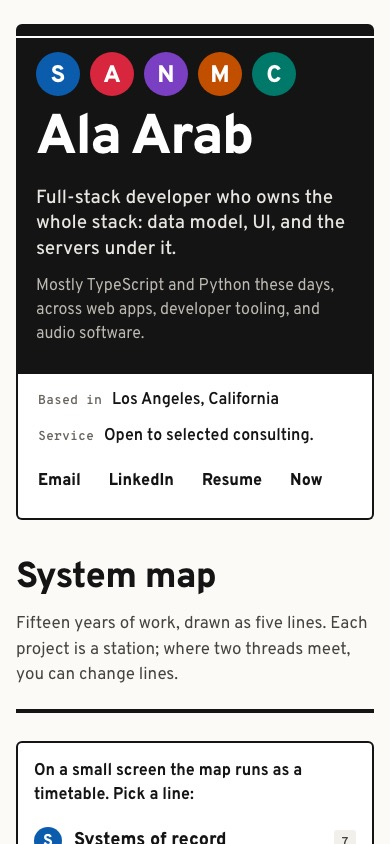
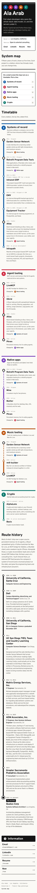
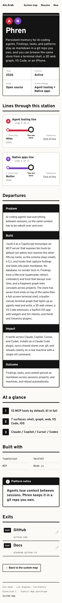

## Accessibility notes

- Landmarks: a skip link, a header, `main`, labelled sections, and a footer. Exactly one `h1` per page.
- Color is never the only signal. Every line has a letter code in its bullet and its name in the key, timetable, tooltip, and strips. Interchanges differ in shape (larger dot with a black ring), not just color.
- The SVG has `<title>` and `<desc>` that point to the timetable as the text equivalent. Each station link has an accessible name ("Phren, 2026, Agent tooling line and Native apps line"), and the open tooltip is tied to it with `aria-describedby`.
- Body text is `#141414` / `#45433e` on `#fbfaf7`. Meta text is `#66635c` (about 5.6:1).
- Visible focus is a 3px ink outline on HTML controls and a ring on map stations.
- `prefers-reduced-motion` turns off every transition, including the station scale-up.

## What it would take to ship

- **Effort: about 3 to 4 days** to turn the prototype into the real site: move the line assignments into `siteContent.ts` (a `lines` field per project), port the pages, add prerender metadata, and test in real browsers.
- **The map is hand-placed.** That is why it looks deliberate, and it is the main cost. Every new project needs a position and a label placement, and a busy year needs a layout rethink. With 15 stations that is fine. At 30 it would need a small layout helper or a redraw each time. A lint check that fails when a project is on no line, or has no position, would keep it honest.
- **Line assignments are editorial.** A few are arguable: Garden Sensor Network on Music (it rests on the Processing music game line in its build text), Atlas on Systems of record, and OGrid on Agent tooling only through its MCP server. Ala should review them.
- **Tablet widths (760 to 960px)** get the timetable instead of the map. A vertical version of the map for narrow screens would be a nice follow-up, but it is its own layout job.
- **Dev server note:** `bun --hot server.ts` currently fails for the whole app on Bun 1.3.14 ("import_Terminal_module is not defined"), not just for this prototype. I verified against the production-style build from `scripts/lab.ts`.
