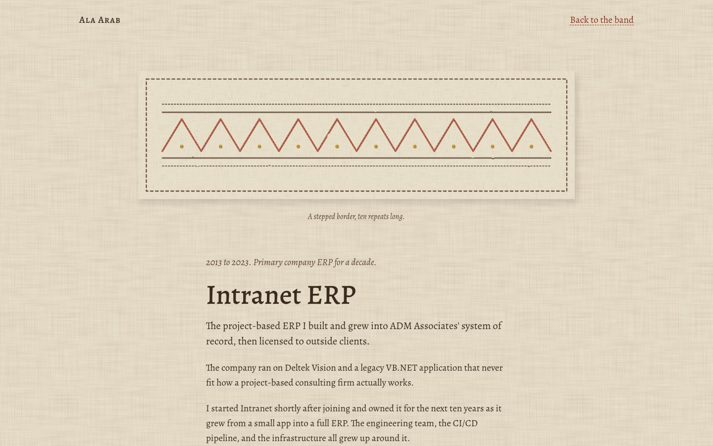
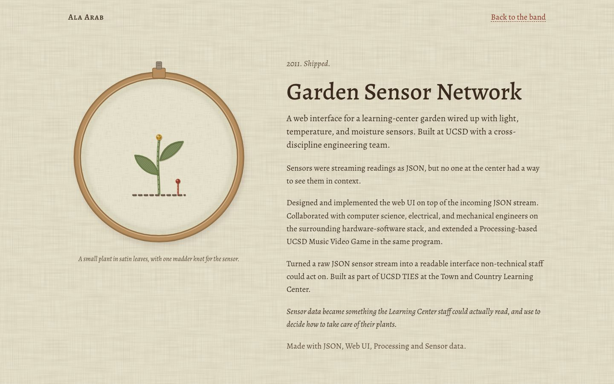
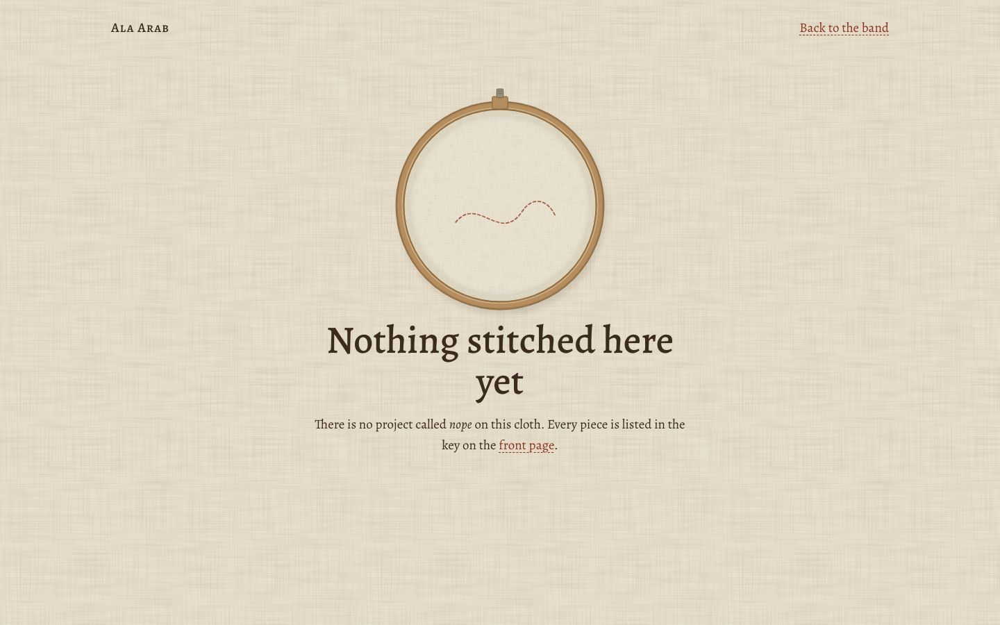

# Embroidery

**Concept:** a long band of stitched linen, with one small embroidered emblem per project, read in the order the work was made.

## Why it fits Ala

Ala's work is made the slow way: a decade on one ERP, then a rewrite; a Max for Live toolchain because he wanted devices he could version; a newborn log for his own daughter. Embroidery is visibly handmade and visibly patient, and a sampler is a record of what someone learned to make. It is soft without being vague: each emblem is a single plain figure, and the name sits under it in small caps. It is also the least "tech site" thing we could do while staying legible and professional.

## References and what I take from each

- **The Bayeux Tapestry.** The story as one continuous band with a narrow border above and below, read in order. I take the band, the thin border, and chronology as the only organising idea. I leave out the crowded figures and the border beasts.
- **Scandinavian and Arts & Crafts samplers** (Morris & Co. and the Glasgow school's needlework, Nordic folk samplers). I take the emblem as a single simple figure built from a handful of stitches, a lot of plain ground around it, and the "key" label a sampler carries.
- **Natural-dye wool on undyed linen.** I take the palette and the evident hand: threads sit on the cloth with a tiny shadow, and nothing is perfectly even.

## Palette

Four dyestuffs, plus undyed wool and linen. Everything else is a mix of these, the way a dyer would get it.

| Role | Hex | Why |
| --- | --- | --- |
| Linen ground | `#e9e1cf` | Undyed oatmeal linen. Warm, never white. |
| Label linen | `#f1ebdc` | A lighter, finer cloth for the sewn-on key and signature. |
| Walnut (text ink, outlines) | `#3b2b1f` | Walnut hulls give a brown that reads as ink; used for body text (about 11:1 on the ground). |
| Madder | `#a3412d` | The warm red. Links, the running border, "current" things. Link text uses a deeper `#8a3222` for contrast. |
| Woad | `#3f5f86` | The cool blue. Agent tooling, the net in Phren, the night in Mina. |
| Weld | `#c29632` | The yellow. Only ever as thread, never as text. Knots, light, the sun. |
| Weld over woad (green) | `#687a45` | Green in natural dyeing is woad overdyed with weld, so it is a mix, not a fifth dye. Used for the garden. |
| Madder under woad (plum) | `#6a4668` | The same trick for purple. Used for Phren, whose own colour is violet. |
| Undyed wool | `#f6f0e1` | Cream thread, mostly for Mina. |

Four dyes because a sampler with a limited set of threads looks intentional; add a fifth and it starts to look like clip art.

## Type

**Alegreya** for everything, with **Alegreya SC** for the project names under the emblems. Alegreya was drawn for long literary text with a calligraphic, slightly uneven rhythm, so it sits next to stitching without looking mechanical. It has a true small-caps companion, so the names are real small caps rather than shrunk capitals. I rejected Spectral (too crisp and screen-like beside thread) and Gentium Book Plus (lovely, but plainer and with no matching small caps). A few words (the signature label, the year marks on the band) are the same Alegreya glyphs drawn as stitches in SVG: a satin fill of fine diagonal threads with a stem outline.

## The one signature moment

Each emblem **sews itself in** as it scrolls into view: the thread appears stitch by stitch along its path, satin fills fill line by line, and French knots land last. It is slow (a few seconds per emblem) and happens once. With reduced motion the emblems are simply finished.

## Project pages

Every page is a hoop or a panel of the same linen with that project's piece in it, and the text beside it set as the maker's notes. Each project gets a thread, a frame, a slight tint of the ground, and its own figure from a small table keyed by slug (`themes.ts`).

- **Phren:** a net of looped threads in plum and woad; each knot is a remembered thing, and one madder thread runs back through the earlier knots.
- **m4l-builder:** a wide panel with a satin-stitch knob and a waveform made of vertical satin stitches. The knob is a real slider (keyboard and pointer), and turning it restitches the wave.
- **Mina:** a smaller, quieter hoop on a dusk-tinted page: a cream crescent moon, a few knot stars, a swaddled bundle, all in finer stitches.
- Everyone else: their own emblem and frame. Basis is rows of identical stitches with one thread tracing back; Intranet is a long border, one repeat per year; Garden Sensor Network is a small plant.

## Deliberately left out

Cards, chips, tables, stat counters, filters, a dark mode, horizontal scrolling, any imagery that is not a stitch, and all but one motion. No faux-medieval lettering and no border animals.

## Files

`src/lab/embroidery/`: `stitch.tsx` (running, stem, satin, straight stitches, French knots, stitched words, the sew-in reveal), `emblems.tsx` (one emblem per slug), `themes.ts` (thread, ground tint, frame and maker's label per slug; band order), `pieces.tsx` (hoop, panel, long panel; the Phren net, the m4l-builder knob and wave, the Mina night), `Home.tsx`, `Project.tsx`, `embroidery.module.css`.

## Screenshots

Home, desktop fold and full page:

Home, phone (the band turns into a vertical strip):

Showcases:

Lighter per-project touch, and the not-found page:

Fold shots are taken after the sew-in has finished; full-page shots use reduced motion, so the emblems are shown finished.

## Critique and changes

**Pass 1.** The sew-in never ran: Bun's CSS modules rename `@keyframes` but not the `animation` shorthand that uses them, so the fold showed empty hoops and an empty band. Switched the reveal to transitions triggered by a `data-sewn` attribute. With that fixed, the honest read was: the emblems looked like a thin line-icon set (a tech site with a texture on it), the band's tick-mark border looked like a ruler, the three lengths of band read as three boxes, the m4l-builder wave read as a bar chart, and the stitched signature read as plain bold text.

Changes: threads about 30% thicker and emblems larger; French knots given visible wraps; the band's fill brought down to a faint tint and the border simplified to two running lines with a sparse row of weld knots; a small sprig between scenes (as the Bayeux border separates its scenes with trees) so a row reads as one continuous story rather than three cells; the wave rebuilt as 112 touching satin stitches so it reads as a filled shape; the panel's CSS dashed outline replaced with a stitched border; the signature's satin pattern made coarse enough to see; linen texture opacity lowered.

**Pass 2.** Better: the band now looks sewn rather than laid out, and Mina is the quietest page, as it should be. Remaining problems I fixed: the Basis thread did not actually connect its rows (now one continuous thread traces back through every row to the first knot); the year marks were illegible (larger); on phone the year marks collided with the side border (moved inside the strip); the knob pointer was too thin; Mina's stars were too faint; the status line lowercased "ERP".

**Still true after two passes.** The Phren net is the weakest showcase: even with looser loops and bigger knots it reads a little like a node graph, which is exactly the "tech diagram" feeling this direction is meant to avoid. A hand-placed composition (fewer knots, one thread visibly looping around each one) would fix it. The band's rows are still rectangles on a page, softened but not gone.

## Verification

- `tsc --noEmit`: no errors in `src/lab/embroidery/`.
- 390px: `scrollWidth == innerWidth` on home, Phren, m4l-builder, Mina and not-found.
- No console errors on any shot page; exactly one `h1` per page.
- Contrast (on the flat ground): body 10.4:1, muted 6.6:1, links 6.3:1; Mina's dusk ground: muted 6.1:1, links 6.8:1.
- Reduced motion: stitches and knots render finished with no transition; the wave does not animate when restitched.
- Focus: dashed madder outline on links and the knob. The knob is `role="slider"` with arrows, Page Up/Down, Home/End and vertical drag, tested by keyboard.
- Tap targets: every nav, key, contact and along-the-band link is at least 44px tall on phone (the one inline link inside a sentence on the not-found page is exempt).

## What it would take to ship

About a week. Two to three days to hand-tune every emblem at small sizes and to redraw the Phren net; a day for the SSR/prerender path (the sew-in needs a no-JS fallback that shows the stitches finished); a day for performance on low-end phones, since every stitch carries its own mask and the wobble filter runs on every emblem (on a page of nine emblems that is fine; at thirty it would not be).

Risks: emblems are hand-drawn SVG, so each new project costs an hour or two of drawing, and a weak emblem shows. The metaphor also sets a ceiling on density: the band holds nine pieces comfortably; past about fifteen it becomes a sampler chart, and the "one band, lots of plain linen" feeling is gone. The key label scales, the band does not, so curation has to stay strict.
