# Embroidery

**Concept:** undyed linen and a few natural-dye threads, used as the frame for the real work. Each product's actual screenshots are mounted on cream mats sewn onto the cloth; the embroidery lives in the rules, dividers, mats, knots and a few stitched words, never in the pictures.

## Why it fits Ala

Ala picked Embroidery as the best of ten directions for its softness and hand-made calm. Across three later rounds he rejected every drawn picture (folk emblems, then monograms) as "cheap" and "cookie cutter", because they did not represent the projects. His audience wants to see the actual work: a pro-audio user wants to see the EQ, not a bird on a lute. So the site keeps the cloth and the thread, and shows the products truthfully.

## References and what I take from each

- **Arts & Crafts and Scandinavian samplers.** Plain ground, a limited set of threads, sections sewn separately with their own border patterns, and a sewn-on label.
- **Framers' mats and museum mounts.** A screenshot is treated like a print: a cream mat, a running-stitch border, a cross-stitch tacking each corner, a soft shadow, and a caption underneath.
- **Natural-dye wool on undyed linen.** The palette and the evident hand: threads sit on the cloth with a tiny shadow.

## Palette

Four dyestuffs, plus undyed wool and linen. Everything else is a mix of these, the way a dyer would get it.

| Role | Hex | Why |
| --- | --- | --- |
| Linen ground | `#e9e1cf` | Undyed oatmeal linen. Warm, never white. |
| Label linen | `#f1ebdc` | A lighter, finer cloth for the sewn-on key and signature. |
| Walnut (text ink, outlines) | `#3b2b1f` | Walnut hulls give a brown that reads as ink; used for body text (about 11:1 on the ground). |
| Madder | `#a3412d` | The warm red. Links, the running border, "current" things. Link text uses a deeper `#8a3222` for contrast. |
| Woad | `#3f5f86` | The cool blue. Agent tooling, the net in Phren, the night in Mina. |
| Weld | `#c29632` | The yellow. Only ever as thread, never as text. Knots, light, the sun. |
| Weld over woad (green) | `#687a45` | Green in natural dyeing is woad overdyed with weld, so it is a mix, not a fifth dye. Used for the garden. |
| Madder under woad (plum) | `#6a4668` | The same trick for purple. Used for Phren, whose own colour is violet. |
| Undyed wool | `#f6f0e1` | Cream thread, mostly for Mina. |

Four dyes because a sampler with a limited set of threads looks intentional. The thread colours only ever touch the frame (rules, mat borders, knots, stitched words); they never touch a screenshot.

## Type

**Alegreya** for everything, with **Alegreya SC** for the project names under the emblems. Alegreya was drawn for long literary text with a calligraphic, slightly uneven rhythm, so it sits next to stitching without looking mechanical. It has a true small-caps companion, so the names are real small caps rather than shrunk capitals. I rejected Spectral (too crisp and screen-like beside thread) and Gentium Book Plus (lovely, but plainer and with no matching small caps). A few words (the section headings and the signature label) are the same Alegreya glyphs drawn as stitches in SVG: a satin fill of fine diagonal threads with a stem outline.

## Motion

- **Home:** the running-stitch underline under the name sews itself in (Ala asked to keep it exactly), and the section dividers and mat borders sew in once as they scroll into view.
- **Project pages:** the dividers and mats sew in the same way. Pages with several screenshots also have a short explainer (see below). Videos never play by themselves.
- **Reduced motion:** every stitch is simply there, the explainer becomes a plain numbered list of screenshots with captions, and nothing animates (`document.getAnimations()` is empty).

## The home page: who he is first, then the work

Ala: "you're starting to focus immediately on the things I made rather than who I am, what I've done, what I went to school for". The order now is:

1. **Introduction:** name, title, intro, contact, and the moving underline. Unchanged.
2. **About:** the three `about` paragraphs (his energy-industry career, what he built at ADM, and his schools), set as plain prose.
3. **Experience:** every role, with a running-stitch rule one stitch-length per year, so ADM's thirteen years reads as the long one.
4. **Education**, plus "Relevant coursework" as a quiet two-column list.
5. **Active projects:** what he is building now.
6. **Things I've made:** shipped and past work, then "At ADM Associates" (Intranet ERP, EMV, Equipment Tracker), then "Client and school work" (Retrofit, Garden Sensor Network).
7. **Interests:** one line, with French knots between the words.
8. **The stitched signature label** with contact.

**Active vs made is data-driven.** `isActive(project)` in `status.ts` returns true when `status` is "Active" or "In active development", or `year` contains "present". Everything else counts as made. Within each list the order is by importance, not date: featured projects first in content order, then the rest. Today that puts Phren, OGrid, m4l-builder, LiveMCP, Intrapath, Basis, Mutter and AlphaLens under Active, and Atlas and Mina under Things I've made, ahead of the ADM and client groups.

**Entries stay compact:** title, year and status, and one line. Projects with a real screenshot get a small mounted thumbnail (150px wide, or 70px for a phone screen); the rest get a single knot. The large screenshots live on the project pages.

Each section has a stitched heading and its own divider pattern: a long running stitch for About, chain for Experience, cross stitch for Education, running stitch for Active, satin blocks for Things I've made, and knots for Interests.

## Project pages: sell the product with the real thing

In order:
- **Stitched header:** year and status, title, a divider in the project's thread, and the one-paragraph summary.
- **Hero screenshot,** mounted.
- **The project's quote.**
- **Three short, plain explanations:** "The problem", "What I built", and "Where it is now" (problem, build and impact from the content). Each is paired with real media where some exists, set beside the text.
- **Outcome, stack, metrics and links.**
- **Before/next along the reading order,** then contact.

Text-only projects get the same header and explanations, with no image.

**Explainer.** On Phren, Mina and Atlas, "What I built" is paired with a calm walkthrough. It steps through two or three real screenshots, about 5 seconds each, with a numbered caption per step and a soft stitched ring around the part being described:
- **Phren:** the terminal graph, then the task list, then the web graph.
- **Mina:** logging on Today, then the calendar, then trends.
- **Atlas:** the queue, then the ticket detail in the same terminal screenshot, then the web copilot.

It starts only once it scrolls into view and has a "Pause the walkthrough" button. With reduced motion it is a static numbered list. The keyframes live in a hoisted `<style href="embroidery-explainer-N" precedence="default">`, because Bun's CSS modules rename `@keyframes` without renaming the `animation-name` that uses them. Each layer picks up its animation through a `--anim` custom property only after it starts, so the first step shows even before the walkthrough plays.

**Videos:**
- **Mina:** "Where it is now" is paired with the real trailer, a 37-second silent tour of the app.
- **Phren:** it is paired with the shell's own start-up animation, converted from `splash.gif`.

Both are H.264 with no audio and use `muted playsinline loop controls preload="none"` with a poster frame, so nothing downloads or plays until the viewer presses play.

## Real visuals: sources

All images are copied from the project repos into `src/lab/embroidery/assets/`, converted to JPEG at quality 80 at their original size (none are scaled up), and imported in `visuals.ts`. Bun bundles them as hashed URLs. The images and videos together total 1.7 MB.

| File | Source | Used on |
| --- | --- | --- |
| `phren-webui-graph.jpg` | `~/Projects/phren/docs/webui-graph.png` | Phren hero, explainer, home thumbnail |
| `phren-shell-graph.jpg` | `~/Projects/phren/docs/shell-graph-search.png` | Phren explainer |
| `phren-shell-tasks.jpg` | `~/Projects/phren/docs/shell-tasks.png` | Phren explainer |
| `m4l-linear-phase-eq.jpg` | crop of `~/Projects/m4l-builder/tmp/screens/lpeq-dev-only-eqcurve.png` (device panel only) | m4l-builder hero, home thumbnail |
| `m4l-linear-phase-eq-design.svg` | `~/Projects/m4l-builder/docs/linear_phase_eq_ui.svg` | m4l-builder, beside the build explanation, captioned as the design |
| `mina-today.jpg`, `mina-trends.jpg`, `mina-calendar.jpg` | `~/Projects/mina/docs/assets/` | Mina hero (Today) and explainer; home thumbnail |
| `mutter-desktop-session.jpg` | `~/Projects/mutter/docs/images/desktop-session.png` | Mutter hero, home thumbnail |
| `atlas-shell.jpg` | `~/Projects/atlas/artifacts/ui-review-2026-09-21/local-shell-wide.png` | Atlas hero, explainer, home thumbnail |
| `mina-trailer.mp4` (406x720, no audio, 0.4 MB) and `mina-trailer-poster.jpg` | `~/Projects/mina/video/2026-09-20-mina/final/mina-trailer-sarah.mp4`, checked frame by frame first: clean app footage with demo data | Mina, "Where it is now" |
| `phren-splash.mp4` (0.07 MB) and `phren-splash-poster.jpg` | `~/Projects/phren/docs/splash.gif` | Phren, "Where it is now" |
| `atlas-web-copilot.jpg` | `~/Projects/atlas/artifacts/ui-review-2026-09-21/hosted-copilot-evidence-desktop.png` (demo data) | Atlas explainer |

Excluded on purpose: every m4l-builder screen that shows an agent chat or a desktop (`lpeq-verify-fresh*.png`, `live-window.png`, `lpeq-analyzer-off*.png`), the other m4l-builder shots (mostly Live's mixer, with the device too small to read), anything under `~/Projects/basis/.private`, and all og/social cards.

**Projects with no visuals yet** (text only; Ala could supply shots): Intranet ERP, Intrapath, Basis, LiveMCP, OGrid, AlphaLens, EMV, Equipment Tracker, Garden Sensor Network, Retrofit Program Data Tools. For m4l-builder, a larger, tighter device capture (at 2x, with more than one node) would make the best single improvement.

## Deliberately left out

Any drawn picture, emblem, monogram or stand-in; filters or textures over screenshots; cards, chips, tables, stat counters and filters; horizontal scrolling; autoplaying video; and any motion that is not stitching in or a pausable walkthrough of real screenshots.

## Files

`src/lab/embroidery/`: `Home.tsx` (the sections), `status.ts` (`isActive` and the ordering), `Project.tsx`, `mount.tsx` (the mat, corner tacks, captions, phone rows, thumbnails, video, and the `Explainer`), `stitch.tsx` (running stitch, dividers, label border, knots, stitched words, the sew-in), `visuals.ts` (real media per slug: the hero, and what pairs with each explanation, with alt text, captions and explainer rings), `themes.ts` (thread and ground tint per slug), `assets.d.ts` (image module types), `assets/`, and `embroidery.module.css`.

## Screenshots

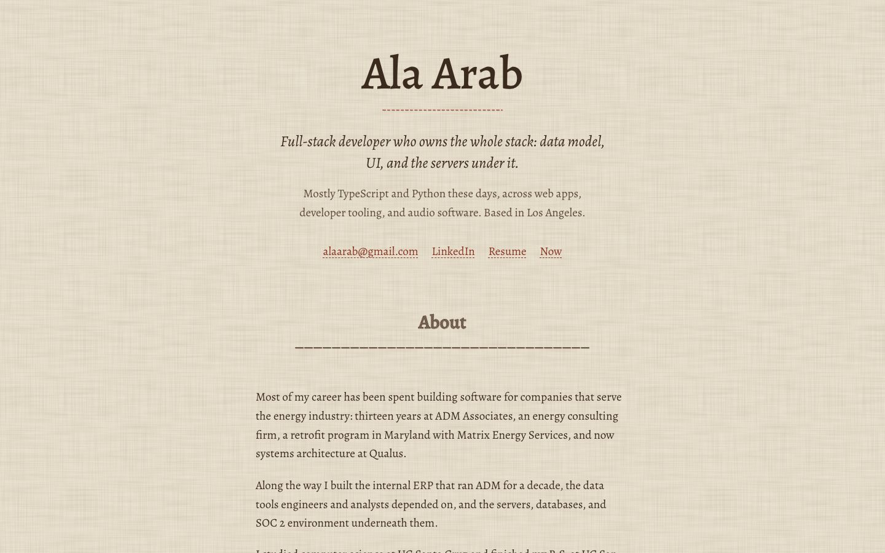
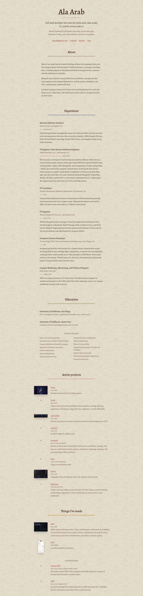
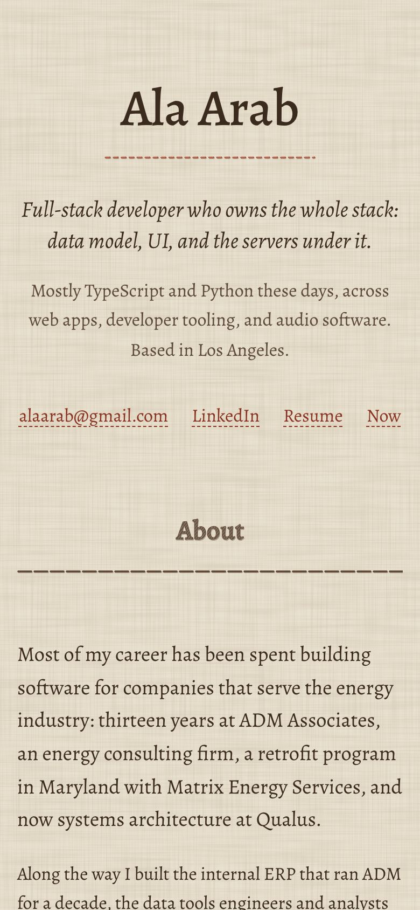
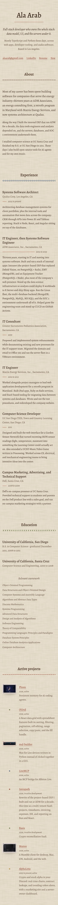
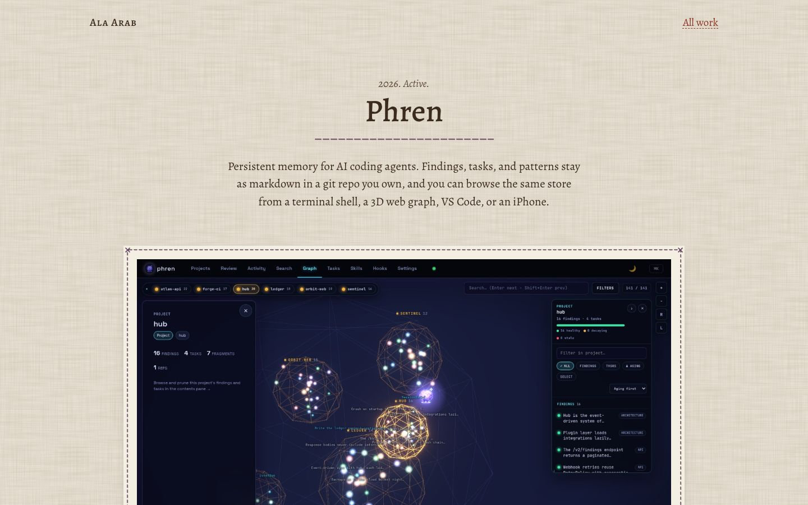
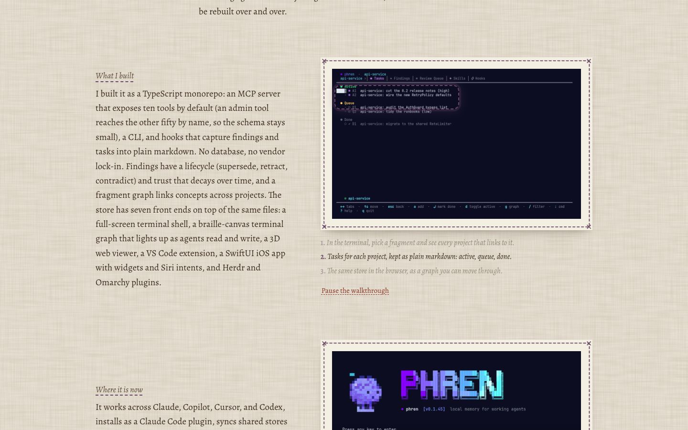
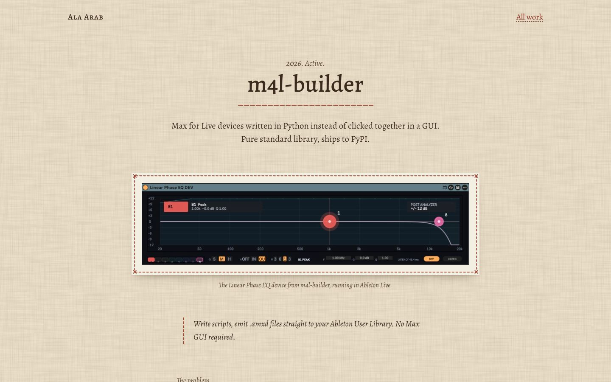
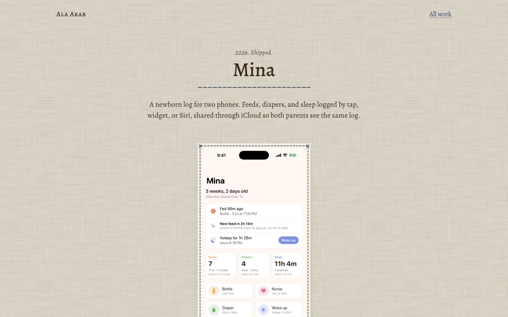
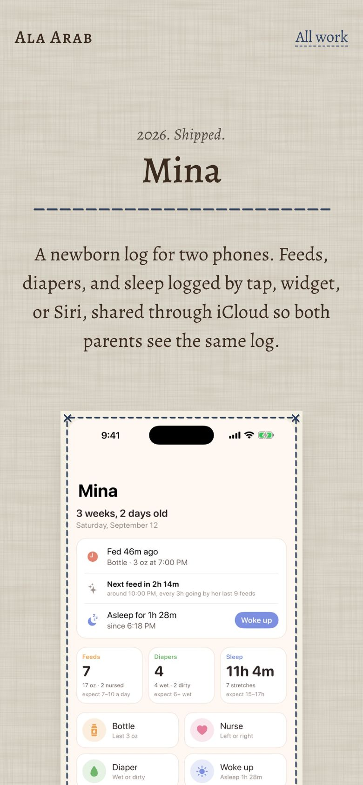
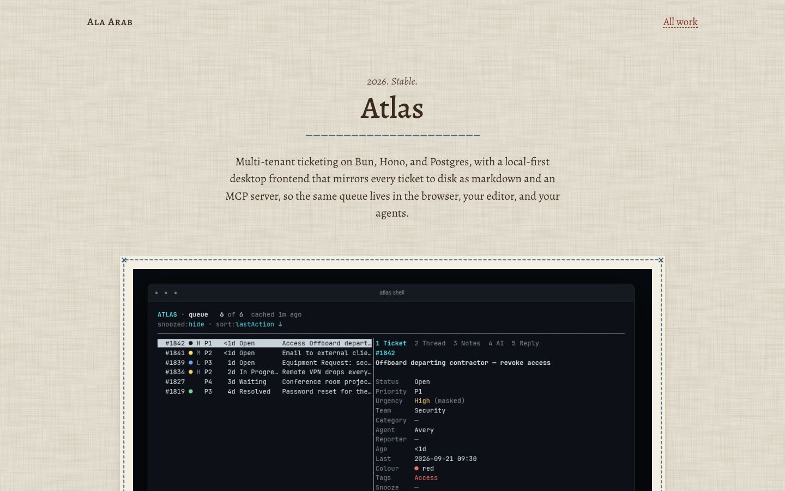
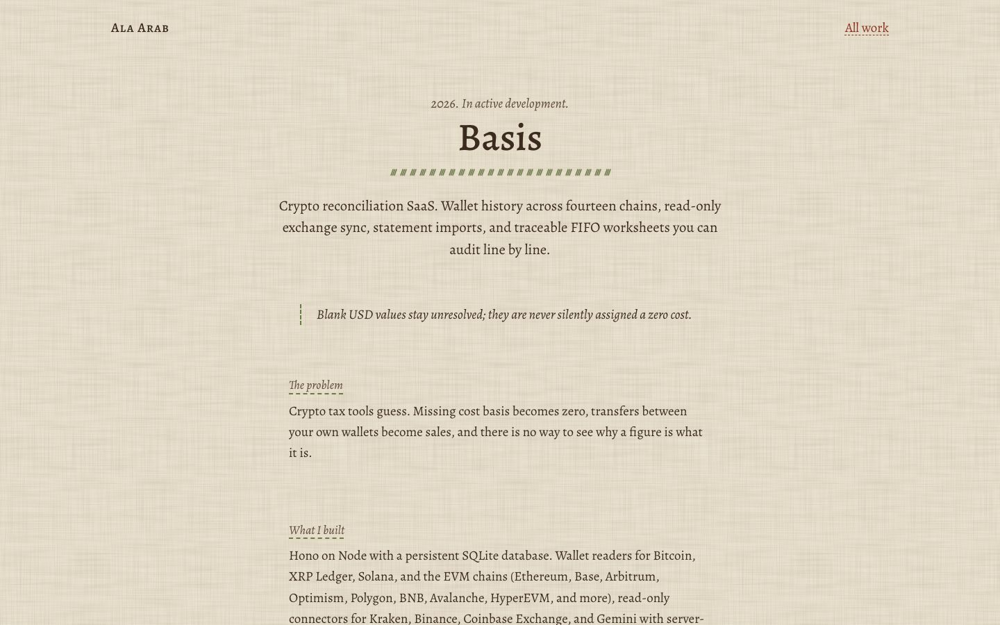

The full-page shots use reduced motion. The fold shots are taken with motion on, after the stitches have sewn in.

## Critique and changes (portfolio order and real products)

**Pass 1.** The home page now reads as a person first, then a portfolio. The explainer played and paused correctly, and the reduced-motion list rendered. Mina's single hero phone sat left-aligned in a two-column row on a phone; one phone screen now gets its own centred single-column row. The full-page phone shot was 1.3 MB at 2x, so the saved copy is downscaled to 1x.

**Pass 2.** I checked the explainer mid-step (`phren-explainer.jpg`): the ring sits on the Active and Queue tasks, and the current caption is full strength while the others are dimmed. The first step stays visible before the walkthrough starts, and pausing holds the current step.

## Critique and changes (the first real-visuals round)

**Pass 1.** The structure worked straight away: the real screenshots do what the drawings never did, and the mats make them sit on the cloth rather than float. Problems I found:
- `sips -Z 1600` had scaled every small source up (Mina's 560px phone screens became 737 by 1600), wasting weight and softening them. I re-converted everything at its original size, which brought the assets from 1.6 MB to 1.2 MB.
- The stitched figures under Intranet ERP were off-centre, because the SVG width is estimated. They are now centred with `text-anchor`.
- At 1440px the fold showed only the name and an empty gap. The masthead's bottom padding and the first section's top margin are tighter now, so the first spread starts in view.

**Pass 2.** On a phone, Mina's three screens left the third on its own row, pinned to the left. The home spread now shows two phone screens. On the project page, a lone third screen is centred on its own row. The dividers are slightly narrower so they read as rules, not as underlines.

**Honest view.** This is the first round where the pictures are not the weak point. The m4l-builder hero is small (a 756px capture of Live's device panel), so it is readable but not generous. Ten of fifteen projects have no image at all. That is honest, but it makes "Other things" a text list, which is correct for now.

## Verification (latest)

- `tsc --noEmit`: clean for `src/lab/embroidery/`.
- At 390px with reduced motion, on home, Phren, m4l-builder, Mina, Atlas, Basis and not-found: no overflow, one `h1`, no console errors, no running animations, every explainer layer visible, and every link and button at least 44px tall (except one inline link in a sentence on not-found).
- Motion on:
  - The Phren explainer shows step 1 at 1.5 s and step 2 at 6.5 s. Pausing holds the step.
  - After scrolling the home page, all 13 stitch reveals have finished.
- Transfer: the home page is about 1.5 MB with every thumbnail loaded, and about 0.9 MB before any lazy image loads (mostly the shared lab bundle and fonts).

## Verification (earlier round)

- `tsc --noEmit`: clean for `src/lab/embroidery/`.
- At 390px on home, Phren, m4l-builder, Mina, Atlas, Basis and not-found: `scrollWidth == innerWidth`, exactly one `h1`, no console errors, no failed requests.
- Every image has alt text. Images below the fold use `loading="lazy"`, and each has width and height set, so nothing shifts as it loads.
- Reduced motion: no stitch is left mid-reveal.
- Motion on: after scrolling the home page, all 13 reveal masks have finished, so nothing stays invisible.
- Tap targets: every link is at least 44px tall on a phone (except one inline link in a sentence on not-found).
- Contrast is unchanged from earlier rounds: body 10.4:1, muted 6.6:1, links 6.3:1.
- Page weight: the home page is about 1.6 MB transferred once every image has loaded (mostly the screenshots, plus the shared lab bundle and fonts). A text-only project page is about 0.9 MB, nearly all of it the shared lab bundle.

## What it would take to ship

A few days. Most of it is asset work, not code:
- Get proper captures for m4l-builder (a device close-up at 2x) and screenshots for the projects that have none.
- Serve WebP or AVIF with `srcset` at 1x and 2x.
- Set up a small pipeline that crops and converts captures from each repo so the images stay current.

The risk is staleness: screenshots age as the products change, so each one needs an owner and a date.
