# Folio

**Concept:** the site is a cloth-bound book. A gold-stamped cover, an endpaper, a title page, a contents list, and one chapter per project.

## Why it fits Ala

Ala's copy is plain and exact, and a well-made book is the most familiar form of "plain and exact, but crafted". A book also solves the round-1 problem structurally: a book has no cards, no chips, no dashboards. It has one idea per page. A contents list with dotted leaders is a quiet list of every project that nobody reads as a "grid of blocks". Each project becomes a chapter, and a chapter can carry its own frontispiece and mood without breaking the world.

## References and what is borrowed

- **Tolkien's own bindings and jackets for The Hobbit (1937) and The Lord of the Rings.** Borrowed: the discipline of two or three colours, one bold simple line emblem, and a thin stamped border. Not borrowed: his emblems, runes, dragons, lettering, or layout.
- **Arts & Crafts printing (Kelmscott, and more so the plainer private presses that followed).** Borrowed: a coloured drop cap, section ornaments, the idea that the text block is the design. Not borrowed: Kelmscott's density and foliage borders.
- **Modern book typography (Bringhurst-style).** Borrowed: small caps for running heads and chapter labels, old-style figures, a 60 to 70 character measure, a real contents list with leaders, an epigraph, a colophon.
- **Ghibli background painting (via the round-2 brief).** Borrowed only the warm-cool balance: a cool dusk-blue cloth against warm gold and cream paper.

## Palette

| Role | Hex | Why |
| --- | --- | --- |
| Cloth | `#2f3d51` | Deep slate blue. Chosen over oxblood (reads as leather and heavy) and forest (reads as fantasy). Blue is the softest of the three and gives the cool half of a warm-cool pair with the gold. |
| Cloth shadow | `#243044` | Weave shading and the stamped border's deboss. |
| Gold | `#b8955a` | Stamping: emblem, border, ornaments, rules. Decoration only; it is about 2.4:1 on cream, so it never carries small text. |
| Pale gold | `#dcc493` | The lettering stamped on the cover. Large text on the cloth, well over 4.5:1. |
| Paper | `#f3ecdc` | Cream, never white. |
| Ink | `#2b2621` | Warm near-black for text. |
| Soft ink | `#5b5046` | Running heads, captions, notes. |
| Rubric | `#8a3b2e` | A muted red for drop caps and chapter numerals, the traditional second printing colour. |
| Endpaper blue | `#3e5068` on `#e4e1d4` | The endpaper is printed in the cloth colour on a paler stock. |

Each chapter swaps the rubric and frontispiece ink for a muted version of the project's own accent (violet-dusk for Phren, amber-brown for m4l-builder, plum-rose for Mina, and so on), and shifts the paper a few degrees.

## Type

- **EB Garamond** for text: a faithful Garamond with real small caps and old-style figures, cut for reading sizes. Used for body, small caps running heads, notes and contents.
- **Cormorant Garamond** for display: a Garamond drawn for large sizes, so the cover lettering and chapter titles stay fine and sharp where EB Garamond would look heavy.

Two cuts of one letterform family rather than a contrast pairing, the way a real book would do it. No monospace anywhere.

## Signature moment

The cover. It fills the first screen, cloth-textured, with a gold-stamped emblem: a sun behind a mountain ridge whose outline is also a decaying sound wave. On click, Enter, or the first scroll it swings open on a hinge at the left edge and reveals the endpaper and the title page. With reduced motion there is no hinge; the cover simply cross-fades. On a phone the hinge becomes a plain fade-and-lift.

## How project pages are themed

Each project is a chapter: running head, roman chapter numeral, title, the project's own quote as an epigraph, a frontispiece drawn for it, a drop cap, then summary, problem, build, impact and outcome as continuous prose broken by ornaments. Stack, dates, metrics and links go into a closing "Notes" paragraph. Previous and next chapter sit at the foot.

- **Phren:** an open book whose pages drift up and become a small constellation. Violet-dusk ink.
- **m4l-builder:** a two-page spread: an engraved instrument panel on the left with one working knob (keyboard and pointer accessible slider) that reshapes an engraved waveform on the facing page. Amber-brown ink.
- **Mina:** a crescent moon over a rocking cradle, the chapter set narrower, softer and a size smaller, like a bedtime book. Plum-rose ink on a dusk paper.
- **Every other slug:** a small frontispiece motif and tint from a table in `src/lab/folio/book.ts` (a bridge over a stream for LiveMCP, a balance for Basis, two tin-can telephones for Mutter, and so on).
- **Unknown slug:** "This chapter is not in this edition", with a way back to the contents.

## Left out on purpose

Cards, tags, filters, stat rows, experience timelines, the Now list, icons, and any fantasy imagery. The resume and Now pages are listed as appendices in the contents rather than re-rendered.

## Screenshots

Cover, closed, and mid-hinge:

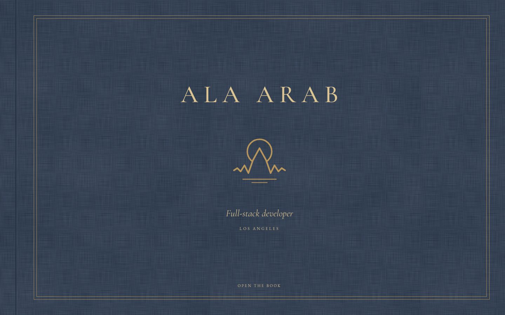
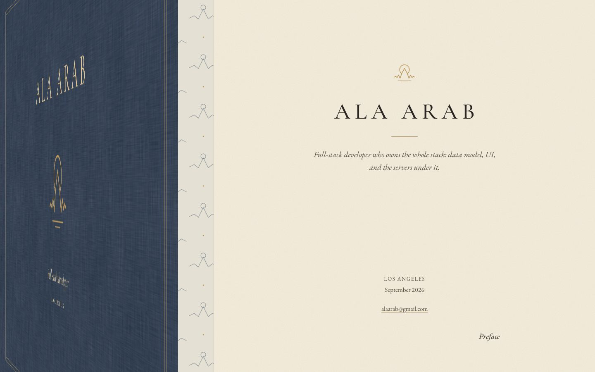

Opened: endpaper and title page, then the whole home page:

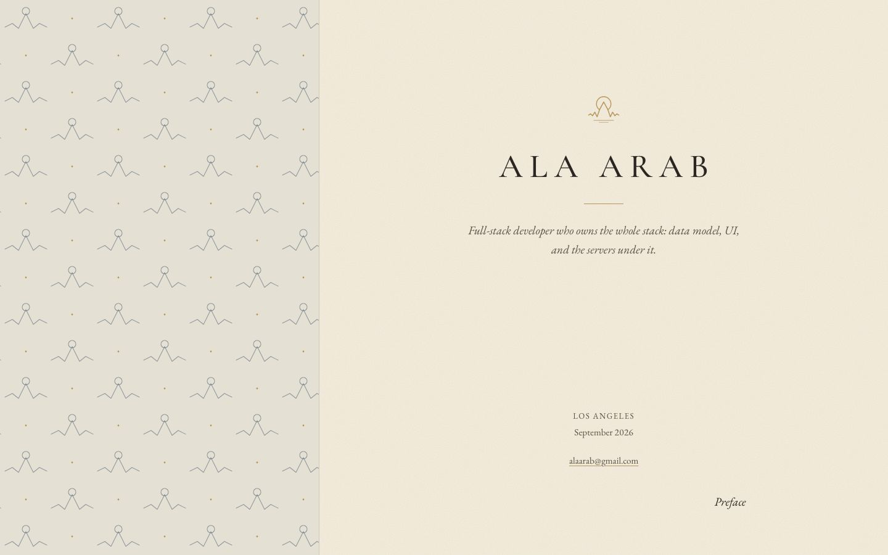
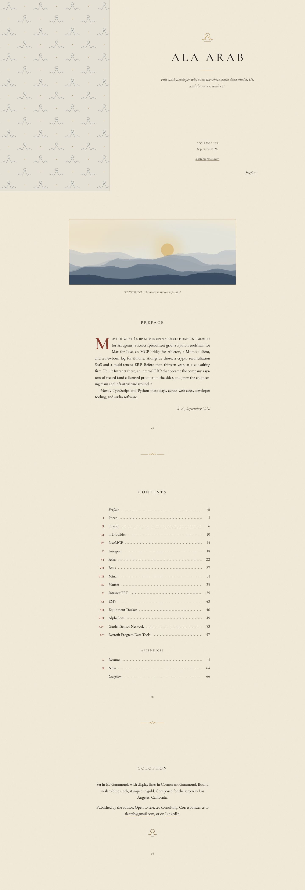

Phone:

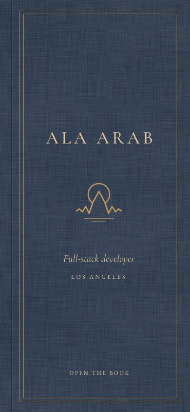
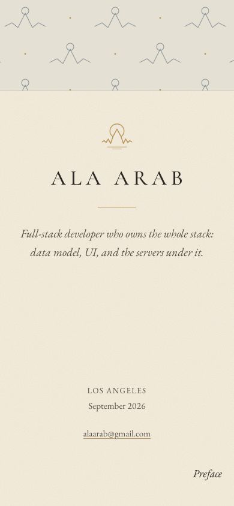
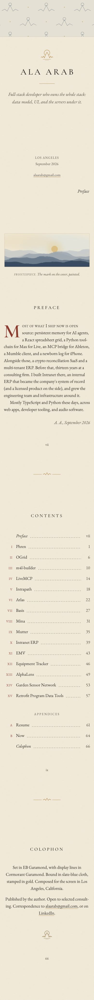

Chapters:

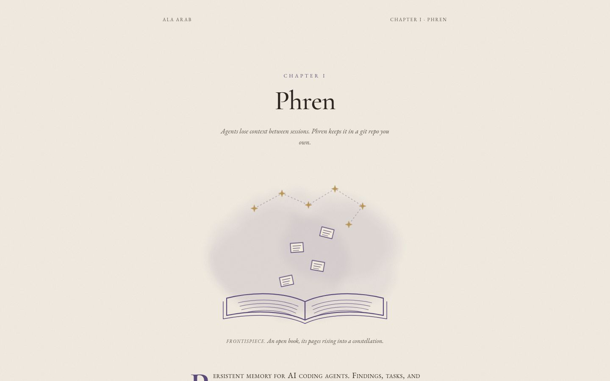
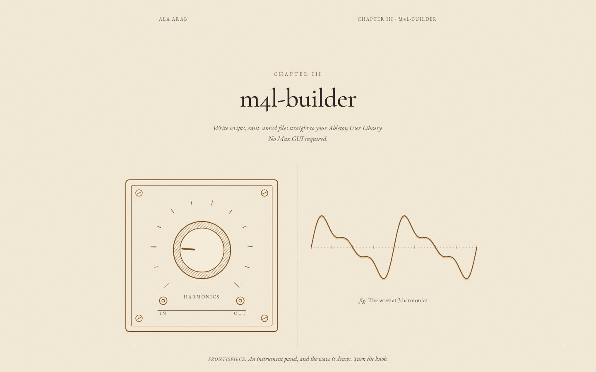
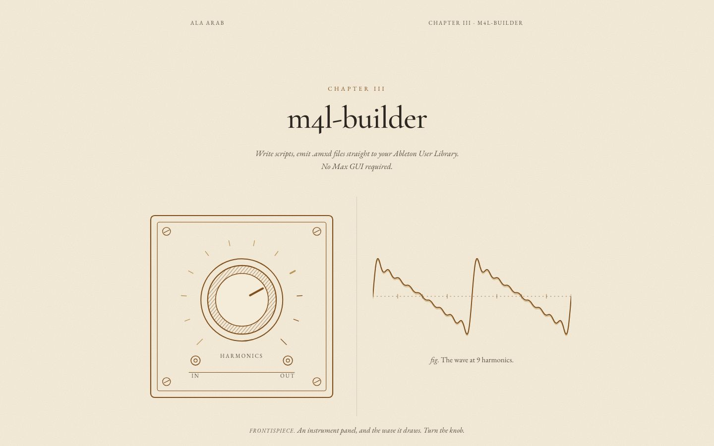
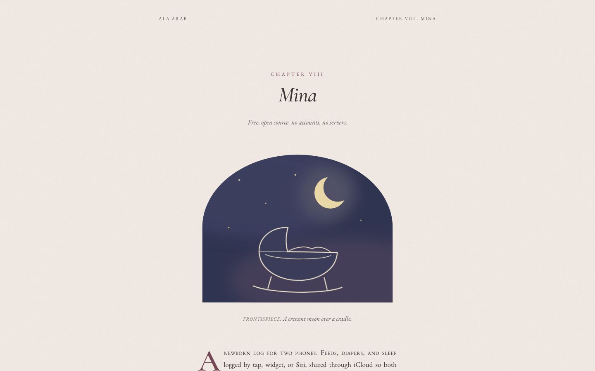
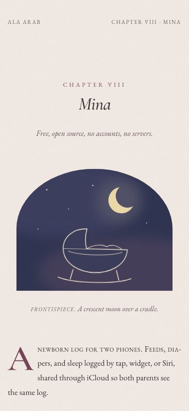
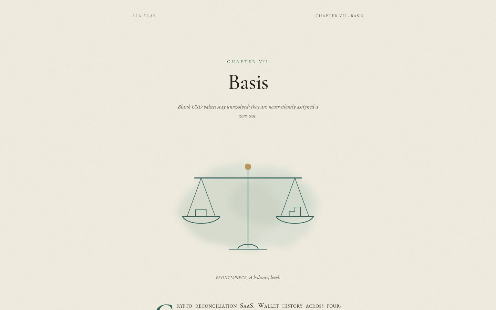
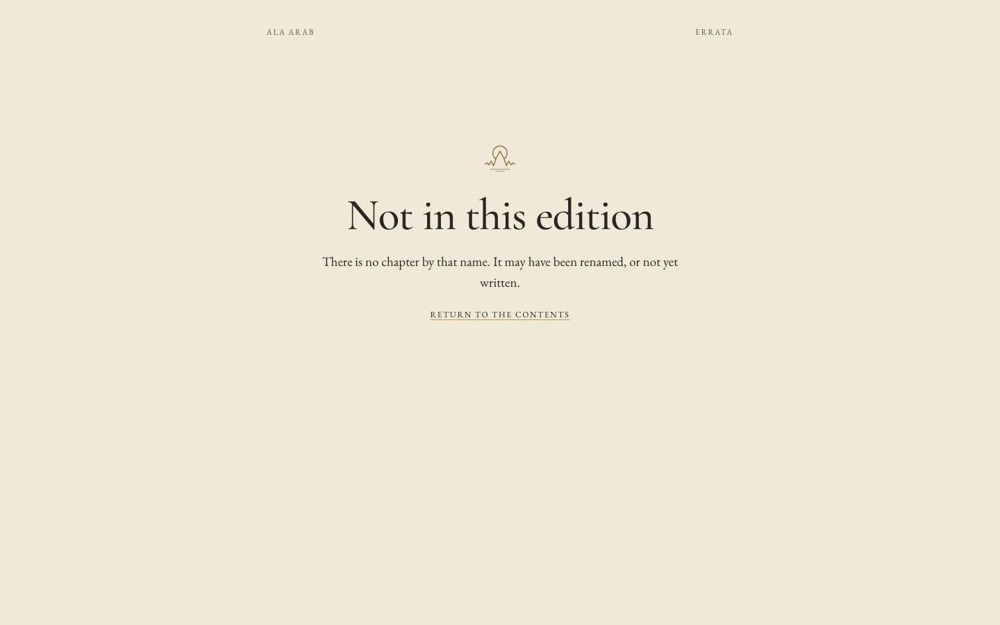

Full-page versions: `phren-desktop-full.jpg`, `m4l-builder-desktop-full.jpg`, `m4l-builder-phone-full.jpg`, `mina-desktop-full.jpg`, `basis-desktop-full.jpg`.

## Critique and changes

**Pass 1.**
- The hinge did nothing. Bun's CSS modules rename `@keyframes` but not the name inside `animation:`, so every module animation silently failed. Keyframes now live in a plain `<style>` that React hoists (`KEYFRAMES` in `book.ts`).
- The endpaper was a dense small repeat and read as wallpaper, the busiest thing on the page. Now it is a looser, larger repeat at half strength.
- The home page after the title page was all type. Handsome, but Ala asked for something painted, and this was close to "a nice text page". Added one painted plate as the book's frontispiece: the cover emblem as layered blue ridges under a low gold sun, in atmospheric perspective. It is the only painted thing on the home page.
- Every chapter started three pages after the one before, which gave the contents a mechanical look. Page counts now follow chapter length.
- Metrics joined with semicolons read oddly ("; Tests assert…"). They are now short sentences.
- Added a catchword ("Preface") at the foot of the title page. Old books used these, and here it is also the obvious way to continue.

**Pass 2.**
- The hand-drawn wobble filter (feTurbulence + feDisplacementMap) broke straight lines into stepped fragments at this stroke weight. It looked broken, not hand-made. I removed it from the line art. Clean engraved line suits a book better, and the watercolour washes behind each drawing still give the softness.
- The Mina plate was an egg-shaped oval. It is now an arched nursery window.
- The knob's focus ring was square around a round control, so it is now round. The prev/next arrows sat against their labels, so they now have a gap.
- The not-found text was left-justified under a centred title. It is now centred.

**Would Ala call it busy, blocky, a newspaper or slop?** Not busy and not blocky. There are no boxes anywhere, and every screen has one idea. The risk runs the other way: between the cover and the plate it is mostly type, and a quick visitor could see it as a very tasteful text page rather than "artistic". The cover, the painted plate and the three showcase frontispieces carry the art. The other twelve chapters get simpler line drawings.

## Verification

- `tsc --noEmit` passes.
- No horizontal overflow at 390px on the home page (closed and open) or on phren, m4l-builder and mina (scrollWidth minus innerWidth = 0).
- No console errors on any shot page. One h1 per page: the cover name, which becomes a visually hidden h1 once the cover is gone.
- Contrast: body text 6.7:1 or better. Every chapter tint used for small text (chapter numeral) is 5.4:1 or better on its paper, soft ink 5.5:1 or better, and the cover lettering 6.5:1. Gold is used only for rules, ornaments and art.
- Reduced motion: the cover cross-fades with no hinge (Enter opens it), and the Phren slips and the Mina cradle do not animate.
- Knob: a `role="slider"` with arrow, Page and Home/End keys, pointer drag, and `aria-valuetext` ("9 harmonics"). The caption under the wave is `aria-live`.
- Tap targets: contents rows, running-head link, note links, chapter foot links, title-page email and catchword are all at least 44px on phone.

## What it would take to ship

- **Effort:** about 2 to 3 days to productionise. That covers moving the chapter table into `siteContent`, prerendering the chapter routes, a no-JS fallback (the book should render already open), and real per-project art review.
- **Risks:** the cover is a gate. It costs a click or scroll before any content shows, and some visitors (recruiters on phones) will bounce. A returning visitor should skip it. Today `#contents` skips it, and a session flag would be the next step. The fonts carry the design, so EB Garamond's small caps must load: a fallback serif without small caps flattens it.
- **As projects are added:** each needs a small drawing, and that is the real cost. A generic motif would break the idea. Roman numerals and page numbers are computed, so reordering is free. The contents list stays elegant to about 25 chapters, and past that it wants "parts".
