# Hillside

**Concept:** a painted hillside under a sky that follows the visitor's local time of day; you read the site by walking down the hill onto warm paper.

## Why it fits Ala

Ala asked for something softer, more artistic, and less like a grid of blocks. A landscape has one idea per screen: the sky. Under it, the work is a plain list, the way a book gives you a frontispiece and then a table of contents. The time-of-day sky is a quiet technical detail (a client-side clock mapped to a palette, with a fixed server render so hydration never mismatches), which suits someone who cares about how the data model and the rendering fit together. It also gives each project page its own place and hour, so a page can be themed to the project without becoming a new template.

## References and what is borrowed

- **Kazuo Oga's background paintings** (My Neighbor Totoro, Kiki's Delivery Service, Only Yesterday). Borrowed: the large calm sky taking most of the frame; cumulus clouds built from a lit mass over a cool shadowed base; hills that turn paler and bluer as they recede (atmospheric perspective); one small human sign in the landscape (a tree, a house with a lit window, a path); warm light against cool shadow. Not borrowed: characters, anime line work, or any specific composition.
- **Alan Lee and Pauline Baynes watercolours / book plates.** Borrowed: the painting stops on the paper with a soft, uneven watercolour edge instead of a hard rectangle, and small oval vignettes set into the text like plates in an old book.
- **Arts & Crafts book typography.** Borrowed: a single centred reading column, generous margins, italic run-in phrases instead of labels, and small hand-drawn ornaments between sections.

## Palette

The sky changes; the ground does not.

| Role | Hex | Why |
| --- | --- | --- |
| Paper | `#f3ead6` | Warm cream ground the painting bleeds into. Never white. |
| Ink | `#3b3a24` | Warm dark brown-green, the colour of shaded moss. Never black. About 10:1 on paper. |
| Ink, soft | `#5f5b3f` | Secondary text (years, captions). About 5.8:1 on paper. |
| Moss | `#4a6329` | Links and small drawn marks. |
| Sage | `#a9b98f` | Middle-distance hills, the divider sprigs. |
| Cornflower | `#7d9bd1` | Clear-day sky, focus ring family (`#3f5f9e`). |
| Peach | `#f1c3a0` | Dawn and golden-hour horizon, lit cloud tops. |

The sky has eight painted palettes (dawn, morning, midday, late afternoon, golden hour, blue hour, night, and an overcast one used by a single project page). Each defines the sky's three bands, lit and shadowed cloud colours, four hill layers from far to near, the warm light colour, star and window glow, and the text colour that reads on that sky.

## Type

- **Cormorant Garamond** (500/600, italic) for the name, headings and project titles. It is a Garamond cut for display sizes, with the calm, slightly calligraphic feel of a book's title page. Used at 500 or heavier so it doesn't go spindly on the sky.
- **Literata** (400/500, with optical sizes) for body text. It was drawn for long reading on screens, has a larger x-height than Cormorant and sturdy serifs, so 18px paragraphs stay easy to read. Both are old-style serifs with diagonal stress, so they sit together without fighting.

## Signature moment

The first paint shows a fixed late-afternoon sky. After hydration the page reads the visitor's clock and, over about four seconds, the sky, clouds and hills ease into their hour: peach and lilac at dawn, clear blue late morning, gold at golden hour, blue hour after sunset, and a soft night with a few stars and a lit window. A small caption under the title says what is happening. That is the only motion on the page, and it is instant under `prefers-reduced-motion`.

## Project pages

Every project gets its own landscape: an hour of the day, a seed for its hills, and one small landmark, from a table keyed by slug (`src/lab/hillside/scenes.ts`).

- **phren**: a hillside at dusk scattered with many small lit windows, each a remembered thing kept and returned to. Title and quote sit centred in the sky.
- **m4l-builder**: hills whose ridgelines are waveforms. A painted knob (`role="slider"`, arrow keys, Home/End) morphs the ridges from sine through triangle and saw to square, so the landscape is an instrument.
- **mina**: night. A soft moon, one small house with one lit window. The whole page stays at night, and the text opens under a small clock reading 3:00.
- **The rest**: basis is a clear morning orchard of evenly spaced trees; intranet-erp a long valley road; ogrid a patchwork of fields; livemcp a stone bridge at golden hour; intrapath a timber frame going up at dawn; atlas a signpost at a crossroads at midday; mutter two houses on facing hills with a line strung between them at blue hour; emv haystacks under an overcast sky; equipment-tracker a barn in the morning; alphalens a small observatory at golden hour; garden-sensor-network a garden of staked rows at dawn; retrofit a row of old houses with a ladder against one in the afternoon.

## Deliberately left out

Cards, chips, tables, stat rows, badges, grids of anything, monospace, dark mode, scroll-driven animation, parallax, drifting clouds (the sky ease is the one motion), characters, and any control that filters the work. Stack and metrics are written as sentences, not badges.

## Screenshots

The home fold was shot at 1:50 to 2:00 pm local, so it shows the midday sky. The `?hour=` query parameter forces an hour for review.

| | |
| --- | --- |
| 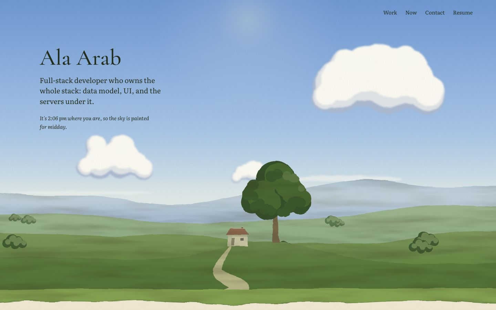 | 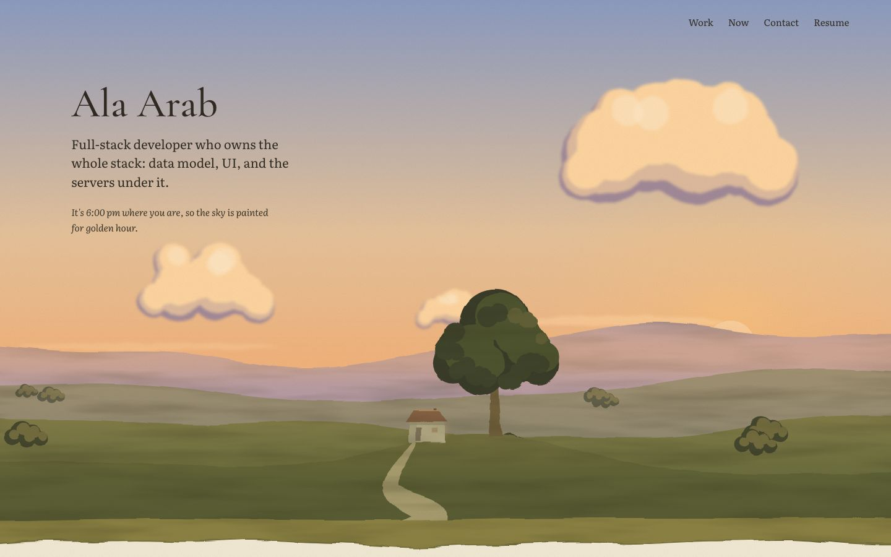 |
| 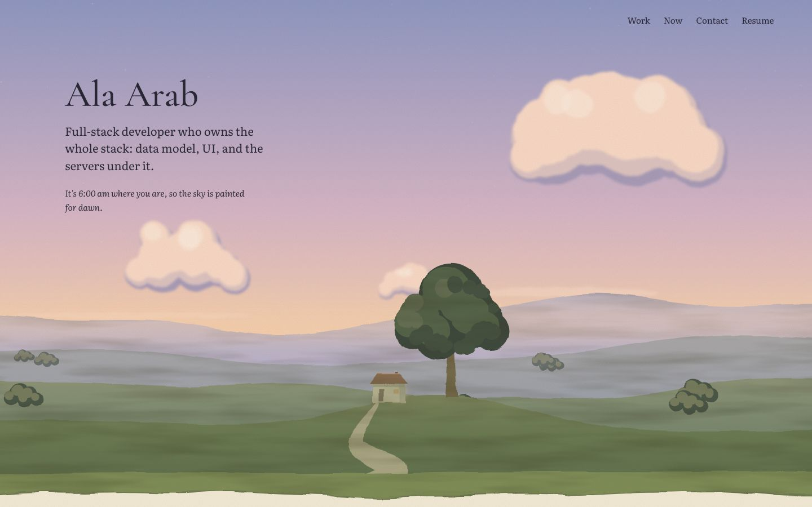 | 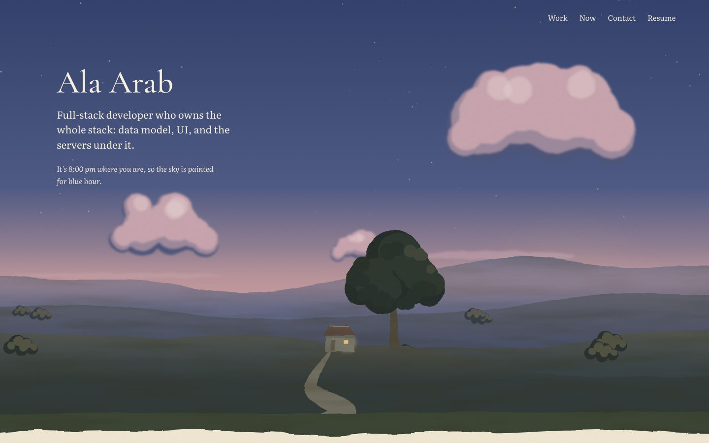 |
| 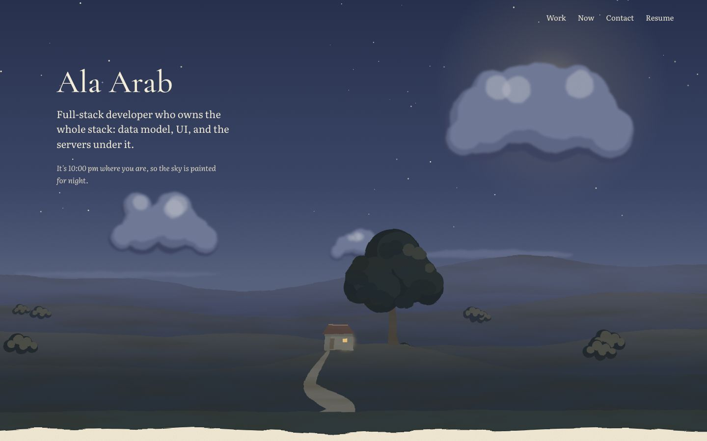 | 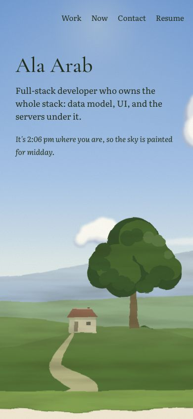 |

- Full home page: [desktop](home-desktop-full.jpg), [phone](home-phone-full.jpg)
- Phren: 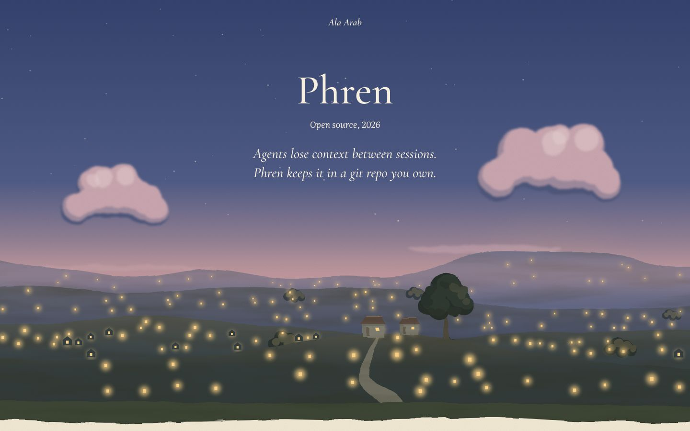
- m4l-builder, sine and square ridges: 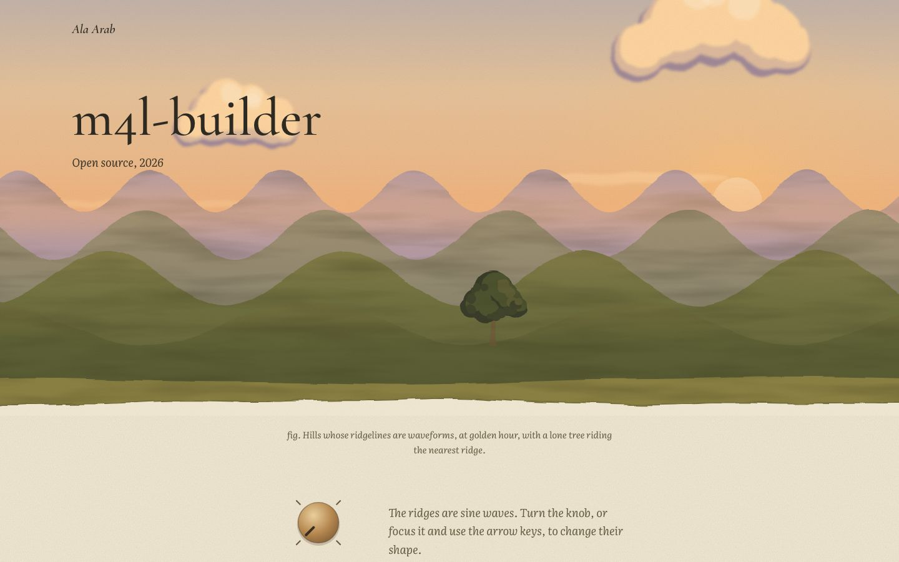 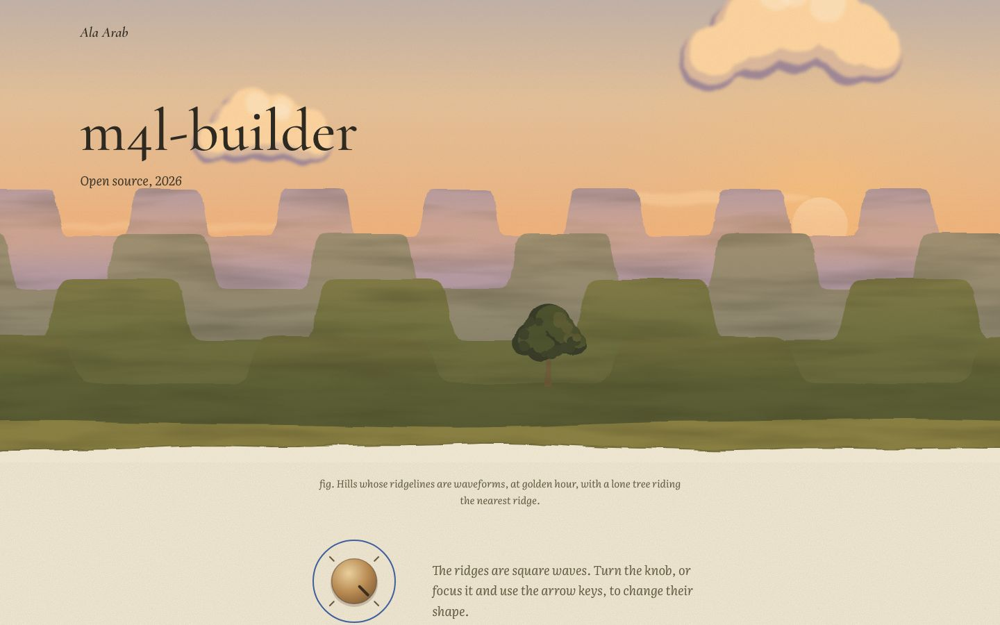
- Mina: 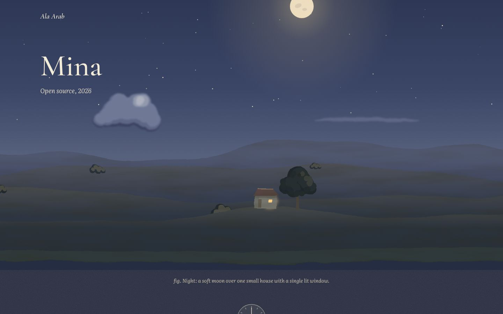 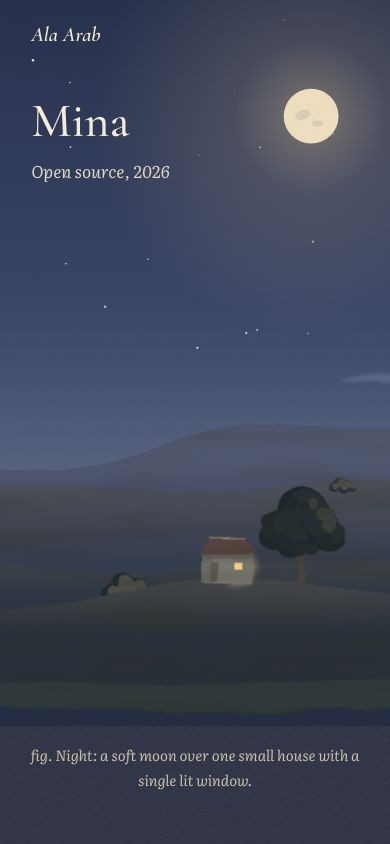
- Basis (orchard) and LiveMCP (bridge): 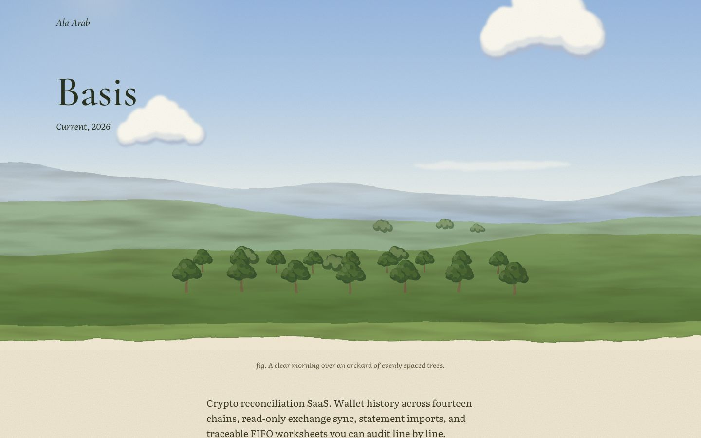 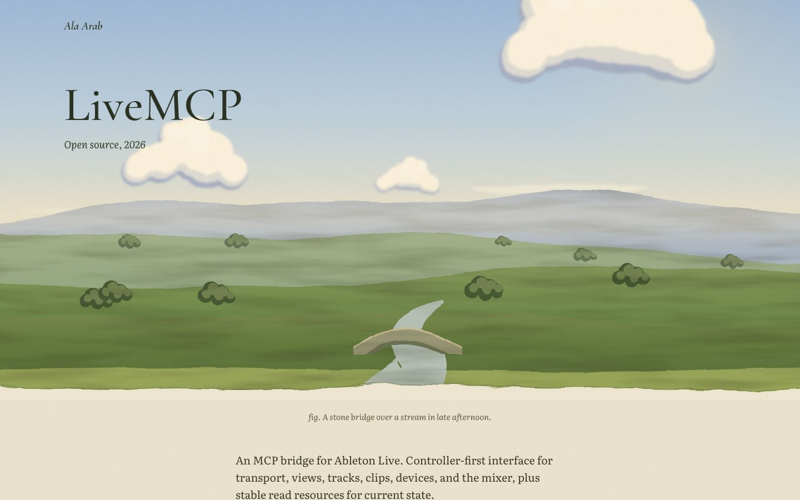

## Critique and changes

**Pass 1.** The composition worked (a big sky, one tree and one house, the paint ending on paper), but it failed on craft:
- The watercolour mottling on the hills came out as dark grey blotches, like smoke or dirt. I cut the texture to low-contrast horizontal washes (a stretched noise at about a fifth of the strength) and softened the edge wobble.
- The clouds read as clip-art bubbles with a drop shadow, because the shadow was one crisp offset shape. They now have a mid-tone layer between shade and light, flatter bases, no stray end puffs, and a softer blur.
- The midday sun was a flat grey disc that sat on top of the nav on phones. By day there is now only a glow; a disc appears for the moon and a low golden-hour sun.
- The tree's highlights looked like polka dots. I replaced them with small leaf clusters round the canopy edge, lit on the sun side.
- On phones the tree fell off the right edge. I moved the landmark group left so it stays inside the 390px crop.
- Phren's hillside had too many dark house pictograms. Fewer houses, closer in tone to the hill, so the lit windows carry the image.

**Pass 2.**
- In-page links came out bright green because the global site `--accent` leaked in. I pinned `--accent` to moss on the root. Project pages sink the project's own accent into the ink, so each page gets a slightly different link colour that stays at 4.6:1 or better.
- Contrast checks on every sky palette found blue hour below 4.5:1 near the horizon and the soft caption colour short on dawn and midday. I darkened the blue-hour middle band and the soft text. Every sky is now at least 4.6:1 across the band the text sits on.
- The orchard ran together into a hedge, so "evenly spaced" didn't read. It is now two clear rows with gaps.
- Mina's moon was cropped off on phones. It moved in toward the house, and the crater marks were toned down so it doesn't look like a face.
- The LiveMCP bridge sat on the paper edge. It moved up the meadow over a proper stream.
- On Mutter a cloud sat behind the title; it moved to the far side. The knob's focus ring became round.

**Would Ala call it busy, blocky, a newspaper, or slop?** It isn't busy or blocky: each screen has one idea, and there are no cards, chips or tables. The list of work below is long (fifteen entries), which is its densest moment, but it is plain type on paper. The main risk is **"generic painterly"**. From a distance the procedural hills can look like a well-made vector illustration rather than gouache. The clouds are the least convincing part: better, but still built from circles. Up close the paper grain, the watercolour edge and the leaf clusters hold up.

## Verification

- `tsc --noEmit` passes for everything in `src/lab/hillside/`.
- At 390px, home, phren, m4l-builder, mina, basis and an unknown slug all have `scrollWidth == innerWidth`, exactly one `h1`, no console errors, and no link or slider under 44px tall.
- The knob is `role="slider"` with `aria-valuetext`. ArrowRight gives "between sine and triangle" and End gives "square". It has a visible focus ring.
- Under `prefers-reduced-motion` the sky transition is effectively zero.
- Contrast: ink on paper is 9.7:1, soft ink 5.8:1, night-page text 10.7:1, and every sky's text is at least 4.6:1.
- Other builders' in-progress imports broke the shared `scripts/lab.ts` build, so I served from a private copy that stubs the missing modules (scratchpad only, not committed).

## What it would take to ship

- **Effort:** about 3 to 5 days. Move `Scene` and the palettes into the main site, prerender with the fixed afternoon sky (already hydration-safe), hand-tune clouds and trees per scene, and check performance on low-end phones.
- **Risks:** SVG turbulence and displacement filters are the cost. Each scene runs about six filtered full-width layers, and during the four-second sky ease they re-rasterise every frame. That is fine on a laptop but worth profiling on older Android. Prerendering the scenes to static SVG, or caching the filtered layers, would fix it. Also, the site's look now depends on painting skill in code: a clumsy new landmark shows immediately.
- **As projects are added:** each one needs a landmark drawing (20 to 60 lines of SVG) and a time of day. That is the fun part but also the bottleneck, and there are only eight hours of sky, so pages will start sharing skies. With more than about twenty projects, the home list needs an "earlier work" split to stay calm.
