# Ink Wash

**Concept:** rice paper, one ink-wash mountain, a red seal, and a great deal of quiet.

Lab route: `/lab/inkwash` (served on port 3408 while building). Code: `src/lab/inkwash/`.

## Why it fits Ala

Round 1 failed because everything was busy: racks, tables, maps, blocks of stuff. This is the opposite pole. Ala's copy is plain, direct and specific, and his best work (Phren, Mina, m4l-builder) is small tools done carefully. An ink painting is the same discipline: few strokes, each one placed on purpose, and the empty paper doing half the work. The page says one thing per screen, and the confidence is in what is left out.

## References and what is borrowed

- **Shan shui ink landscape painting.** Borrowed: graded ink from dense black-brown at a ridge to the faintest grey at its foot; the foot of every mountain dissolving into mist instead of ending on a line; short dry texture strokes on a slope; a few moss dots on a ridge. Not borrowed: calligraphy, any Chinese or Japanese characters, pavilions-and-pagodas subject matter.
- **Hasegawa Tōhaku, "Pine Trees" screens.** Borrowed: most of the surface is empty mist, and forms appear only where they have to. The first screen of the home page is built on that ratio: roughly four fifths paper.
- **Ghibli's pauses on an empty landscape** (the pillow shots between scenes). Borrowed: the idea that a quiet landscape with nothing happening is itself a scene worth holding, and the warm-cool balance of paper against grey ink.
- **The seal on a painting.** Borrowed: a single small vermilion mark is the only color on the page. Here it carries a Latin "AA" monogram, carved geometric strokes with uneven ink, not faux-Asian lettering.
- **Scroll colophons.** On project pages the stack and facts sit beside the painting like an inscription next to the seal, rather than in boxes.

## Palette

| Role | Hex | Why |
| --- | --- | --- |
| Paper | `#f3efe6` | Warm rice paper; never white. |
| Mist | `#f8f5ee` | The lightest thing on the page: mist bands laid over ink. Still not white. |
| Ink, dense | `#2b2620` | Black-brown, the densest ink at a ridge. Used for headings. |
| Ink, text | `#3b352e` | Body text: reads as ink, 11:1 on paper. |
| Ink, quiet | `#6a6257` | Secondary lines and captions, 5.2:1 on paper (above 4.5). |
| Wash greys | `#8c8479`, `#b9b2a6`, `#d9d3c7` | Graded ink for far ranges and faint washes. Art only, never text. |
| Seal | `#b8412c` | Vermilion. The only saturated color anywhere. |

Project pages shift the ink slightly toward the project (Phren a cool violet-grey, m4l-builder a bronze brown, Mina a night blue-grey with dimmer paper), never enough to become a theme color. The seal stays vermilion everywhere.

## Type

- **Cormorant Garamond, Light (300)**, with wide tracking, for the name and project titles. It has the high contrast and long, fine hairlines of a brush-cut letter; at light weight and generous tracking it sits on the paper the way a small inscription sits in the corner of a painting. It is only used at 26px and up, where the hairlines hold.
- **Newsreader (400, with 300 italic for the title line)** for everything read. It is a text serif with optical sizes, so it stays sturdy at 17 to 18px where Cormorant would go faint, and its calligraphic italic matches Cormorant without competing.

No sans, no monospace, no uppercase labels.

## The signature moment

On load, the ink blooms into the paper: the mountain appears from its peak outward as a soft wet edge spreads across the sheet over about 1.6 seconds, once. It is a CSS mask on one wrapper (an animated radial mask radius plus opacity), so it costs almost nothing. Under `prefers-reduced-motion` the painting is simply there, finished. Project pages reuse the same bloom for their one painting; nothing else on the site moves (the m4l-builder rings respond to the knob, which is interaction, not motion).

## Project pages

Each project page is a single small ink painting placed off-center, with a lot of paper around it, and the text in a narrow column. The facts (year, stack, metrics) are set as a short inscription beside the painting with the seal, and the quote, if any, is written into the empty part of the painting's space. Problem, build, impact and outcome are prose paragraphs separated by one short brush mark, not labelled boxes.

- **Phren:** stepping stones across still water, receding into mist, each with a faint reflection. A path you can walk back along. Ink goes cool violet-grey.
- **m4l-builder:** a bronze singing bowl and its striker, in ink. A working knob (keyboard, pointer and screen reader accessible, `role="slider"`) changes the rings of sound drawn around it, from a few wide rings to many fine ones.
- **Mina:** a thin crescent above a small bird asleep on a branch, the faintest wash, at night. The paper dims slightly.
- **Every other slug** gets a small motif from a table in `motifs.tsx`: Basis is evenly weighted stones on a balance, Intranet ERP an old pine that has stood a long time, Garden Sensor Network young shoots, OGrid terraced fields, LiveMCP a footbridge over a stream, Atlas a hut and its reflection, Intrapath a path climbing a hill, Mutter two birds calling across a gap, EMV a cairn of loose stones, Equipment Tracker nets drying on poles, AlphaLens the sun on a far horizon, Retrofit a small house with a ladder against it. Each also has its own brush mark in the home page list.
- **Unknown slug:** a single band of mist and one line.

## Deliberately left out

Grids of cards, tags, stats, any category grouping, the experience timeline (it lives on /resume), every metric on the home page, hover effects beyond an ink underline, scroll-driven animation, parallax, a dark mode, and any second color.

## Screenshots

Home, first screen and full page (desktop), then phone:

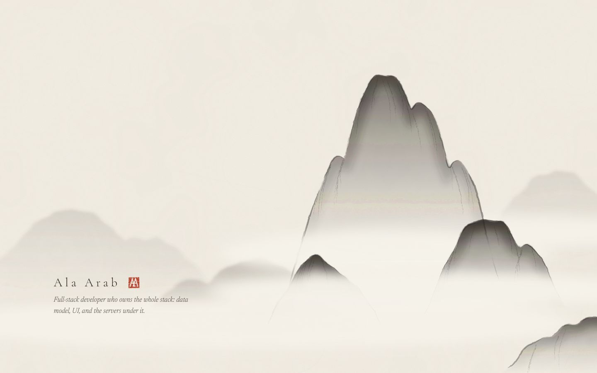
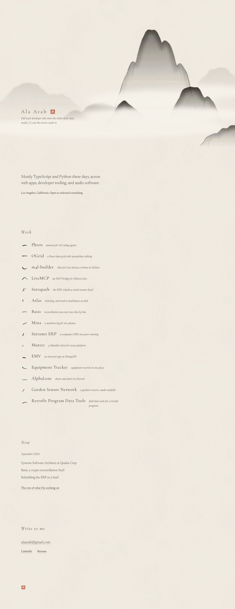
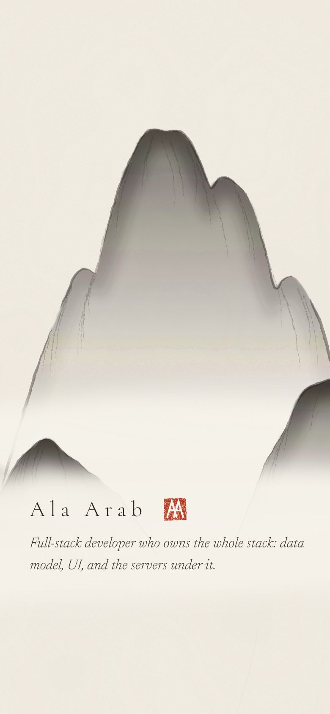
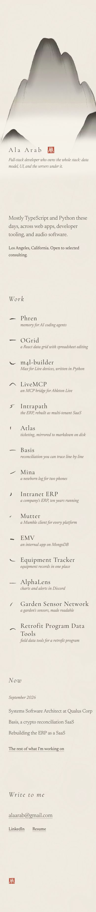

Showcase pages:

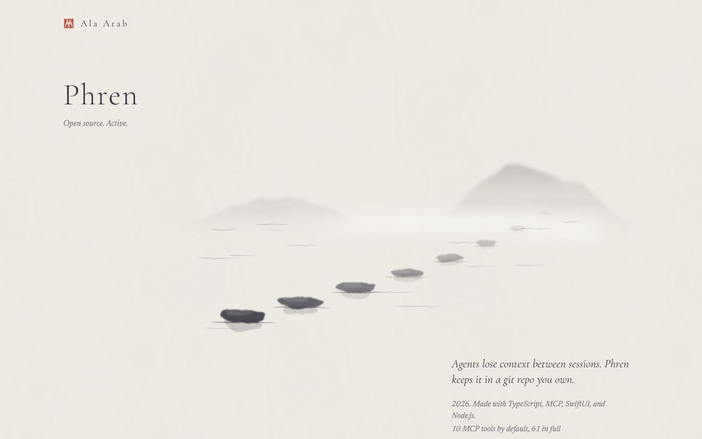
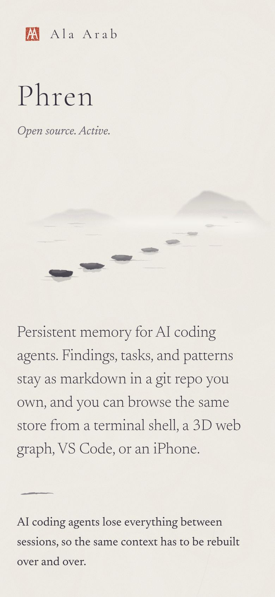
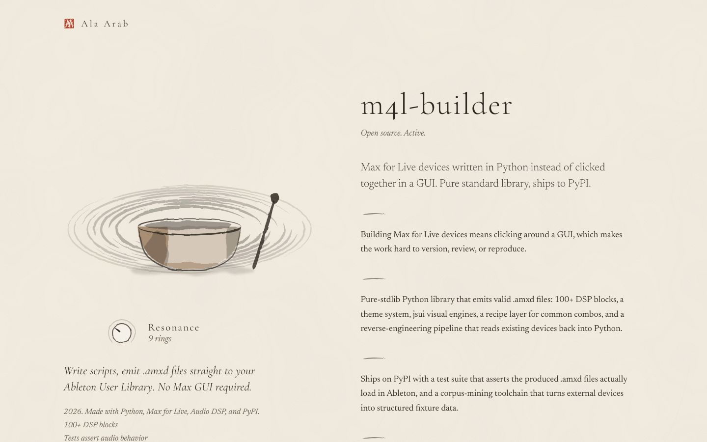
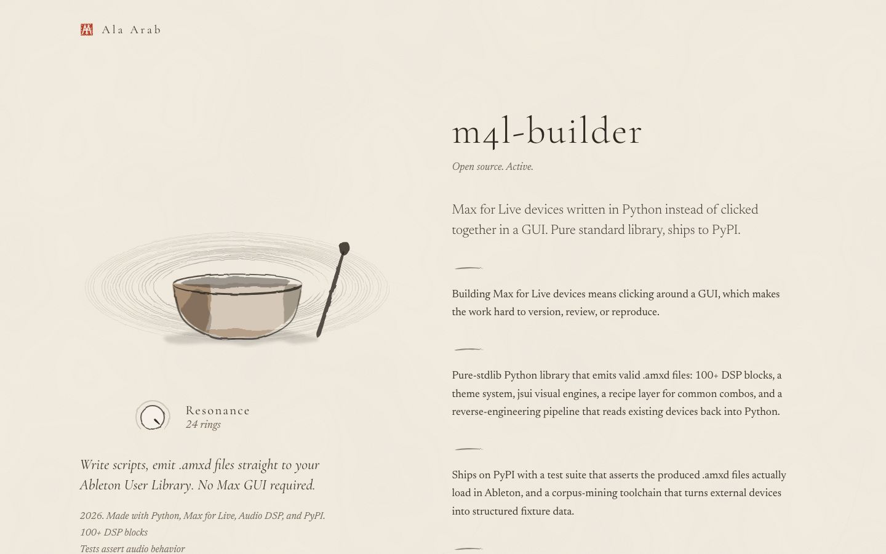
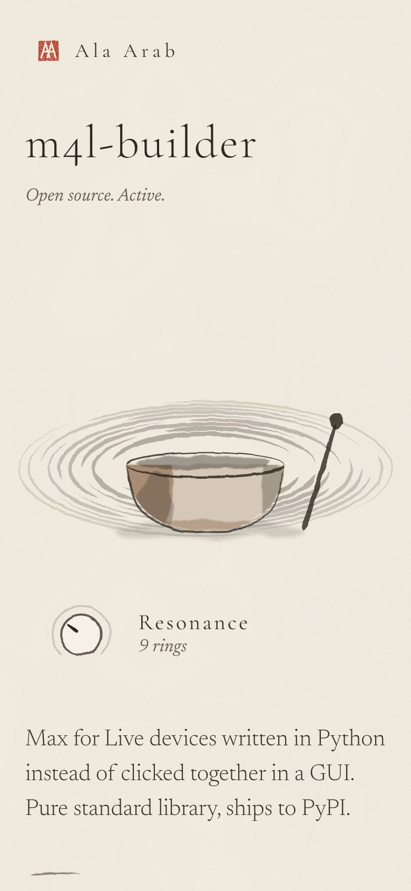
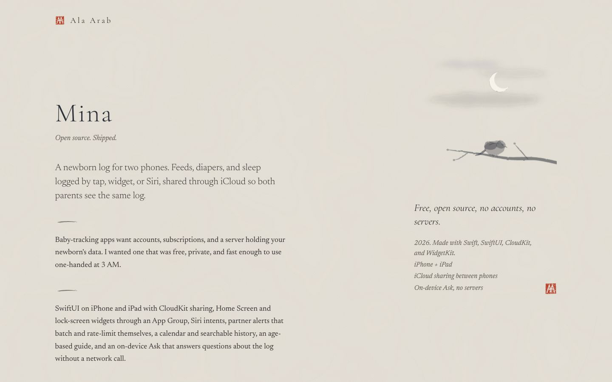
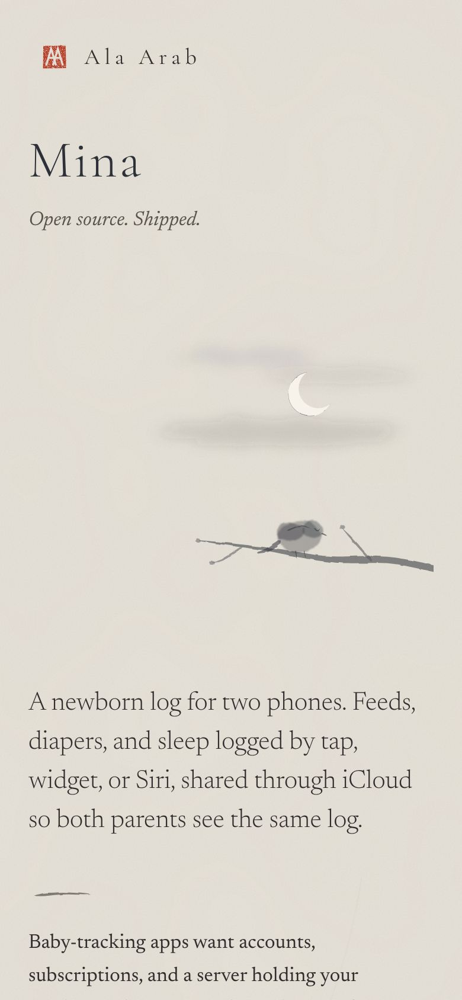

Lighter per-project pages and the not-found page:

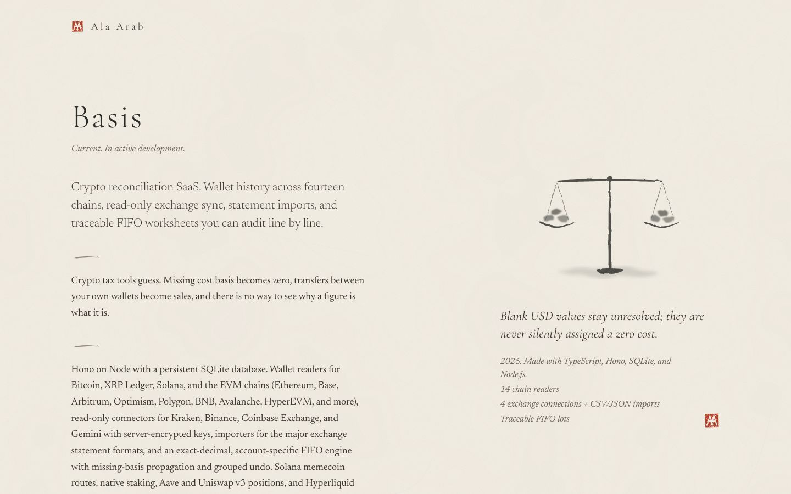
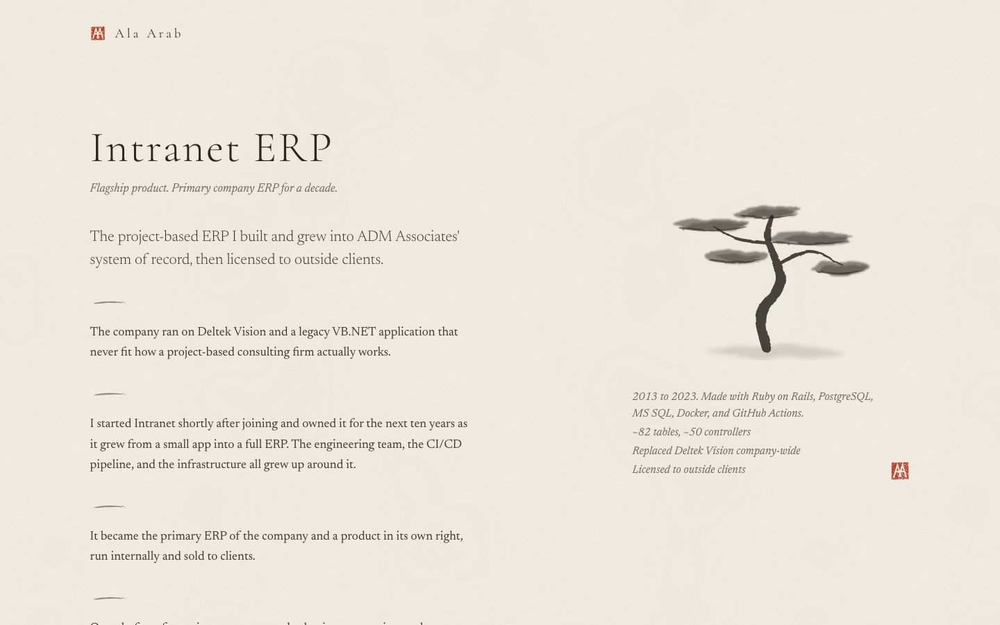
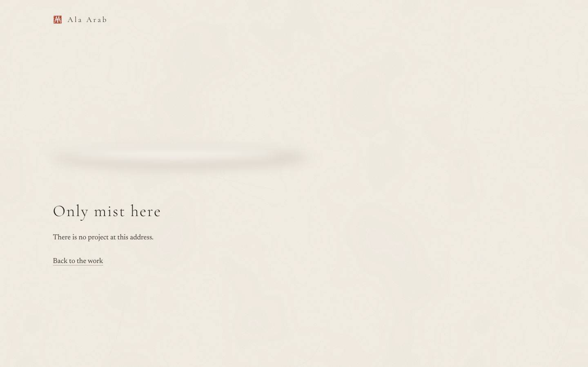

## Critique and changes

**Pass 1** (first render):

- The mountains were pointed triangles with an outline traced all the way round. That read as a child's drawing or a Toblerone, not ink. The texture strokes crossed each other like hatching (I had the slope direction inverted), and the "moss dots" on the peak read as a pair of eyes. The tiny pines on the near hill looked like written characters, which the brief explicitly rules out.
- Mist bands and night washes were cut off with hard, straight edges where the SVG ended, so the Phren and Mina paintings showed a visible rectangle. That is the "web template with a texture on it" look.
- The Phren page put all of the text below the fold, so the title was the only clue to what the project was.
- The singing bowl looked like a 3D render with a smooth metallic gradient, and the rings were dashed like stitching.
- The paper's long fibers showed as straight scratches.
- The full-page screenshots stretched the hero, because resizing the viewport to 3,700px also resized `100svh`.

**Fixes:**

- I rebuilt the mountain as a real shan shui massif. It is three overlapping layers, built back to front, each fading into mist before the next begins. Peaks are rounded and lumpy. Each layer has a pool of ink along the inside of its ridge (a blurred ridge stroke clipped to the shape), the contour is broken into separate brush strokes, and a few thin creases run down the slope in the right direction. I removed the pines and moss dots.
- Mist now uses a `--mist` color only a shade off the paper, and every wash was pulled inside its frame so no edge shows. For Mina I replaced the square sky with three soft, torn cloud washes.
- Phren and the other project pages now have a separate header, so the title and status are always in the first screen. The painting and its inscription sit in a side column, and the text follows.
- The bowl is now painted with irregular washes (bronze pooled on the left, a darker side on the right) plus a brushed contour and rim. The rings are brushed arcs with gaps. At the low end of the knob there are a few wide, soft rings, and at the high end many hair-thin ones.
- I made the paper fibers fewer, shorter and fainter. The full-page shots now use Playwright `fullPage` capture.

**Pass 2:**

- The Intranet pine's needle tufts had tick marks that looked like a ruler. I replaced them with a single dark brush line under each tuft.
- Mina's first night sky was a radial gradient that read as a target. The clouds replaced it, and in a third small pass I softened their blur.
- Phren's far hills still met the frame edge, so I moved them in.

**Pass 3 (build fix):** the bloom never actually played. Bun's CSS modules renamed `@keyframes bloom` to `bloom_nTo_zQ` but left the name inside the `animation` shorthand unchanged, so nothing matched. My reduced-motion check had only confirmed that the animation was off, which it always was. The keyframes, `@property` and the bloom rule now live in a plain `<style>` string rendered by `InkDefs` (React hoists it), under the names `iw-bloom` and `data-iw-bloom`. I measured it in the browser: 250ms after load the mask radius is 39% and opacity is 0.5, and it ends at 135% and 1. With reduced motion the animation is `none` and the painting is shown finished.

**Would Ala call it busy, blocky, a newspaper or slop?** Not busy and not blocky: each screen has one thing on it. The home page's first screen is a painting and a signature, and the list below it is 15 lines with no boxes. The home mountain now looks painted. The weaker art is the small per-project motifs (the Basis balance and the EMV cairn): they are well made, but closer to tidy illustration than to wet ink.

## Verification

Checked at 390px wide on phone, with reduced motion on, across home, Phren, m4l-builder, Mina, Basis and an unknown slug:

- Horizontal overflow: 0 on every page.
- Exactly one `h1` on every page.
- No console errors.
- Every link and the knob are at least 44px tall.
- With reduced motion, the bloom's animation and mask are both `none`, so the painting shows finished.
- The knob is keyboard operable (Arrow, Page Up/Down, Home, End). Its `aria-valuetext` reads "9 rings" and changes to "24 rings", and the painting's label updates with it. The focus outline is a solid 2px ring.
- Contrast: body text 10.5:1; quiet italic 5.2:1 on paper and 5.4:1 on mist; on Mina's dimmed paper, 10.6:1 and 6.0:1. Phren and m4l-builder tones are all above 5.3:1.
- `tsc --noEmit` passes.

## What it would take to ship

- **Effort:** about 3 to 4 days. That covers moving `ink.tsx` into a shared module and prerendering the pages (the paintings are deterministic, so SSR output matches). It also covers a proper design pass on the 12 small motifs, where two or three still need more wet-ink character. Last, the hero needs testing on low-end phones, because the displacement filters on a full-viewport SVG are the main performance cost.
- **Risks:** SVG filter rendering differs between Chrome, Safari and Firefox (displacement scale and blur quality), so the ink will look slightly different in each. The bloom depends on `@property` and animated masks, and browsers without them just show the finished painting, which is fine. The biggest risk is taste: this depends on the ink being good, and a mediocre motif shows more here than it would in a busier design.
- **Adding projects:** a new project needs its line of words, a mark and a small painting in `motifs.tsx`. That is the cost of this direction: every new project needs a drawing, and a generic fallback would break the concept. The home list works well up to about 20 entries. Past that, the quiet one-line list starts to feel like an index, and older work should move to /resume.

## Weakest point

The concept depends entirely on the quality of hand-authored SVG ink. The home mountain and the Phren stones reach that quality. The smaller motifs are respectable but more illustrative than painted, and procedural SVG ink will never have the texture of real sumi on real paper. Someone looking closely will see it is code.
