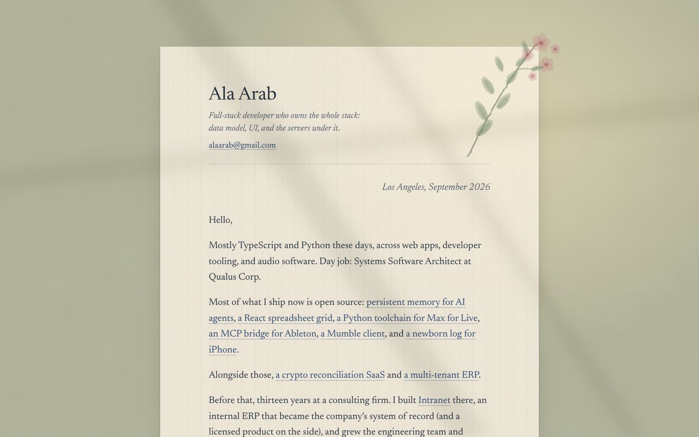
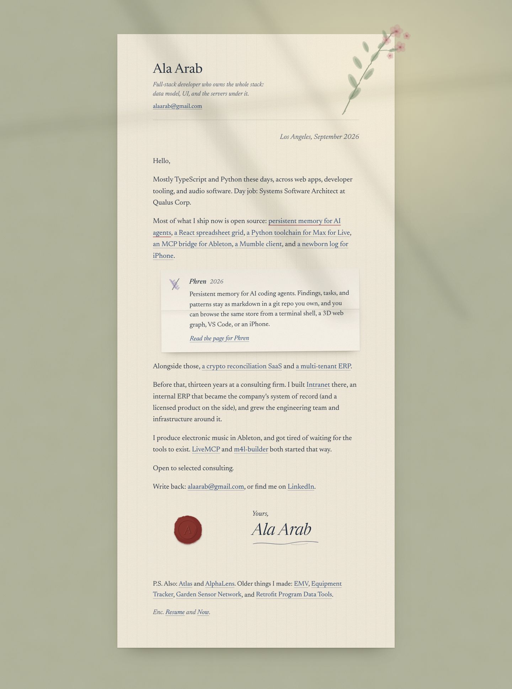
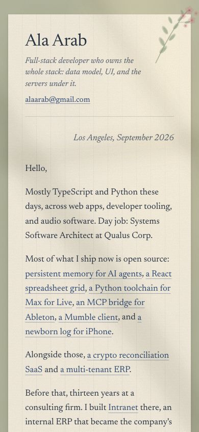
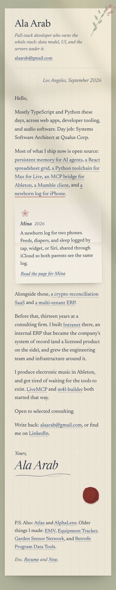
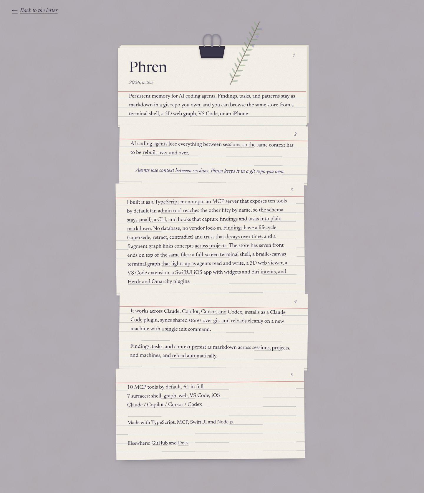
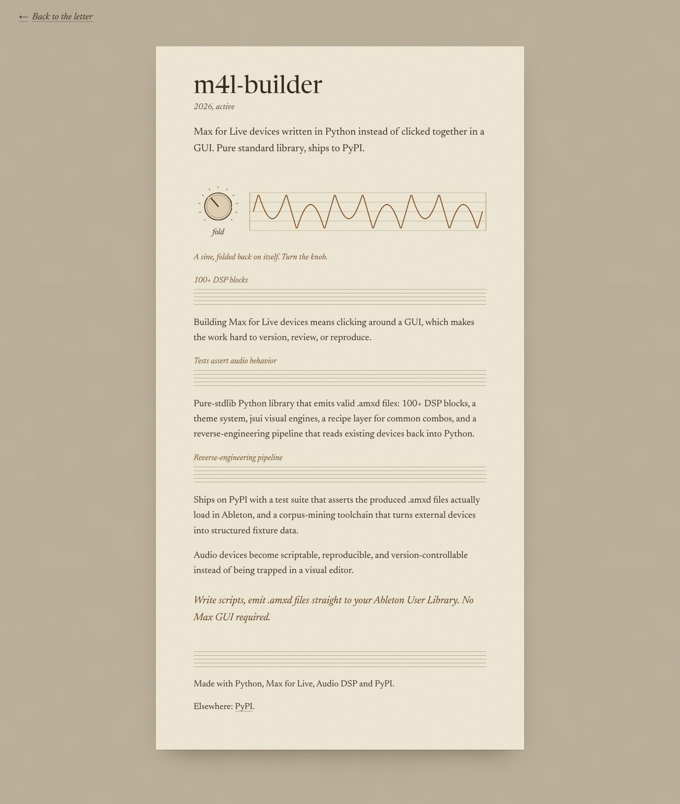
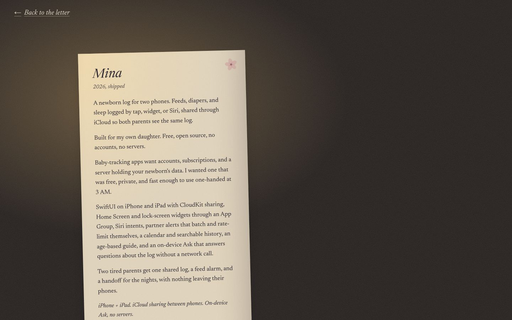
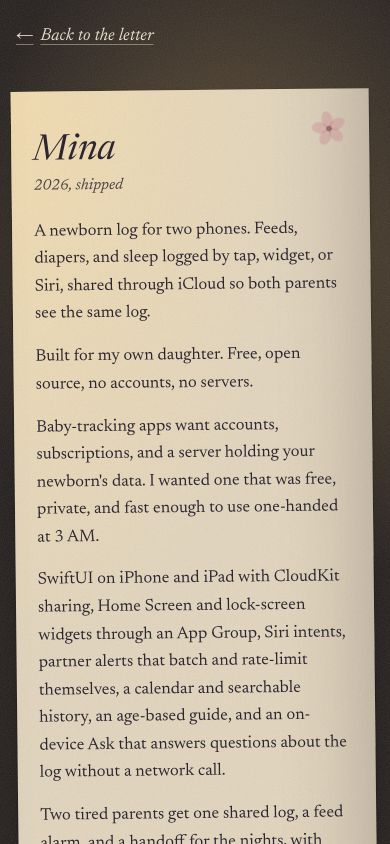
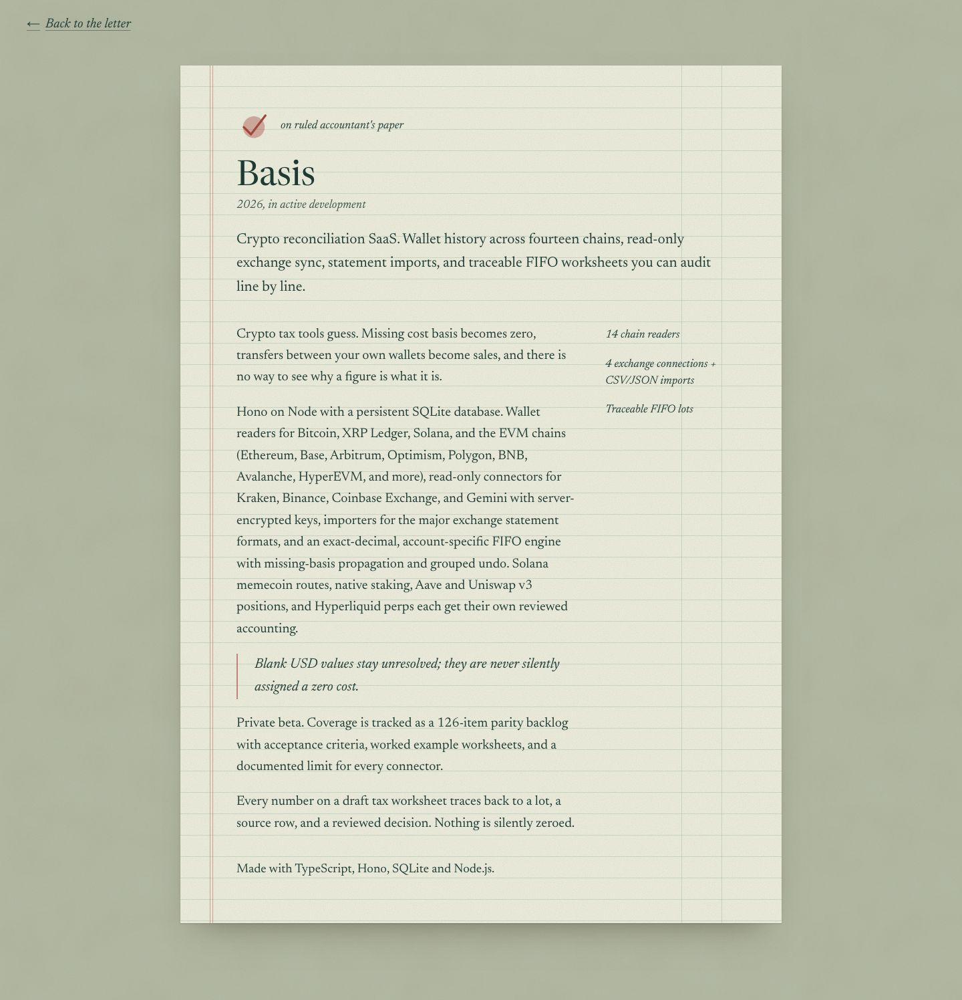

# Letter

**Concept:** the site is a letter from Ala. Each project unfolds, in place, from the sentence that mentions it.

Prototype: `/lab/letter` (home) and `/lab/letter/projects/:slug`. Code in `src/lab/letter/`.

## Why it fits Ala

His own copy is already written in the first person and in plain sentences ("Most of what I ship now is open source: persistent memory for AI agents, a React spreadsheet grid, ..."). That paragraph is a letter already. Round 1 failed because it turned his work into objects to sort: racks, rows, stations. A letter does the opposite. It has one idea per screen (a person telling you what he makes), it has no grid to fill, and it is the softest possible container that still says exactly what he does in the first three lines. The projects are not categorised; they are mentioned, the way you would mention them to someone.

## References and what is borrowed from each

- **Personal correspondence on laid paper.** The object itself: a letterhead, a place and date line, a greeting, a measure of about 62 characters, a sign-off, a P.S., "Enc." for the resume. The paper texture is laid paper: faint vertical chain lines and very fine horizontal laid lines, plus grain.
- **Ghibli interiors at a writing desk** (the quiet desk scenes in *Whisper of the Heart* and *Kiki's Delivery Service*, Kazuo Oga's light). Borrowed: afternoon light as a subject. A soft, blurred window shadow lies diagonally across the page. The desk under the sheet is a muted sage cloth, warm-cool balance against the cream paper. No characters, no scenery.
- **Hand-bound notebooks and pressed flowers.** Borrowed: one small watercolor touch per page (a pressed sprig on the letter, rosemary on Phren, a blossom on Mina), made from a few overlapping translucent SVG fills with a displacement filter for the hand-made edge.
- **Arts & Crafts printing.** Borrowed: restraint. One type family, ink colour for hierarchy instead of weights and boxes, a single small ornament (the wax seal) instead of a logo.

## Palette

| Role | Hex | Why |
|---|---|---|
| Laid paper | `#f5efe2` | Warm cream, clearly not white; reads as rag paper in afternoon light. |
| Paper shade | `#ebe3d0` | Chain lines and the edge of the sheet. |
| Ink | `#26303f` | Blue-black fountain-pen ink. About 12:1 on the paper. |
| Faded ink | `#4f5869` | Date line, captions. About 6.6:1 on the paper. |
| Link ink | `#2b4670` | A slightly bluer ink for the project phrases, so they read as "underlined in a different pen", not as web-blue links. |
| Desk cloth | `#b3b8a0` | Muted sage. Cool against the warm paper, the Oga warm-cool balance. |
| Pressed rose | `#c4868a` | The flower, faded as a pressed petal would be. |
| Pressed leaf | `#8b9c7e` | Sage leaf, lighter than the cloth. |
| Seal | `#7b2d2a` | Deep red wax, the only saturated colour on the page. |

Project pages shift this: Phren goes to a violet-grey ink and rosemary; m4l-builder to sepia manuscript; Mina to lamplight at night (`#1c1b24` room, `#f0c983` lamp); Basis to accountant's green paper with red rules; and so on.

## Type

**Newsreader** (Production Type, Google Fonts), one family for everything. It was drawn for long-form reading on screens, it has an optical size axis (so the 19px body and the 46px project titles each get the right contrast from the same family), and its italic is warm and slightly calligraphic, which does the work of a "signature" without a fake handwriting font. Literata was the runner-up; it is a little more bookish and less like a personal letter. Crimson Pro is lovely but too light at body size on cream. No second family: a letter written in one hand is the point.

## Signature moment

Clicking (or pressing Enter on) a project phrase in the letter unfolds a small folded note directly under that paragraph: a paper insert that swings open along a crease, with the project's one-line summary, a small mark drawn for that project, and a link to its page. Only one note is open at a time. Escape closes it and returns focus to the phrase. Under reduced motion the note simply appears.

## Project pages

Every project is "a different piece of paper tucked into the envelope", chosen for that project:

- **Phren:** a small stack of index cards held with a binder clip, a sprig of rosemary (for remembrance) under the clip. The project text runs across the cards, one thought per card.
- **m4l-builder:** a sheet of music manuscript paper. The text sits between the staves. An ink-drawn knob (an accessible slider) folds a waveform drawn on the staff.
- **Mina:** a small note left on a nightstand at 3 AM. The room is dark; warm lamplight falls on one corner of the note. Smaller, softer text.
- **Everyone else:** one entry per slug in `papers.ts`: paper type, ink, and a small drawn mark. OGrid is graph paper, Basis ruled accountant's paper with red margins, the Intranet ERP a worn memo pad with a coffee ring, Intrapath tracing vellum, Atlas a carbon-copy ticket, Mutter airmail stationery, Garden Sensor Network a seed packet, and so on.
- Every page has a "back to the letter" link, and unknown slugs get "This page seems to have slipped out of the envelope."

## Deliberately left out

Stats, metrics as numbers-in-boxes, tags and chips, category headings, a hero illustration, a nav bar, a project grid, dark mode, a second typeface, any monospace, and every project being equal on the home page. Metrics appear only as margin notes on project pages. The experience timeline is left to the resume, linked as an enclosure.

## Screenshots

Home, desktop fold and full page (with the Phren note unfolded):

Home on a phone (fold, and full with the Mina note open):

Phren (index cards under a clip), m4l-builder (manuscript paper with the fold knob), Mina (a note on the nightstand at 3 AM, desktop and phone), Basis (ruled accountant's paper):

## Critique and changes

**Pass 1.** Would Ala call it busy or a newspaper? No: it is one sheet and one voice. But it failed on two other counts.
- *The paper read grey, not warm.* The grain tile was far too strong (55% alpha brown noise), so every sheet looked like recycled cardboard and the ink lost its contrast. I cut the grain to 20%.
- *The "afternoon light" wasn't there.* A soft-light blend of blurred shapes just made grey smudges on the desk and greyed the first paragraph. I replaced it with warm light pooled on the cloth *under* the sheet, a highlight on the sheet's top corner, and three narrow mullion shadows in multiply, blurred less, so they read as a window.
- *The pressed sprig was a weed.* Too small and too thin to register. I made it bigger with more leaves and five-petal heads, adding a darker edge ring so each fill pools like watercolor.
- *Six dotted underlines in one sentence was noisy.* Mentions are now a thin solid underline at 38% ink. The open one turns faded rose.
- *Phren's ruled lines ran through the middle of the text.* Rules moved to just under the baseline, so the writing sits on the lines. The clip and the rosemary are larger.
- The "Back" arrow had lost its space inside the flex link, so I fixed it with a gap.

**Pass 2.**
- *Mina's lamp base* (a drawn circle, top left) looked like a UI button sitting behind the back link. I removed it. The glow alone is quieter.
- *Mutter's airmail border* didn't render (border-image with a repeating gradient), so I redid it as a border-box background.
- The Mina note tilt is smaller on phones.
- *The animations never ran in the built CSS.* Bun's CSS modules rename `@keyframes` but leave the names inside `animation:` unchanged. The keyframes now live in a hoisted `<style href="letter-keyframes">` in `FontLink.tsx`, with `letter-` prefixed names. I confirmed in the browser that `letter-noteRoom`, `letter-unfold` and `letter-lampBreath` all play, and none do under reduced motion.
- The "Elsewhere" links were 43px tall; they now have 44px+ tap targets. The inline project phrases get extra vertical padding for a taller hit area without changing the line box.

What still bothers me: the m4l-builder staves are plain CSS lines, clean where the rest is hand-made; the Phren clip is a flat shape; and the generic papers (EMV, Equipment Tracker, Retrofit) are pleasant but mostly texture plus a small mark. They are "themed" by paper, not by art.

## Verification

- `tsc --noEmit`: no errors in `src/lab/letter/`.
- Home, phren, m4l-builder and mina at 390px: `scrollWidth == innerWidth` (390). Every slug, plus an unknown one, renders at 1440 with exactly one h1.
- No console errors or page errors on any page.
- Keyboard: Enter on a mention unfolds its note (`aria-expanded` true), opening a second closes the first, and Escape closes it and returns focus to the phrase. The knob responds to arrows, Page Up/Down, Home and End (`aria-valuenow` 100 after End).
- Reduced motion: the note has no animation, and the Mina lamp doesn't breathe.
- Contrast (computed): ink on paper 11.6:1, faded ink 6.3:1, link ink 8.3:1, Phren card numbers 5.3:1, m4l sepia captions 6.8:1, Mina note in its darkest corner about 7.8:1. The yellow, manila and kraft papers are all above 8:1.
- Focus: a 2px ink outline on every link, mention and the knob.

## What it would take to ship

- **Effort:** about 2 to 3 days to productionise. That means moving the home letter into `siteContent.ts` as explicit paragraphs with mention markup (the `linkify` phrase matching is fine for a prototype but brittle for real copy), prerendering the project pages, and a pass on the three generic papers that are only texture.
- **Risks:** the home page depends on Ala's copy staying letter-shaped. If the summary becomes a list, the concept breaks. Inline mentions are `role="button"` spans (real `<button>`s can't wrap across lines). That's accessible, but it needs a proper no-JS fallback (render them as links to the project pages).
- **As projects are added:** each new project needs a phrase in the letter or a place in the P.S., plus a paper entry in `papers.ts`. The P.S. is the pressure valve, and if it grows past five or six names it starts to read like a list, so older work would eventually have to move to the resume. Bespoke showcase pages cost about half a day each.
