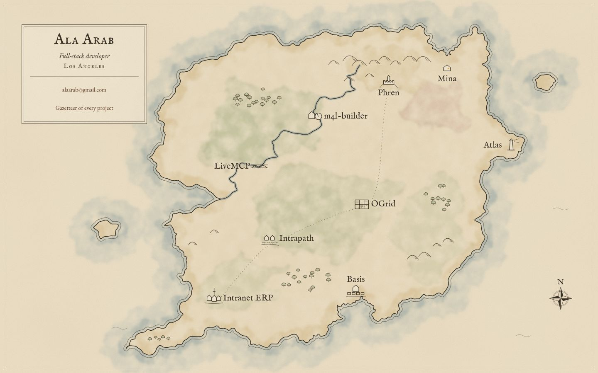
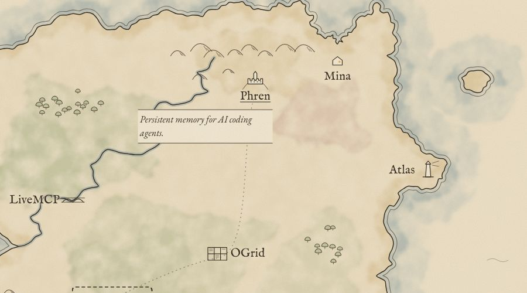
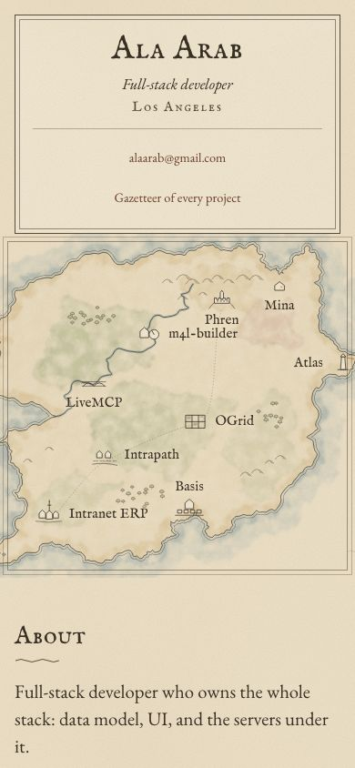
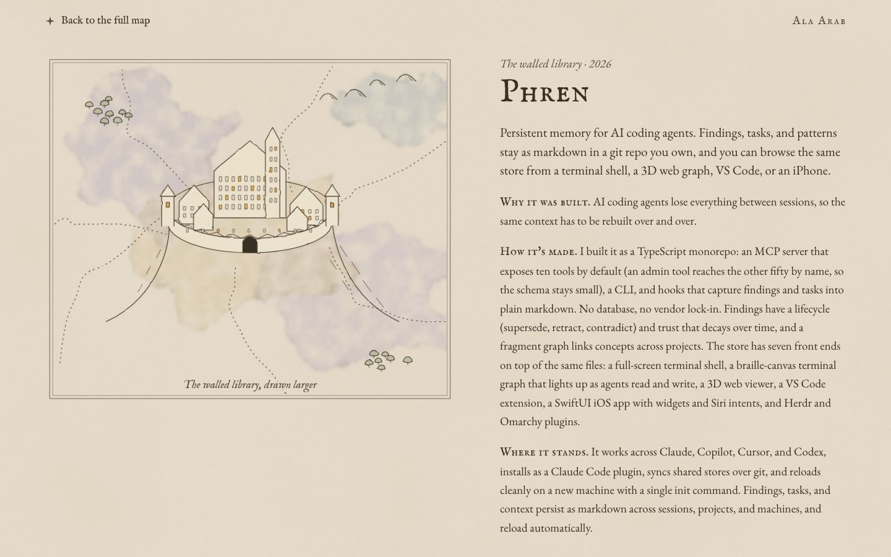
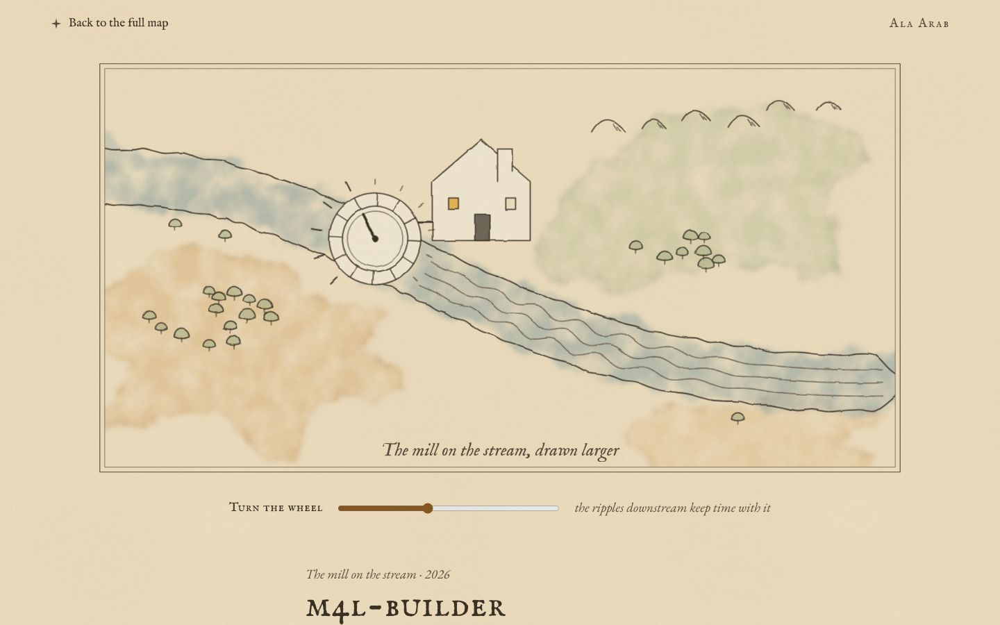
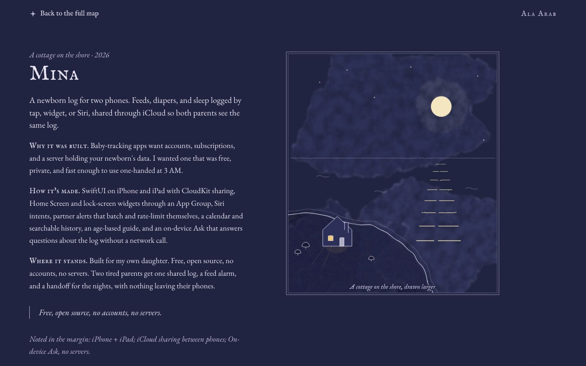
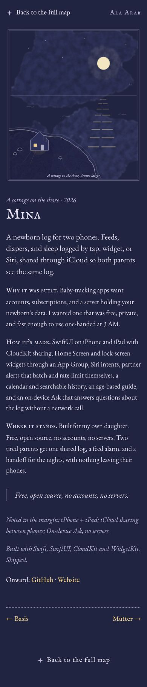
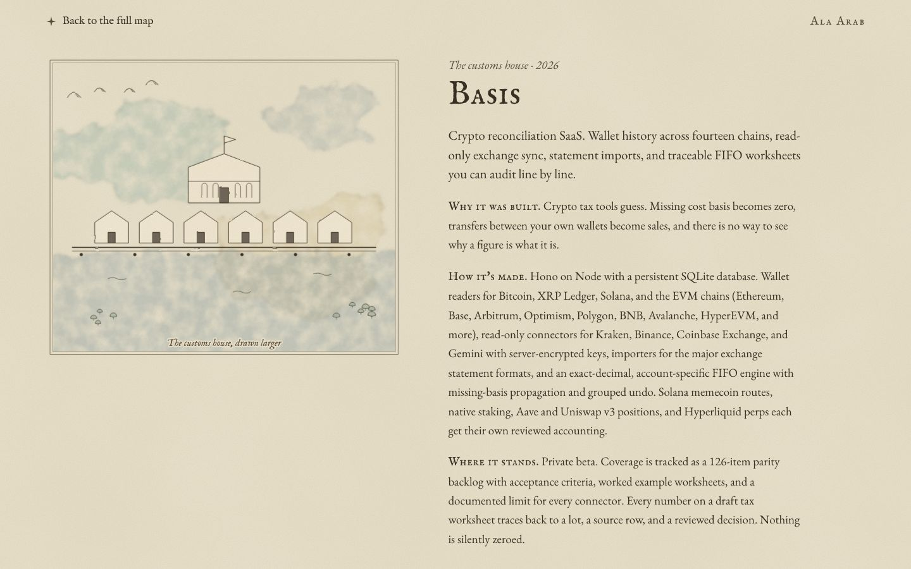

# Map

**Concept:** a sparse, hand-inked map of an imagined country where each piece of work is a small settlement, washed in watercolor.

## Why it fits Ala

Ala's work is a body of places built over fifteen years: an ERP that became a company's system of record, then its rewrite; tools for agents; tools for music; apps for his own family. A map says "this is a body of work you can walk around in" without turning it into a grid of cards. Older work sits to the south-west, newer to the north-east, so the drawing quietly carries a timeline without a single number on it. It's also the calmest way to show nine projects at once: a map is mostly empty on purpose.

Round 1's transit map was called "too busy". This is the opposite: one coastline, one river, a few hills and trees, nine names, and a lot of sea.

## References and what I borrow

- **Pauline Baynes' painted maps** (the Narnia and Middle-earth posters): soft, flat watercolor washes laid over ink, sea tinted only near the shore and fading to bare paper. Borrow the coastal wash and the muted four-colour restraint. Not borrowed: her decorative borders, vignettes, creatures.
- **Tolkien's own maps (Thror's Map, the Shire map):** a single confident ink line; hills as small repeated arcs; forests as clusters of tiny tree marks; lettering that is calligraphic but plain. Borrow the mark vocabulary and the economy. Not borrowed: runes, any geography, any lettering.
- **Old estate and coastal charts:** a fine echo line just off the coast, a small compass rose, a cartouche in a corner carrying the owner's name. Borrow those three devices.
- **Kazuo Oga's backgrounds:** warm paper, cool shadows, nothing saturated. Borrow the warm-cool balance of the palette.

## Palette

| Role | Hex | Why |
| --- | --- | --- |
| Parchment ground | `#efe4cc` | Warm, unbleached paper; never white. |
| Ink | `#3b3226` | Iron-gall brown-black; softer than black, 10:1 on the ground. |
| Faded ink (secondary text) | `#5e5040` | Still above 6:1 on parchment for small text. |
| Sea wash | `#8fa3a8` | Blue-grey, pooled only along the coast. |
| Meadow wash | `#a9b58a` | Muted green for the interior. |
| Sand wash | `#d9c08e` | Warm band just inside the coastline. |
| Faded rose | `#c99a8e` | One heath in the north-east; the only warm accent. |

Project pages shift this set (lavender dusk for Phren, ochre for m4l-builder, indigo night for Mina, and a keyed shift for every other slug).

## Type

- **IM Fell English SC / IM Fell English italic** for map lettering and headings. The Fell types are 17th-century English printing types, the kind used on real period maps and title pages; they have a slightly uneven, inked edge that sits naturally beside wobbly SVG lines. It is calligraphic in feeling but reads plainly, which is why I didn't take Pirata One (blackletter, too gothic) or a script face (illegible at label size). Cormorant SC was the close runner-up; it is more elegant but too thin and "fashion" for ink lettering on a chart.
- **EB Garamond** for body. Same Renaissance lineage as the Fell types, so they belong together, but it was cut for clean text setting: even colour, comfortable at 19px, good italics for the traveler's-notes voice.

## Signature moment

On first load the map inks itself: the coastline draws in (about a second), then the washes bloom in behind it and the names settle. It happens once per visit (session storage); with reduced motion the map is simply finished.

## Project pages

Each project page is an inset map "zoomed in" on its settlement, drawn in its own mood, with the text beside it as the traveler's notes (prose, not labelled boxes).

- **Phren:** a walled library town on a hill, many small lit windows, roads arriving from every direction (memory carried across sessions and machines). Lavender dusk washes.
- **m4l-builder:** a mill on a stream whose wheel is a knob. A real, accessible slider turns the wheel and changes the rhythm of the ripples drawn downstream. Ochre washes.
- **Mina:** one cottage at night on a quiet shore, the moon on the water, one lit window. The whole page goes to indigo.
- **Every other slug:** a keyed motif, palette shift and caption from a small table (`places.ts`): Basis a customs house with lined storehouses, Intranet a long-established market town, Atlas a lighthouse, Garden Sensor Network a garden plot, and so on.
- Unknown slug: "This place isn't on the map yet", with the way back.

## Deliberately left out

Regions named after categories, a legend, filters of any kind, tags, stats, a timeline widget, sea monsters, ships, decorative borders, any second animation, and a dark theme for the home page.

## Screenshots

Home, desktop fold (1440x900), after the map has inked itself in:

Hovering or focusing a place shows its one-line annotation:

Home, phone. The map crops to the settlements, the cartouche moves above it, and the marks are drawn larger:

Full pages: [desktop](home-desktop-full.jpg), [phone](home-phone-full.jpg).

Project pages:

## Files

- `src/lab/map/Home.tsx` has the home page: the cartouche, the map, then About, the gazetteer, Now and Contact.
- `src/lab/map/CountryMap.tsx` draws the country and places the links, the annotation, the phone crop and the ink-in.
- `src/lab/map/country.tsx` holds the geography: coastline, islets, river, place coordinates and settlement marks.
- `src/lab/map/ink.tsx` has the drawing helpers: roughened outlines, hills, trees, washes, the compass and SVG filters.
- `src/lab/map/Insets.tsx` has the Phren, mill and Mina insets, plus a keyed motif for every other slug.
- `src/lab/map/places.ts` gives each slug its place name and palette shift, and holds the font URL.
- `src/lab/map/Project.tsx` lays out the project pages (three layouts), the not-found page and the mill slider.

## Critique and changes

**Pass 1** (first build of the home page). The island was a potato: an even, round, uniformly crinkled blob. The watercolor patches read as camouflage rectangles with hard edges. The trees looked like mushrooms. On the phone, a strip of the global dark body showed above the cartouche because of margin collapse.
Changes: I redrew the coast with a south-west peninsula, a western firth at the river mouth, a harbour for Basis, a north-east cove for Mina and an eastern headland for Atlas. The wash filter now uses higher-frequency displacement and alpha mottling, and each wash carries a pooled edge. Blobs have more lobes and uneven radii. The tree crowns are bigger and the trunks shorter. I replaced the margin with padding.

**Pass 2** (all pages). Would Ala call the home page busy? I don't think so. It shows one coastline, one river, nine names and a lot of sea, and it reads as a drawing, not a layout. The project insets had more problems:
- Washes bled past the inset neat-lines.
- The drawings were too clean and vector-like: the Phren town read as clip art.
- The stream wash on the mill page sat off the banks, and the mill house stood in the water.
- The Mina cottage sat on the sea side of its shore, with no land drawn.
- The Basis customs house looked like a striped tent.
- The OGrid hatching drew one line per field.
- The Intranet market cross looked like a π.

Changes: everything in an inset is now clipped to the frame and passed through a light wobble filter, so lines look hand-inked. The stream wash follows the centre line, and the mill house moved onto the north bank with an axle to the wheel. The Mina foreground became a dark land wash with the cottage on it and lamplight falling on the grass. Basis got a portico with arched windows and a harbour wash. OGrid is now hand-jittered hedged fields with furrows (the selected range and its fill-handle square are a quiet nod). The market cross became a well.

**Pass 3.** The river on the home map was nearly straight, which looked mechanical, so I gave it real meanders.

**What still isn't great.** The motif insets for the less important projects (Mutter, AlphaLens, EMV, Equipment Tracker) are simpler line drawings over washes. They are distinct but clearly lighter than the three showcases. The phone map is small (390x378), so the place names are legible but the drawing loses its air.

## Verification

- `tsc --noEmit` passes.
- There is no horizontal overflow at 390px (scrollWidth equals innerWidth) on the home page, Phren, m4l-builder, Mina, OGrid and the not-found page.
- There are no console errors, and each page has exactly one h1.
- Focus is visible: a dashed outline on map places, links and the slider.
- Tap targets: the map places, gazetteer names, cartouche links, back links, neighbour links and the slider are all at least 44px. The only exceptions are links inside running prose (the email address, LinkedIn and Resume in the paragraphs), which is the WCAG inline exception.
- Contrast on parchment: ink 9.96:1, secondary ink 6.17:1, links 7.06:1. On Mina's night page, secondary ink is 8.41:1 and links 10.23:1.
- Motion: the coastline ink-in runs on the first visit of a session only, and not at all under prefers-reduced-motion. Bun CSS modules rename `@keyframes` but not the name inside the `animation` shorthand, so the keyframes (`map-draw`, `map-bloom`) live in a plain hoisted `<style>` in `Home.tsx`. Confirmed in the built page: at 0.5s the place names are at opacity 0 and the washes at 0.33; by 3s everything is at 1 and the coast dash offset is 0. The mill wheel's rotation transition is also turned off under reduced motion.
- The slider responds to the keyboard, and aria-valuetext describes the wheel.

## What it would take to ship

- **Effort:** about 3 to 4 days to take this to production.
  - Port it into the real `/` and `/projects/:slug` routes and prerender them.
  - Tighten the phone map.
  - Give the four weakest motifs a second drawing pass.
  - Test the SVG filter cost on low-end phones. Five filtered groups are fine on a laptop, but feDisplacementMap over a full-width map is the main performance risk. The fallback is to rasterize the washes into a static SVG at build time, or to drop the displacement on small screens.
- **Adding projects:** each new featured project needs a hand-placed spot on the map, a settlement mark and an inset motif. The geography is authored by hand, so beyond about 10 to 12 places the map loses the emptiness that makes it work. At that point the answer is to keep the map to 8 or 9 featured places and let the gazetteer carry the rest, which it already does. A non-featured project only needs an entry in `places.ts`, and it falls back to the country palette and a neutral motif if it doesn't have one.
- **Risk:** the concept depends on drawing quality. A careless new motif stands out much more here than a new card would in a grid.
