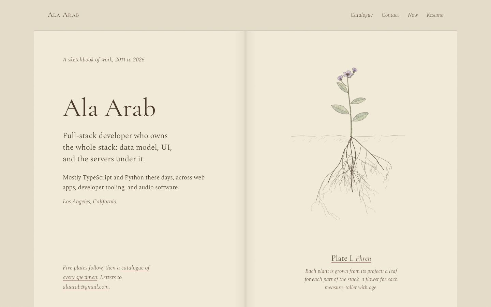
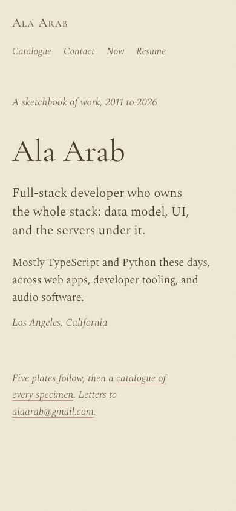
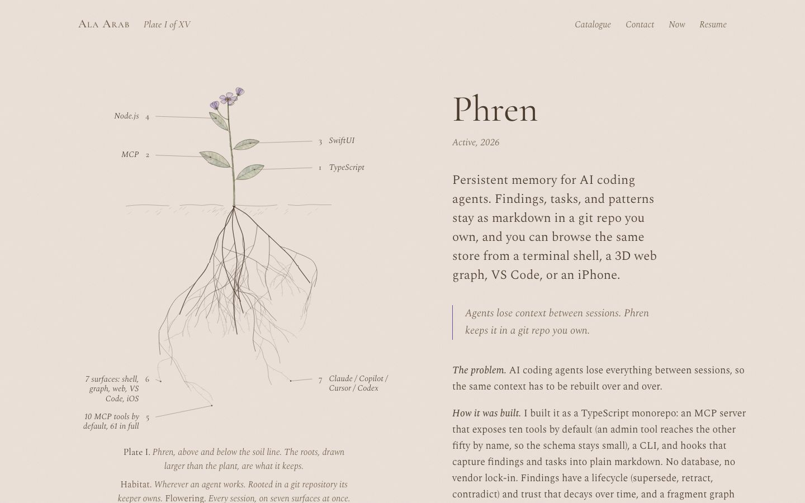
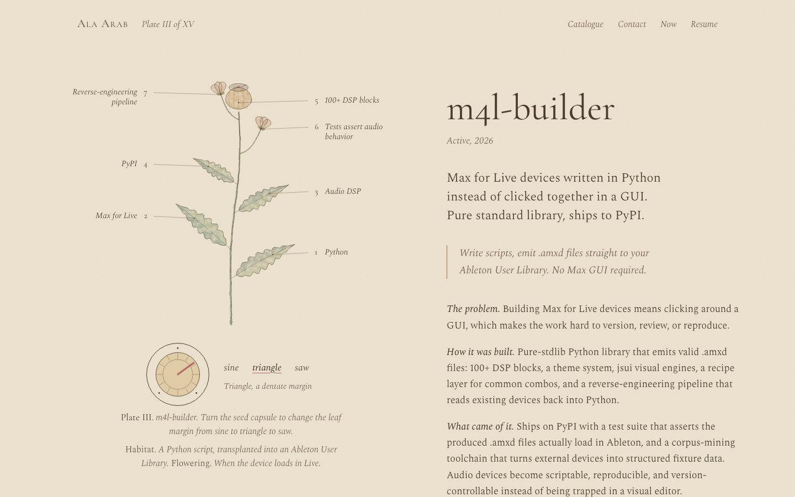
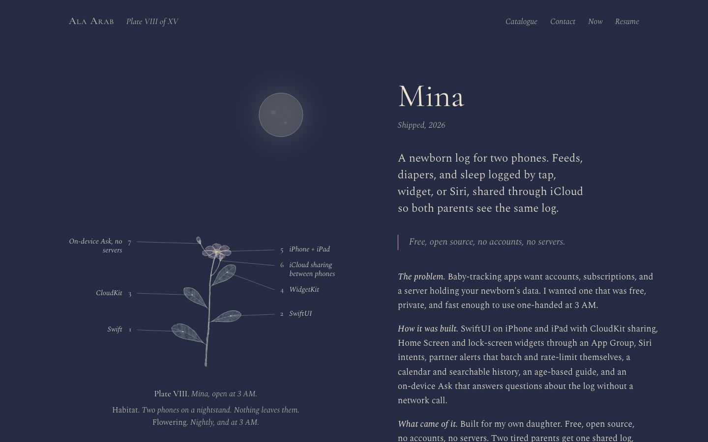
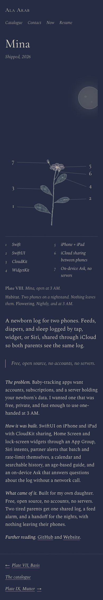
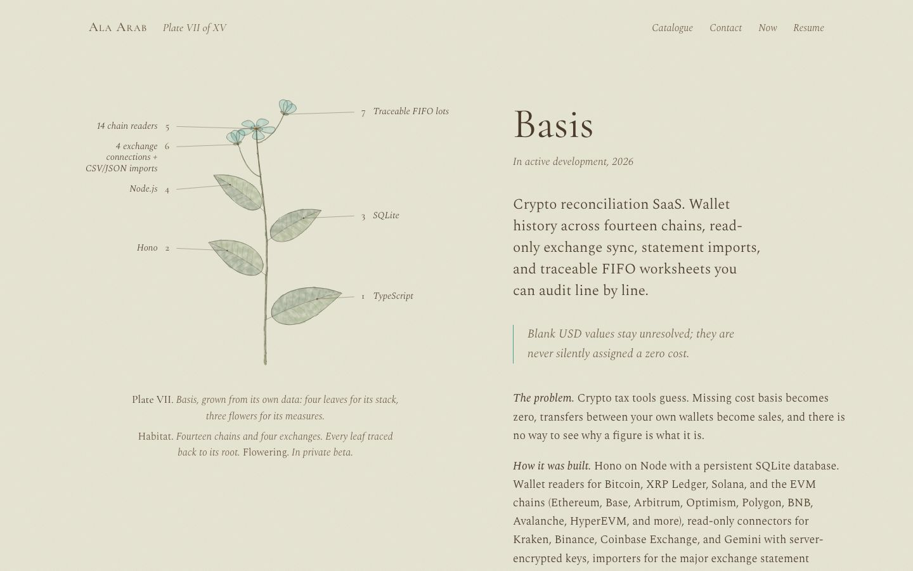

# Specimens

**Concept:** a naturalist's sketchbook. Each project is a botanical plate, and the plant on it is grown from that project's own data.

## Why it fits Ala

Ala's work is a collection of long-tended things: an ERP he grew for a decade, a memory store that keeps what agents learn, instruments he made for his own sessions, an app for his daughter. A sketchbook of specimens treats each one as something grown and observed rather than a product tile. The generated plant is honest about its data: a project with five stack items has five leaves, a project with three metrics has three flowers, and an older project stands taller. It's a quiet, specific way to show a body of work without any card, chip, or table. It is also a real engineering artifact (a seeded, deterministic SVG generator), which suits someone who owns the whole stack.

## References and what I borrow

- **Pierre-Joseph Redouté (Les Liliacées, Les Roses):** one specimen per sheet with a lot of paper around it, transparent washes laid over a fine contour, and one half of each leaf shaded darker than the other.
- **Curtis's Botanical Magazine plates:** the plate number and italic name at the foot, and small numbered figures linked to a written key. The key becomes the annotations: real stack items and metrics at the ends of fine leader lines.
- **Field notebooks (Darwin, Beatrix Potter's fungi studies):** the text beside the drawing reads as notes, with italic run-in heads instead of labeled boxes.
- **Kazuo Oga / Ghibli background painting (from the shared brief):** warm-cool balance and restraint. The washes are low-opacity and slightly mottled, and the mina page shifts to a cool night paper under a pale moon.
- **Classic book design:** an open spread with a gutter, running heads, and roman plate numerals.

I'm deliberately not borrowing Haeckel's dense symmetry, ornamental borders, or fake Latin binomials (those would mean inventing facts).

## Palette

| Token | Hex | Why |
|---|---|---|
| Ground | `#e7dfcb` | The table the sketchbook lies on, a shade darker than the page so the spread reads without a shadow |
| Paper | `#f1ead9` | Warm cream laid paper, never white |
| Ink | `#4a3b2c` | Iron-gall sepia for text and contours, never black (about 9.6:1 on paper) |
| Ink soft | `#6a5843` | Captions and annotations (about 5.6:1 on paper) |
| Sap green | `#6f8a4a` | Leaf washes, laid at 25 to 35% opacity |
| Madder rose | `#b56a6a` | Flower wash, and the link underline |
| Indigo | `#3f4f7a` | Cool shadow half of leaves and the mina night |
| Ochre | `#c49a4a` | Stamens, soil, the capsule on m4l-builder |

Flower hue comes from each project's accent, desaturated and lightened into a wash, so Phren's violet becomes a soft heather and Basis's teal a pale verdigris.

## Type

- **Spectral** (300/400, with its italic) for the text. It's a screen-first book serif from Production Type, so it holds up at 18px on a laptop where Cormorant would go thin. Its italic is refined enough for captions and annotations.
- **Cormorant Garamond** (400/500 and italic) for the display lines only: the name, plate titles, and roman numerals. Its high contrast at large sizes recalls the engraved lettering at the foot of a Curtis plate.
- No handwriting face. None on Google Fonts reads as fine penmanship, and the italic does the annotating better.

## The signature moment

The plant draws itself the first time it comes into view: the stem is inked from the soil up, then the leaf contours, and the washes settle in after the line. It happens once per plate and never loops. With reduced motion, the plate is simply finished.

## How project pages are themed

Every page is one large plate beside the field notes, with the plant grown from that project's data and a per-slug note in `src/lab/specimens/notes.ts`: a habitat line, a flowering line, a leaf form, and a wash hue.

- **phren:** a small plant above a soil line and a root system below it that's larger than the plant. The roots stand for the kept memory, and its metrics are annotated on the roots.
- **m4l-builder:** the leaf margins are waveforms. A seed capsule drawn as a knob (a real slider, keyboard and pointer) sweeps from sine (a sinuate margin) through triangle (dentate) to saw (serrate), and the plant redraws.
- **mina:** the page turns to night paper. There's one small pale flower open under a moon washed in indigo, captioned "open at 3 AM".
- **Everything else:** the generated plant, its accent wash, a leaf form, and the habitat and flowering note.

## Deliberately left out

Grids of cards, tags, stats, filters, dark mode, monospace, handwriting fonts, and ornament borders. Also experience and education on the home page (Resume covers them), and more than five plates on the home page. Everything else is in the catalogue.

## Screenshots

| Home, desktop fold | Home, phone fold |
|---|---|
|  |  |

Full pages: [home desktop](home-desktop-full.jpg), [home phone](home-phone-full.jpg).

| Phren | m4l-builder (sine) | m4l-builder (knob at triangle) |
|---|---|---|
|  |  |  |

| Mina, desktop | Mina, phone | Basis (default treatment) |
|---|---|---|
|  |  |  |

Phone: [phren](phren-phone.jpg), [m4l-builder](m4l-builder-phone.jpg).

## How the plant is grown

`src/lab/specimens/grower.ts` is a seeded generator (FNV hash of the slug into mulberry32). It grows a tapered stem with sway and lean, one leaf per stack item (alternating sides, lower leaves longer and more spread), one flower per metric (a face-view terminal flower and side-view cup flowers on curved stalks), and a bud when there are no metrics. Height comes from age (from `startYear`) and a little from leaf count. Each leaf is a washed fill plus a cooler wash over one half, an ink contour, a midrib, and veins. Washes go through a displacement and mottling filter; ink goes through a finer displacement for the hand wobble. Leader lines anchor to real points on the generated leaves, flowers, or roots, so the annotations always touch the part they name.

## Critique and changes

**Pass 1** (first screenshots):
- The reveal didn't play: plates stayed blank with motion enabled. Bun's CSS modules hash `@keyframes` names but leave `animation` and `animation-name` references alone, so the animation pointed at nothing. I moved the two keyframes into a small global `<style>` in `chrome.tsx`.
- The annotation text rendered at about 12px, too small to read. I widened the plate to 900 units, raised the label size, and grew the leaves and flowers so each plant fills its sheet.
- Phren's soil was a flat beige rectangle, which read as a UI block and not as ground. Roots clamped at the plate edge made hard vertical lines. I replaced the soil wash with a broken ink line and sparse hatching, and roots now turn back inward instead of clamping. I also made them thinner and less dense, so they read as a drawing and not as a scribble.
- The Mina moon was a flat grey disc with a halo, like a UI target. With the watercolor filter it looked like concrete. Now it's a blurred haze, a thin wash, and a fine contour.

**Pass 2:**
- On phones the plant used only 40% of the width, because the plate kept its desktop label margins. On narrow screens the plate is scaled to 170% and cropped: the leader numerals stay visible and the key folds below as a two-column list.
- Short plants left a band of empty paper above them. The viewBox now crops to the plant's highest point, plus air.
- Labels near the foot of the phren plate ran into the caption. Labels now reflow upward when they'd run off the plate.
- The home caption for Atlas was a long run-on sentence. Captions over 90 characters now fall back to the project name.
- The knob's focus ring was a square box around a round capsule, so I made it round. The name link on phones was 34px tall; it's now 44px.

**Would Ala call it busy, blocky, a newspaper, or slop?** I don't think it's busy: each spread holds one idea, and the plates are mostly paper. It isn't blocky either, since the only rectangles are the book pages themselves. The catalogue is the most "list-like" moment, but it's quiet and each row carries its own sprig. It reads as drawn rather than templated because every plant is different and the line wobbles. The risk is that at a glance a visitor sees "pretty leaves" before "developer". The opening page puts the name and title first to guard against that.

## Verification

- `tsc --noEmit`: clean for `src/lab/specimens`.
- No horizontal overflow at 390px (scrollWidth 390) on home, phren, m4l-builder, mina, and basis.
- No console errors or page errors on any shot page, including an unknown slug.
- Exactly one h1 per page (home, all project pages, not-found).
- Focus: a 1.5px ink outline on every link and button, round on the knob.
- Contrast: ink #4a3b2c on paper is about 9.6:1, and ink-soft #6a5843 (captions and annotations) is about 5.6:1. On the night page, #ece3cc and #c3bba9 on #232a42 are above 8:1.
- Reduced motion: the reveal is gated behind `prefers-reduced-motion: no-preference`. Under reduce, plates render finished (the full-page shots are taken that way).
- Tap targets: running head, catalogue rows, turn links, and knob choices are all at least 44px. Inline links inside prose are exempt.
- Knob: role `slider` with `aria-valuetext` ("Triangle, a dentate margin"). Arrow keys, PageUp/PageDown, Home/End, and pointer drag all work, and the leaves redraw.

## What it would take to ship

- **Effort:** about 3 to 4 days to productionize. That covers moving the generator into `src/`, prerendering the SVGs server-side (the generator is pure, so SSR works and the plates exist without JS), tuning the reveal on low-end phones, and a pass on Safari's filter performance.
- **Risks:** SVG filters (turbulence and displacement) are the expensive part. Five filtered plates on one page is fine on a laptop, but a mid-range Android phone should be profiled. The fallback is to drop the mottling layer on small screens. The other risk is taste: a plant per project is a strong metaphor, and some visitors will read it as whimsy before they read it as work.
- **As projects are added:** each new project grows a plant with no design work, which is the main strength here. It needs a line in `notes.ts` (habitat, flowering, leaf form); without one it falls back to a plain elliptic plant with no habitat line. A project with seven or more stack items crowds the stem, and its labels start stacking in the margins. Past about 20 projects the catalogue would want a third column or a second spread. Roman numerals get long after XX.

## Files

- `src/lab/specimens/grower.ts`: the seeded plant generator
- `src/lab/specimens/Plant.tsx`: SVG rendering, filters, reveal, sprigs, leader-line annotations
- `src/lab/specimens/themes.tsx`: per-page frames (phren roots, m4l capsule, mina night and moon), captions
- `src/lab/specimens/notes.ts`: habitat, flowering, and leaf form per slug
- `src/lab/specimens/Knob.tsx`: the capsule knob (accessible slider)
- `src/lab/specimens/Home.tsx`, `Project.tsx`, `chrome.tsx`, `specimens.module.css`
