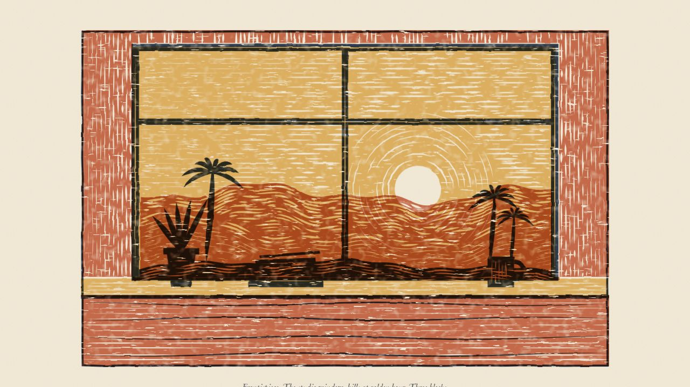
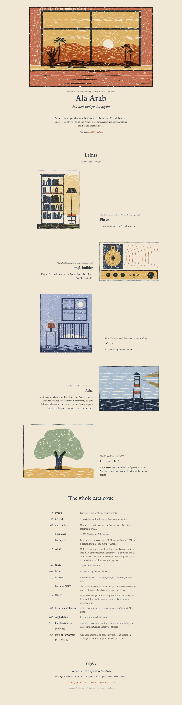
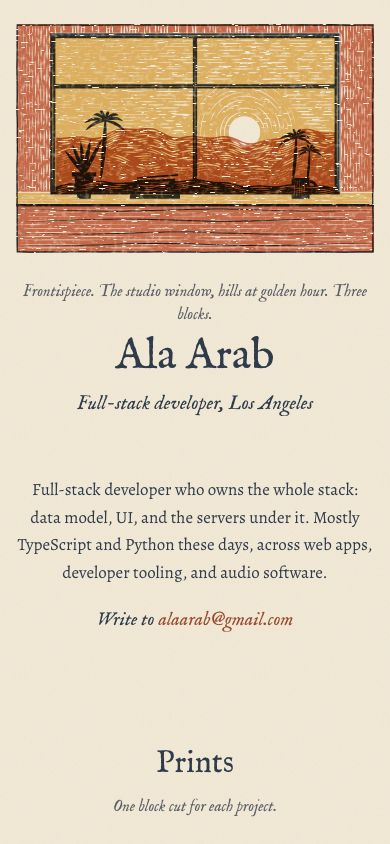
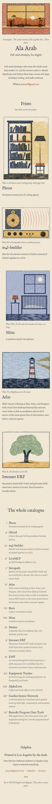
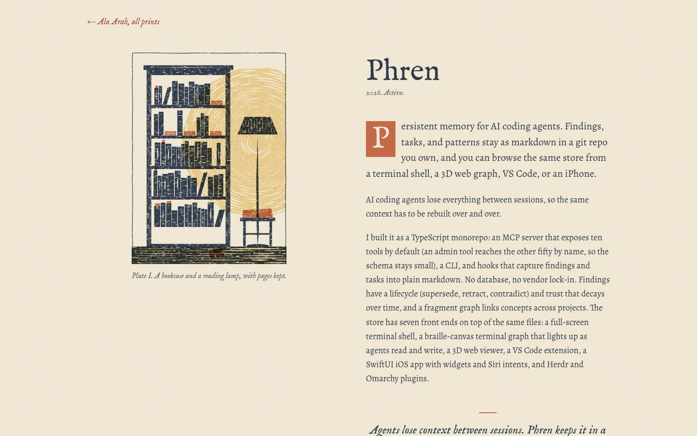
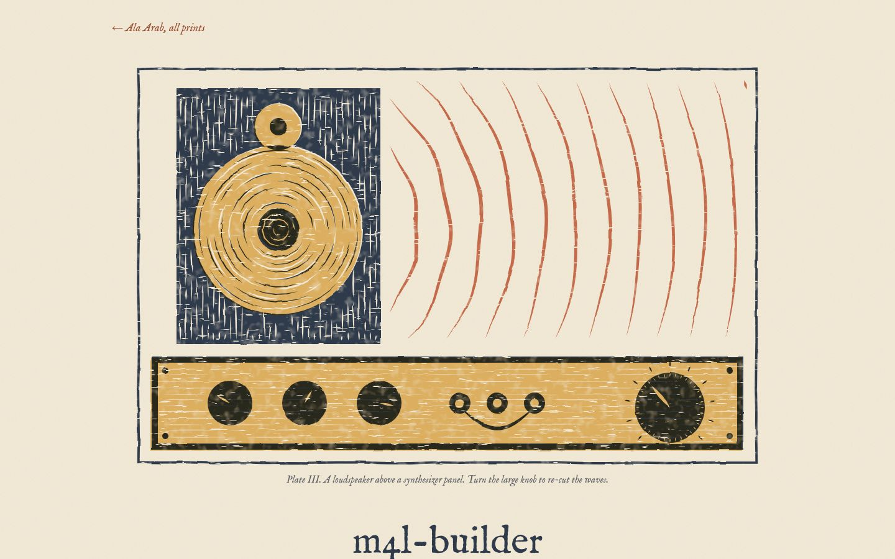
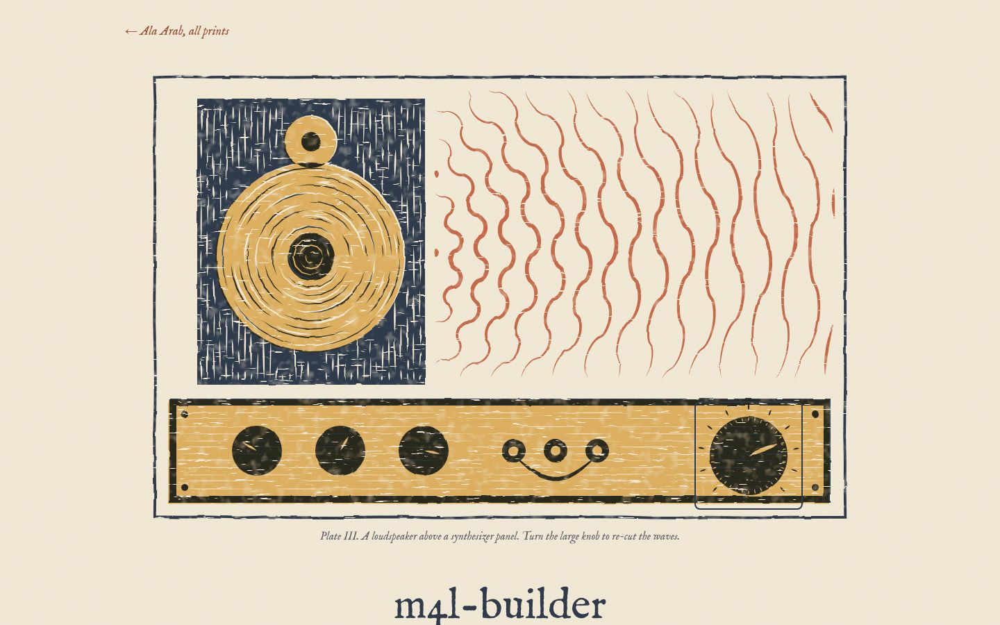
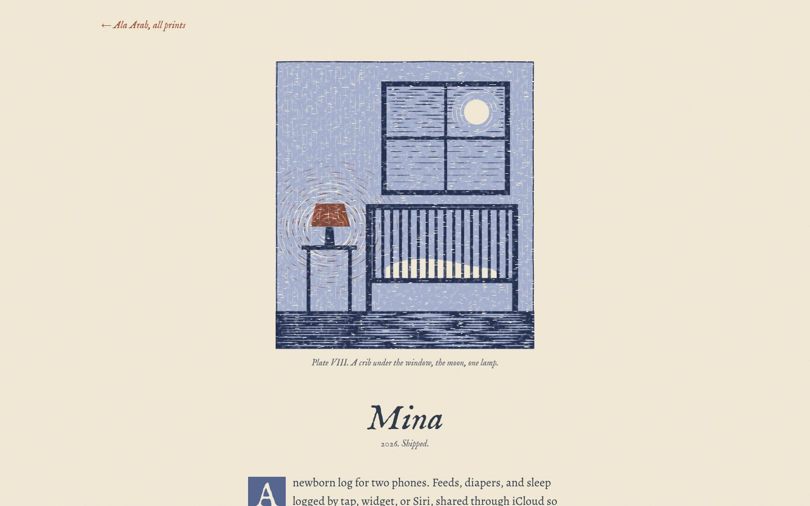
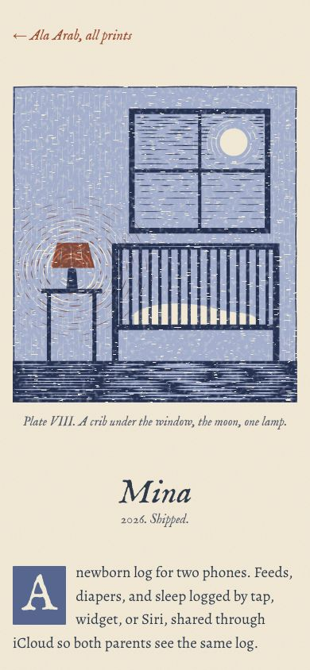
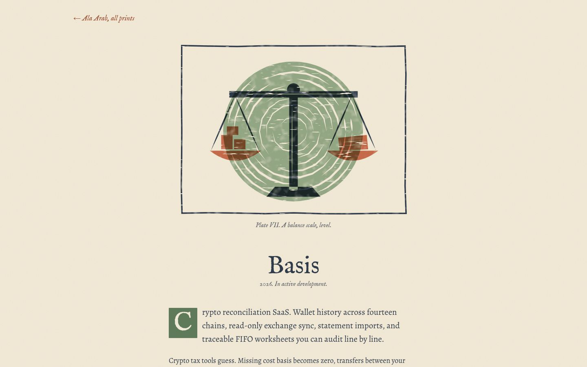

# Woodcut

**Concept in one line:** the site is a small portfolio of hand-cut colour prints, one block cut for each project, printed in three soft inks on warm paper.

Prototype routes: `/lab/woodcut` and `/lab/woodcut/projects/:slug`. Code in `src/lab/woodcut/`.

## Why it fits Ala

Ala builds tools by hand, for himself first, and keeps them plain: markdown files instead of databases, Python scripts instead of a GUI, a baby log with no servers. A woodcut is the same kind of work. Every line is a deliberate cut, the medium can't fake detail, and a print is made to be looked at quietly. It gives the site the softness and craft he asked for after round 1 without turning into an illustration style. The work stays legible as work: each project is one plate with a caption and an essay, and the whole catalogue is a plain list.

## References and what is borrowed

- **Gustave Baumann** (colour woodcuts of New Mexico and California). Borrowed: very few colours, large flat luminous shapes, hills in layered ranges that get lighter with distance, the warm-cool balance of late light. His subject (the Southwest) maps naturally onto the Los Angeles hills in the frontispiece.
- **Mary Azarian** (hand-coloured woodcuts). Borrowed: domestic, tender subjects (a crib, a lamp, a garden bed) carved simply, with a clear key block and soft colour laid under it. This is the mood for Mina and the small plates.
- **Eric Ravilious and English wood engraving.** Borrowed: tone made from parallel cut lines instead of shading, skies built from horizontal gouge strokes, the orderly calm of a composed interior (the Phren bookcase), and the catalogue habit of printing a plate with a small italic caption under it.
- **Arts and Crafts printing** (Kelmscott-era book pages, generally). Borrowed: a carved initial, a single-column text block with generous margins, a colophon at the end of the book instead of a footer.

Not borrowed: the heavy black linocut or "tattoo flash" look, fantasy imagery, Tolkien lettering or ornament.

## Palette

| Role | Hex | Why |
| --- | --- | --- |
| Paper | `#f2ead8` | A warm, unbleached rag paper. Never white. |
| Key ink, blue-grey | `#2f3a4a` | The block that carries the drawing. Blue-grey instead of black keeps prints soft and makes the warm inks glow against it. It is also the text colour (9.6:1 on paper). |
| Terracotta | `#c46a4a` | The middle block: hills, clay, pages, the one warm lamp. Echoes Los Angeles stucco and roof tile. Used for decoration only; text links in this colour use a deeper `#9a4a2f` for contrast. |
| Ochre | `#dcae5f` | The lightest block, printed first: late sun, lamplight, wood. |
| Sage `#93a684`, mist `#a9bccf`, night `#8794b6` | swapped in per project | Each project plate keeps key + terracotta and swaps the light ink to suit the subject (sage for the oak and garden, mist for the sea, night for Mina). |

Inks overprint with `multiply`, so where terracotta falls on ochre you get a third, darker warm tone for free, as with real transparent inks.

## Type

- **IM Fell English** (display, captions): a digitised 17th-century English type with genuine ink spread and irregular edges. It reads like something pulled from a press, and its italic is perfect for plate captions. Used only at display and caption sizes, where the roughness is charm rather than noise.
- **Alegreya** (body): a calligraphic book face designed for long reading. It has enough warmth to sit beside Fell without competing, and it stays crisp at 18px on screen, which Fell does not.

## Signature moment

The frontispiece prints itself on load. The three colour blocks arrive one at a time, ochre first, then terracotta, then the blue-grey key block last, each landing with a tiny shift like a sheet being pulled from the block. About 1.5 seconds, once. With `prefers-reduced-motion` the finished print is simply there.

## How project pages are themed

Every project gets its own carved plate (keyed by slug in `plates.tsx`), its own light ink and its own caption. Three showcase pages get their own layout as well:

- **Phren**: a tall print of a bookcase and reading lamp in blue-grey, with loose pages in terracotta. The print stands to the left of the essay like a frontispiece facing its text.
- **m4l-builder**: a wide print of a carved loudspeaker above a synthesizer panel. One knob in the panel is a real, keyboard-accessible slider; turning it re-cuts the wave lines radiating from the speaker (their spacing and shape).
- **Mina**: a small, quiet print in night blue: a crib under a window with the moon, and one warm terracotta lamp. Narrower measure, more space.

Everything else: a medium plate above the essay with a carved initial in that project's ink. Unknown slugs get an uncut block.

## Deliberately left out

Cards, chips, tables, stats, a nav bar, category grouping, any control on the home page, hover effects beyond a quiet underline, more than one motion, and any ink darker than the blue-grey key.

## Screenshots

Home, desktop fold and full page:

Home, phone:

Showcase pages:

A lighter-touch page:

## Critique and changes

**Pass 1.** The first render had the right structure but the wrong surface. The ink texture was fine salt-and-pepper speckle everywhere, which read as a digital noise filter and not as ink. The ochre block covered the whole sheet, so the room wall came out a heavy orange, and the bench front was key over terracotta, which made a near-black band across the bottom: exactly the heavy linocut look the brief warns against. The objects on the sill (pot, books, mug) were the same blue-grey as the near hill behind them and disappeared.
Changes: the ochre block now covers only the window and the sill, so the wall is terracotta on paper and much lighter. The bench front is terracotta with a few drawn grain lines instead of a solid key block. The near hill dropped to a thin strip so the sill objects stand against the lit terracotta hills, and the objects were redrawn larger with cut highlights. The texture moved to larger, rarer clumps.

**Pass 2.** Better, but still three problems. (1) The texture holes were now streaks and combined with the vertical wall cuts into a woven, plaid look; the hole threshold was raised so paper shows through only occasionally and the uneven-ink mottle was softened. (2) Mina's window was a solid dark pane, too heavy for "the softest night blue"; the sky is now thin key strokes over the pale night block, getting sparser toward the sill, and the moon moved into one pane so the mullion no longer crosses it. (3) m4l-builder's waves were wriggly at the default setting and its panel sliders looked like grave crosses; the waves are now smooth arcs at low settings that tighten and square off as the knob is turned up, and the sliders became three patch jacks with a drooping cable. Home: featured prints now share a max height so Phren's tall plate doesn't dwarf the rest, and the catalogue became a three-column grid so titles don't wrap mid-word.

**Would Ala call it busy, blocky, a newspaper, slop?** The home page has one idea per screen: the frontispiece, a short introduction, prints with captions, a plain list, a colophon. No boxes, chips or tables. The catalogue list is the densest part, and it reads as a list of plates rather than a table. Is it subtle? The prints are not subtle up close: gouge marks and misregistration are the point. The page around them is quiet. Readability: body is Alegreya at 18px on a 34em measure; all text is at least 5.2:1.

## Verification

- `tsc --noEmit` passes.
- No console errors on home, the three showcase pages, all twelve other slugs, and an unknown slug.
- No horizontal overflow at 390px on any of those pages (scrollWidth 390).
- One `h1` on every page.
- Stand-alone links and the knob are at least 44px tall on phone; links inside running prose are left inline.
- Contrast on paper: text 9.6:1, muted captions 5.4:1, links 5.2:1. Carved initials (64px, large text) are 3.2:1 to 4.8:1.
- The knob is `role="slider"` with arrow keys, Page Up/Down, Home/End and pointer drag; eight Up presses moved it from 30 to 75 and re-cut the waves. Visible focus ring.
- The print-in animation runs in the built bundle: 150 ms after load the three layers are at opacity 0.41, 0 and 0, and all three reach 1 by 2.5 s. With reduced motion there are no running animations and every layer is at 1 from the start. (The keyframes are injected through a hoisted `<style>` in `Print.tsx`, because Bun's CSS modules rename module keyframes without renaming the reference to them.)

## What it would take to ship

- **Effort:** about three to four days to bring this to production quality. Most of that is art: each plate needs another pass by eye (the small plates are simple and some are plain, for example Mutter's tin cans), plus a real-device check of the SVG filters on iOS Safari.
- **Risks:** (1) Performance. Every print runs an SVG turbulence and displacement filter per colour layer. It's fine on a desktop and a recent iPhone, but the home page renders six prints with three or four filtered layers each, and the m4l-builder page re-filters on every knob change. Pre-rendering the texture into a static SVG pattern, or rendering plates to cached SVG at build time, would fix this. (2) The texture is procedural, so it can drift between browsers; Safari's `feTurbulence` output differs slightly from Chrome's.
- **What gets hard as projects are added:** every new project needs a plate cut by hand in code. That's the charm and the cost: roughly an hour or two per small plate. A project without a plate would fall back to the uncut block, which is honest but would look unfinished if it happened more than once. The catalogue list scales fine.
