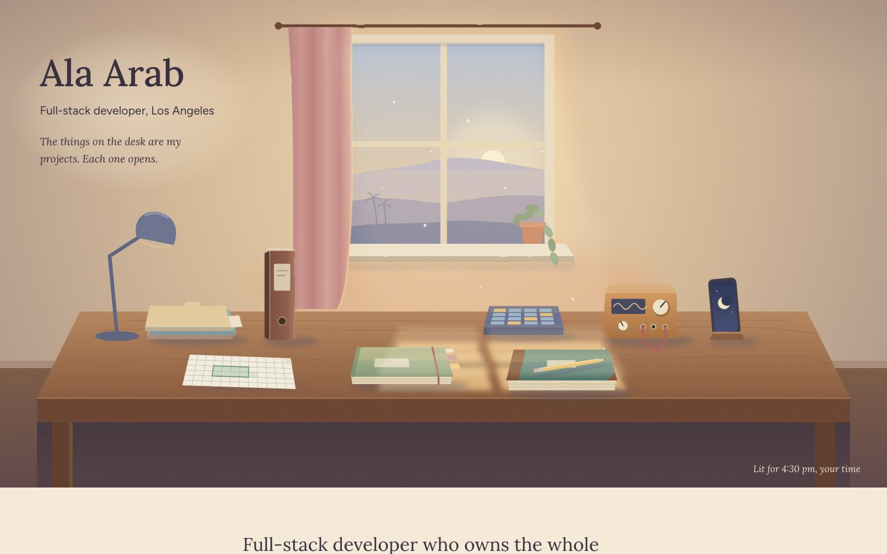
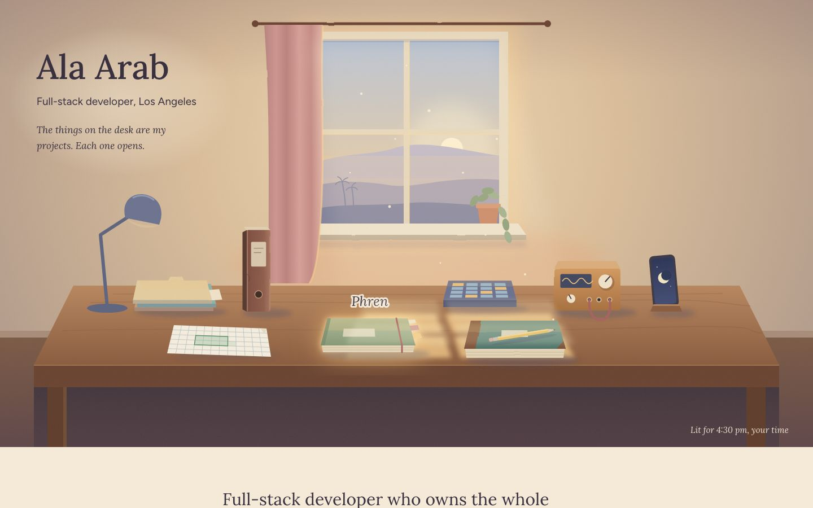
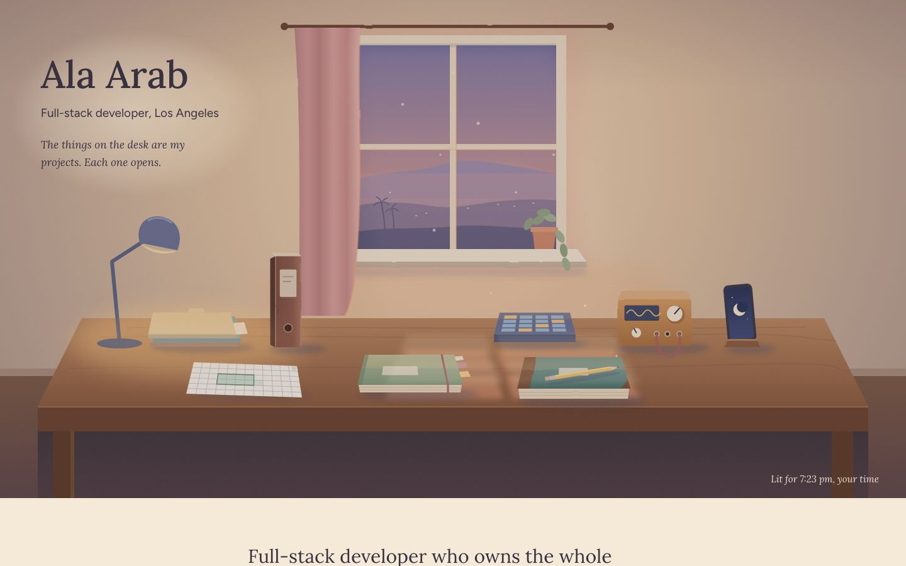
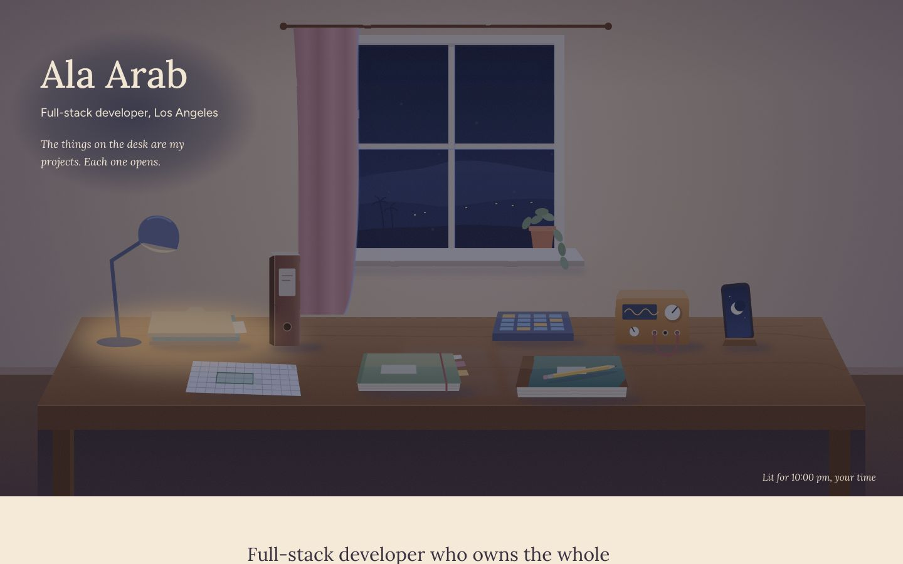
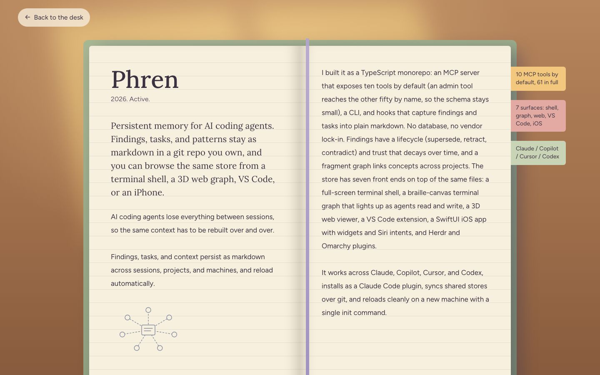
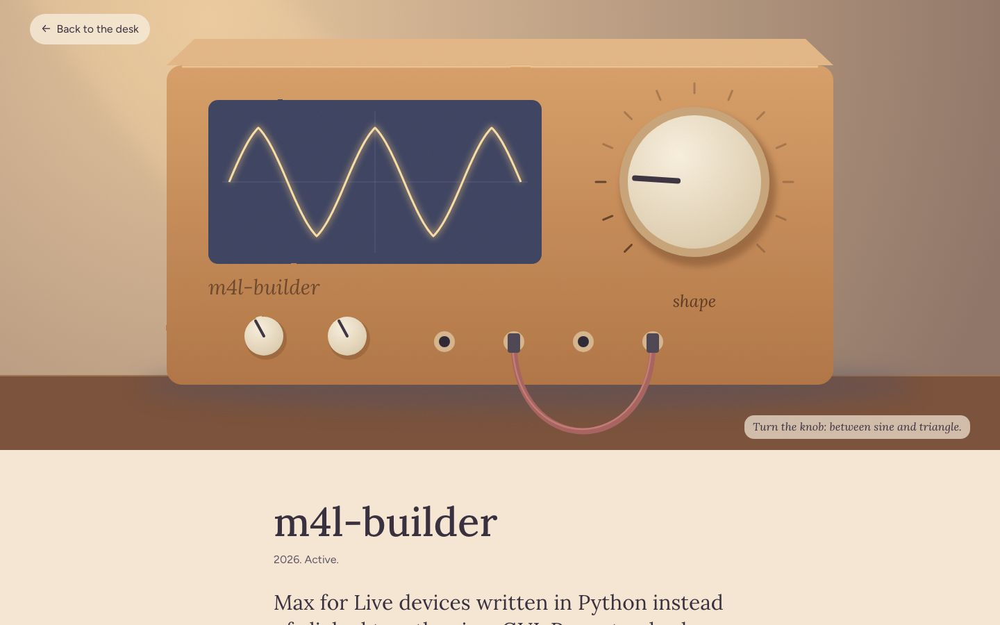
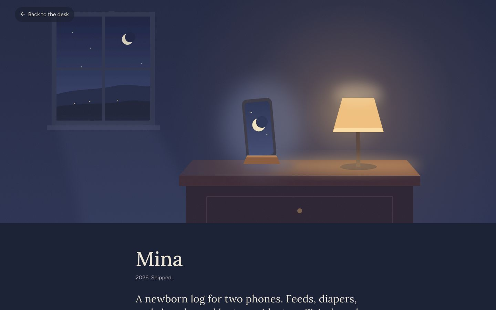

# Workshop

**Concept:** a painted workroom in late-afternoon light. The things on the desk are the projects.

Prototype: `/lab/workshop` (home) and `/lab/workshop/projects/:slug`. Source: `src/lab/workshop/`.

## Why it fits Ala

Ala makes tools: agent memory, a grid, audio devices, a newborn log for his own daughter. A desk is where tools actually live, and a desk in an LA room with the hills outside is a plain, true picture of a person who builds things at home, for himself first. It is personal without being cute, and it says "maker" without a single logo, chip or card. The objects are ordinary (a notebook, a ledger, a binder, a small box with knobs), which matches his plain, specific voice.

## References and what I am borrowing

- **Whisper of the Heart, the antique shop and Shizuku's desk (Kazuo Oga's backgrounds).** The single warm beam through a window, the pooled honey light on wood, and objects placed with care rather than scattered. I borrow the light direction, the warm/cool split (honey in the beam, blue-grey in the shadows), and the stillness. Not the characters, not the clutter.
- **Kiki's Delivery Service, Kiki's attic room.** How few things are needed to make a room feel lived in: a window, a curtain, a desk, a plant. I borrow the restraint and the curtain in the light.
- **Arrietty's interiors.** Everyday objects seen up close as if they were large. This is the project-page move: we walk up to one object and it fills the frame.
- **Tolkien's own jacket art and Arts & Crafts printing.** Flat, soft shapes with a slightly hand-made edge; a quiet serif title set with space around it. I borrow the flatness and the hand-made wobble on edges (feTurbulence + feDisplacementMap), not any motif.

## Palette

| Role | Hex | Why |
| --- | --- | --- |
| Paper (page ground) | `#f5ead8` | warm plaster in afternoon light; never white |
| Ink | `#3a3140` | plum-grey, reads as dark ink, 11:1 on paper; never black |
| Ink, quiet | `#5f5467` | secondary text, 6:1 on paper |
| Honey light | `#f4c77e` | the beam and the glow on hover |
| Apricot | `#e9a071` | the low sun, the warm bounce on the wall |
| Dusty rose | `#cf9690` / link `#94474a` | curtain, and link color (5.9:1 on paper) |
| Sage | `#9aab88` | plant, the Phren notebook cover, a quiet cool-warm |
| Wood | `#8a5b3e`, `#6a4330` | desk, binders, frame |
| Blue-grey | `#77809a`, `#5d6480` | hills, cast shadows, everything the sun is not touching |

Shadows are always blue-grey, light is always honey: that one rule does most of the painting.

## Type

- **Lora** for the name, headings and captions. A contemporary serif with brushed, calligraphic curves; it feels like a well-printed book without being old-fashioned, and its italic is lovely at caption size (object names on hover).
- **Figtree** for body text and UI. A humanist-leaning geometric sans with open apertures, warm but grown-up (it avoids the rounded, childish feel of Nunito), very legible at 17-18px.

## Signature moment

The window light and the sky outside follow the visitor's local time. The page renders a fixed 4:30 pm afternoon first, then on the client it eases toward the real hour: pale and high at noon, rose at dusk, blue with the desk lamp lit at night. It is subtle (the room never goes fully dark), and the scene's corner says what time it is painting.

## Project pages

We walk up to the object and it fills the scene, in its own light.

- **Phren:** the sage notebook lies open. The pages carry the project text, and paper tabs down the edge hold short notes (the project's own metrics) as if carried over from earlier sessions.
- **m4l-builder:** a close-up of the little hardware box. Its main knob is a real, keyboard-accessible slider that reshapes a waveform on the box's small screen; the patch cable sways slowly.
- **Mina:** the phone on the nightstand at night. The room is blue and dim, one warm lamp. Quiet and small; the text sits in the lamplight.
- **Every other slug:** its object up close, with a light and palette shift from a small table keyed by slug (`src/lab/workshop/themes.ts`): EMV an old filing drawer, Equipment Tracker a tag on a tool, Garden Sensor Network a potted plant with a sensor, Retrofit an old tablet, Mutter a headset, AlphaLens a small chart pinned to the wall, Intrapath a new binder next to the old one, and the desk objects for the rest.
- Always a way back to the desk.

## Deliberately left out

- No navigation bar, no chips, no cards, no counters, no filters. The desk is the index; the text list under it is the accessible equivalent.
- No people, no pets, no anime faces. The room is empty; the light is the character.
- No detailed rendering. Each object is a handful of soft shapes. If an object needs more than a few shapes to read, it is the wrong object.
- Only one motion per page: dust drifting in the beam (home), the cable swaying (m4l-builder), and so on. All stop under reduced motion.

## Screenshots

Home, 4:30 pm (the fixed first render):

Hovering the notebook (Phren) warms it and names it:

The same room at 7:24 pm and at 10 pm (`?hour=` overrides the clock, for review only):

Full page: [home-desktop-full.jpg](home-desktop-full.jpg). Phone: [home-phone.jpg](home-phone.jpg), [home-phone-full.jpg](home-phone-full.jpg).

Phren, the open notebook:

m4l-builder, the box up close with a working knob:

Mina, the nightstand at night:

Lighter touch pages: [basis](basis-desktop.jpg), [intrapath](intrapath-desktop.jpg), [garden-sensor-network](garden-sensor-network-desktop.jpg), and the [not-found corner](notfound-desktop.jpg). Phone: [phren](phren-phone.jpg), [mina](mina-phone.jpg).

## Critique and changes

**Pass 1.** The first render was pleasant but flat. The wall and the window were close in value, so the window didn't glow and the light had nothing to push against. The top of the wall went grey-mauve (a blue-grey ceiling gradient read as dirt). Under the desk was a heavy purple slab. The lamp's base was hidden behind the desk, so it floated. The feTurbulence wobble was too strong and made long straight edges (window frame, box panels) look like torn paper, which reads as "filter", not "painted". The sun sat behind the mullion. On close-ups the light on the desk was a bright oval like a stage spotlight, and the Basis ledger had odd leather wedges. Phren's tabs were hidden behind the desk (a stacking-context bug), and the ribbon was a purple divider bar down the gutter.
Changes: halved the wobble; warmed the ceiling shade; added a bloom behind the window so it lights the room; moved the sun onto the ridge; made the floor a warm wood and the under-desk shade a gradient; redrew the lamp with a domed shade and put it on the desk; swapped the spotlight oval for soft window-pane patches plus a diagonal soft-light sheen over the whole close-up; simplified the ledger; fixed the tabs and made the ribbon a thin lavender bookmark; added a small pencil sketch to the notebook (one store, seven surfaces, taken from the project's own text).

**Pass 2.** At dusk and at night the name on the wall dropped to about 3.9:1, and the potted plant (Garden Sensor Network) looked like an umbrella on a stick. Inline links were 28px tall on phones, and the desk objects had two focus rings (the global outline plus the dashed hit ring).
Changes: a soft, wide pool of light behind the title (warm by day, blue at night) that also reads as light on the wall; all title text uses the main ink, which measures 5.1:1 or better at every hour I sampled (4:30 pm, 7:30 pm, 10 pm). The plant was redrawn as a fan of leaves with soil and a proper sensor stake. Links got 12px of block padding (44px targets), and objects now show only the dashed ring and the glow.

**Honest read against Ala's words.**
- *Busy?* The home screen has one idea, the desk, and eight objects. The text below it is a calm single column. I think it passes.
- *Blocky / newspaper?* No grids, no cards, no chips. The project list is typographic lines.
- *Slop / clip-art?* This is the real risk. At thumbnail size the objects read as flat vector icons; the light (window bloom, panes on the desk, soft-light sheen, blue-grey shadows) is what keeps it from being an icon set, and it only partly succeeds. The m4l-builder and Mina pages are the most convincing because their light has a clear source. The generic close-ups are good at mood but the objects at 3x scale are plainly geometric.
- *Subtle?* Yes. The time-of-day shift is gentle, and there is only one moving thing per page (dust at home, the cable on m4l-builder).
- *Readable?* Body 17-18px Figtree, 700px measure, ink 11:1 on paper; every themed link is 5.4:1 or better on its page.

## Verification

- `tsc --noEmit` passes for these files.
- No horizontal overflow at 390px on home, phren, m4l-builder, mina and basis (scrollWidth = 390). No console errors on any page shot.
- One h1 per page. Visible focus: a dashed ring and glow on desk objects, a dashed ring on the knob, and an outline elsewhere.
- Animations: Bun's CSS modules rename `@keyframes` but not the name inside `animation:`, so the keyframes live in a global `<style>` with `ws-` prefixed names (`shared.tsx`). I confirmed in the browser that the dust and the cable actually move.
- Reduced motion: zero running animations with `prefers-reduced-motion: reduce`. Without it, the home page has the dust and m4l-builder has the cable, and nothing else moves.
- The knob is `role="slider"` with arrows, Page Up/Down, Home and End, and dragging; its aria-valuetext names the shape ("between triangle and saw"). A polite live caption repeats it.
- Phone tap targets are all at least 44px. On phones the desk is a picture (its links are removed), and the list directly under the name does the navigating, as the brief allows.

## What it would take to ship

- **Effort:** about 3 to 5 days to make it production quality. Most of that is drawing: every object needs a second, more careful pass at close-up scale (more considered shapes and edge light), plus a real SSR check that the fixed afternoon hydrates without a flash (the clock is applied in a layout effect).
- **Risks:** it depends on drawing quality more than on code. A mediocre object reads as clip-art instantly, and there are fifteen of them. Mix-blend and filter effects vary a little across browsers (Safari renders `soft-light` inside SVG slightly differently), so it needs a cross-browser pass. On phones the desk is decorative, which is honest but less magical than on desktop.
- **As projects are added:** the desk holds about eight objects before it gets busy. A new featured project means drawing a new object and finding room on the desk, or retiring something to the shelf. Retiring is the healthier habit, and it matches the metaphor: the desk holds what's current and the shelf holds the rest. Non-featured projects only need one entry in `themes.ts` and a small drawing.
